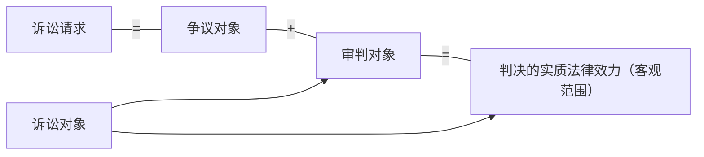
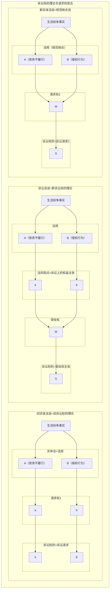

# 一、通说的局限性
通说以为，诉讼标的是指当事人间争议的并要求人民法院作出裁判的权利义务关系。简言之，通说是将当事人间争议的法律关系当作诉讼标的。但是，若按照通说指导司法实践，则难以避免诉讼标的的范围大于诉讼请求的情形。对此，若从诉讼标的与判决的实质法律效力（既判力、确定力）关系上分析，就有可能出现因既判力的客观范围大于诉讼请求，而使原告的实体权利得不到充分保护的情形。例如，原告作为民间借款法律关系的债权人，向被告提出返还本金诉讼请求，受案法院以被告已经返还本金（债权消灭）为理由驳回了原告的诉讼请求，此后，原告又向人民法院起诉，对被告提出支付利息诉讼请求和支付迟滞履行违约金诉讼请求。对于后诉，若按照通说的解释，因后诉的两项诉讼请求都是基于同一特定民间借款法律关系产生的，而在前诉返还本金诉讼中，人民法院已经对于此项有争议的民间借款法律关系进行了判决，且判决已经生效（确定），即对该项争议的法律关系产生了实质法律效力（既判力、确定力），所以，人民法院应当驳回原告的这两项诉讼请求。然而，这样的判决对于原告来说是极不公平的，因为原告并没有在前诉中向被告主张支付利息和违约金这两项诉讼请求，并且在前诉中，双方当事人也没有围绕着这两项诉讼请求成立与否展开诉讼攻击防御，如是，原告的处分权和辩论权都受到了侵害。

不仅如此，以争议的法律关系当作诉讼标的，有可能对被告也产生不公平诉讼，使被告的诉讼权利和实体权利受到侵害。例如，原告基于民间借款法律关系向被告主张返还本金诉讼请求，而法院是以争议的民间借款法律关系为审判对象，此种情形下极有可能对被告并未实施诉讼防御的权利义务作出判决。

需要指出，虽然我国法律没有对判决的实质法律效力（既判力的客观范围）作出明确规定，但是按照《民事诉讼法》关于当事人申请再审的法定事由规定，人民法院不得遗漏或者超出诉讼请求作出裁判。据此也可以认为，将诉讼标的定位于争议法律关系的通说，并不是一种十分妥当的观点，不仅与立法有冲突，而且也不利于指导民事诉讼实践。
# 二、对通说的修正
按照通说关于诉讼标的的解释，在民事诉讼中极有可能出现人民法院的审判对象及判决内容大于原告诉讼请求的情形，从而对原告的处分权和辩论权等诉讼权利造成侵害。但是，如果不按照通说解释诉讼标的，则又可能出现原告基于同一债权法律关系分别提起返还本金请求、支付利息请求、给付违约金请求等诉讼的可能，进而使同一法律关系争议长期处于争议之中，这在增加当事人讼累的同时，也使司法资源变得紧张起来。因此，是否以诉讼请求作为诉讼标的，以及如何从民事诉讼制度的整体上尤其是判决的实质法律效力（既判力、确定力）立场上把握诉讼请求和诉讼标的之间的关系，这就成了受德国民事诉讼法及其法理影响的各国民事诉讼法学界的一大“哥德巴赫猜想”。

本书认为，我国民事诉讼在原则上应当以诉讼请求作为诉讼标的的确定标准，并以此对通说主张的“争议法律关系说”进行修正。其理由如下：诉讼标的是当事人间争议对象和人民法院的审判对象之结合，以诉讼请求作为诉讼标的的确定标准，有助于贯彻处分原则，保障当事人双方公平、有效地进行诉讼攻击防御（辩论原则），促成公正、高效、权威的民事审判制度的形成。其要点是：强调诉讼请求、争议对象、审判对象三者间的统一，推动民事诉讼的规范化运行。

但是，我们在以诉讼请求作为诉讼标的的确定标准时，还要考虑到对其他一些问题的解决方法。这些问题主要是围绕着“权利救济用尽”和“纠纷一次性解决”这对矛盾的解决展开的。所谓“权利救济用尽”，是指民事诉讼应当牺牲纠纷最大化解决所带来的利益，以实现当事人实体权利救济的最大化为目的确定诉讼标的。与此相对，“纠纷一次性解决”不以穷尽当事人的实体权利救济为目标，而是强调尽可能利用一次诉讼最大化地解决当事人间的纠纷。“权利救济用尽”和“纠纷一次性解决”之间的紧张关系，主要体现在如下三个方面：

第一，请求权与请求事项（内容）的关系问题。这里主要涉及两个问题。首先，我们虽然主张以诉讼请求作为诉讼标的的确定标准，但这并不意味着诉讼标的和诉讼请求之间可以完全画上等号。造成诉讼标的与诉讼请求之间关系的不对等或者紧张的原因之一，主要来自实体法和诉讼法的分立和平衡之要求。实体法具有社会规范和裁判规范之双重功能。在生活领域，实体法的适用依从意思自治原则，当事人可以按照自己的意思行使和处分自己的实体请求权。例如，就一起交通事故引起的人身损害赔偿请求权的行使而言，受害方今天可以要求加害方给付住院期间的医疗费，明天可以要求给付相应的误工费，后天还可以要求给付相应的营养费等。但是，当受害人以诉的客体向被告主张损害赔偿请求权时，国家则要从诉讼经济、减轻被告讼累、纠纷尽可能一次性解决、维护法律关系的安定性等诸多方面考虑，限制受害人如同在生活领域一样自由地行使给付请求权。由于这种限制是通过具有公法性质的民事诉讼法来完成的，所以在民事诉讼法上就产生了一个诉讼标的的基本单位（最小单位）的确定问题。亦即人民法院应当以诉讼标的的基本单位作为审判对象进行裁判，其发生法律效力的判决（确定判决）的实质法律效力也仅及于该基本单位。与此同时，对于原告未在诉讼请求中主张的权利内容，在通常情况下将依照处分原则视为原告已作出放弃请求的处分。

其次，实体法在很多场合下，并没有就请求权与请求项目之间的关系作出明确规定。例如，在交通事故人身损害赔偿请求中，我国法律规定受害人可以向加害人提出财产性损害赔偿请求和精神性损害赔偿请求，其中财产性损害赔偿请求又可细化为支付医疗费、营养费、误工费、护理费、伤残补助金等多项请求。但我国法律没有就请求权的最小单位作出明确规定。如此一来，因请求权的最小单位不明，原告的诉讼请求之范围也不明，进而导致诉讼标的的基本单位难以确定。在民事诉讼实务中，假设在交通事故人身损害赔偿请求中的财产性损害赔偿请求和精神性损害赔偿请求并不属于两个独立的损害赔偿请求权，而只是一项损害赔偿请求权的两项事项（内容），那么支付医疗费、营养费、误工费、护理费、伤残补助金等请求就将被划为财产性损害赔偿请求的构成要素，如此，原告向被告提出损害赔偿请求权（诉讼请求）的主张时，倘若只主张了财产性损害赔偿且仅主张了其中的医疗费和护理费这两项内容，那么在其胜诉或败诉后，都不得再基于其他请求事项向被告另诉提出权利主张（诉讼请求）。与此同时，按照以诉讼请求作为诉讼标的的确定标准之解释，财产性损害赔偿和精神性损害赔偿之集合的损害赔偿请求权是确定争议对象和审判对象及诉讼标的的基本单位。

综上所述，在处分主义民事诉讼中，从判决的实质法律效力立场分析，诉讼标的是案件的争议对象和审判对象，其范围受限于诉讼请求；诉讼请求是指原告对被告的权利主张而不是指权利主张的具体内容（如医药费）；由于权利主张的依据（如损害赔偿请求权）在通常情形下要大于个案中的权利主张的具体内容，所以，诉讼标的在通常情况下也大于权利主张的具体内容。同理，为了贯彻处分主义，案件的诉讼标的又必须限制在诉讼请求的事项范围（权利主张的具体内容）之内，被告和法院不得以原告未对被告主张的诉讼请求事项进行争议和审判，而对于原告没有主张的具体权利内容（诉讼请求事项），人民法院应当按照处分原则视其已作放弃处分。

第二，请求权竞合问题。按照权利保护请求说的诉权理论解释，诉讼标的在实质上是原告的实体权利主张，但是究竟以什么为标准来确定权利主张及诉讼标的，实体法本身却没有对此作出具体规定，而只能交由司法实践解决。一般而言，给付诉讼的诉讼标的是原告要求对方当事人为一定给付的实体法上请求权主张；确认诉讼的诉讼标的是原告提出的实体法规定或认可的权利及法律关系存在或不存在的主张；形成诉讼的诉讼标的是指原告对被告提出的实体法规定或认可的形成请求之主张。这种以实体法为标准确定诉讼标的的学说，被称作实体法的诉讼标的说。但是，在实体法的诉讼标的说指导下，除确认诉讼外，民事诉讼实践存在着一个长期未决的缺陷：由于实体法对同一事实关系进行了不同的法律评价，进而出现了对于同一事实关系或者有若干条法律规范进行调整（法条竞合），或者基于不同法律规定却发生相同的请求权（请求权竞合）的情形。例如，对于一起医患纠纷事实（同一生活事实），法律规定可以采用合同法和侵权行为责任法进行调整（法条竞合），而基于合同不履行责任和侵权行为责任，受害人都可以提出损害赔偿诉讼请求（请求权竞合）。这种法条竞合和请求权竞合的情况，只发生在给付诉讼和形成诉讼领域。对请求权竞合而言，在给付诉讼中，损害赔偿请求权可以基于合同法律关系和侵权法律关系产生；在形成诉讼中，婚姻关系解除请求权（离婚请求）可以基于多种事由成立。于此情形下，按照实体法的诉讼标的说解释，由于损害赔偿请求权的法律基础不同或离婚请求的事由不同，诉讼标的也不同。如此一来，则可能出现基于同一事实的民事纠纷不能够得到一次性解决的问题。例如，就一起医疗事故损害赔偿诉讼而言，原告在以合同法律关系为基础的损害赔偿诉讼请求被驳回后，又以侵权责任法律关系为基础提出损害赔偿请求诉讼。或者在离婚诉讼中，在以虐待为事由的诉讼请求被驳回后（《婚姻法》第32条第3款第2项），又以因感情不和分居满两年为事由提起离婚诉讼（《婚姻法》第32条第3款第4项）。民事诉讼若不能一次性处理同一事实或同一法律关系为基础的民事纠纷，则会使当事人间的法律关系处于不稳定状态，并有碍社会主义法治秩序的安定性。
# 三、诉讼标的的学说及意义
为了克服实体法诉讼标的说的缺陷，诞生了不以实体权利为依据，单从诉讼法立场把握权利主张及诉讼请求的诉讼标的理论—诉讼法诉讼标的说。自1925年德国学者罗森贝克（Leo Rosenberg）拉开诉讼标的理论“大论战”以来，有关诉讼标的确定标准的争论至今战火未熄。诉讼标的涉及民事诉讼制度及其理论的全盘，尤其是涉及请求合并、请求变更、重复起诉、判决的法律效力等诉讼制度的确定标准，因此，正确地认识和把握诉讼标的理论，对于学习民事诉讼法学和民事诉讼实践有着至关重要的意义。但如前所述，这里并没有为学习者提供标准答案。

以下以图示方式简要评述诉讼标的理论中最具代表性的三种学说：

**表2 诉讼标的理论与请求之诉讼法上效果**

||请求之合并|请求之变更|重复起诉|
|:---:|:---:|:---:|:---:|
|旧实体法说|√|√|√|
|诉讼法说|×|×|×|
|新实体法说|×|×|×|

## （一）旧实体法说
### 1.旧实体法说的意义
旧实体法说又称旧诉讼标的理论，它以实体法上的权利或法律关系为诉讼标的，原则上以每项请求权及权利构成一个诉讼标的。按照旧实体法说的解释，实体权利必须以法律明确规定的构成要件为发生前提，如果对同一事实关系可以适用多条法律规定且产生多项实体法上权利时，在民事诉讼中，根据原告的权利主张将形成多个诉讼标的。

在旧实体法说的解释下，如果甲乘坐乙驾驶的出租车遭遇交通事故，则可以根据法律规定，就交通事故这一事实关系具有两个实体法上的损害赔偿请求权。其理由是，交通事故这一事实关系既可以满足侵权行为损害赔偿请求权的构成要件，同时也可以满足债务不履行损害赔偿请求权的构成要件，抑或基于同一事实关系发生的各个损害赔偿请求权—侵权行为损害赔偿请求权和债务不履行损害赔偿请求权，在性质上属于不同的实体法上的权利。而在民事诉讼中，如果甲同时主张这两项权利，即使诉讼请求的内容相同，如都为一万元损害赔偿请求，也应视为两个不同的诉讼标的。 ^kekelf

- 对[[第三节 诉讼标的及其确定标准#^kekelf|此案例]]，如果按照旧实体法说的解释，在民事诉讼上将发生下列效果：
	- 第一，甲以两个请求权分别提起诉讼，但由于诉讼标的不同而不构成重复起诉，法院应当分别予以受理。禁止重复起诉原则，是指当事人对诉讼系属（法院处理中）案件再次提起诉讼。不允许当事人对系属于法院的案件提起诉讼，是为防止矛盾判决和实现诉讼经济。一般认为，应当以诉讼标的作为判断案件是否系属于法院的标准。我国《民事诉讼法》没有明确规定禁止重复起诉原则，立法论上有观点认为，对同一诉讼标的，当事人在法院受理以后不得再次起诉。
	- 第二，如果甲在一个诉讼程序中同时主张两个请求权，则构成诉讼请求合并。
	- 第三，如果甲在诉讼开始时主张一个请求权（债务不履行损害赔偿请求权），而在诉讼进行中又变更为另一个请求权（侵权行为损害赔偿请求权），则构成诉讼请求变更。关于诉讼请求变更及追加诉讼请求的时机，《民事诉讼法》规定可以在诉讼进行过程中提出，实行随时提出主义。（《民事诉讼法》第140条）但司法解释则规定必须在举证时限届满之前提出（《民事证据规定》第34条第3款）。由于立法和司法解释相冲突，因而导致司法实践无所适从。
	- 第四，如果甲主张一个请求权提起诉讼并败诉，其后可以主张另一个请求权提起诉讼，不违反《民事诉讼法》第124条第工款第5项规定，即不构成对既判力原则的违反。
	- 第五，如果甲主张一个请求权提起诉讼，而法院却认定另一个请求权并对甲的诉讼请求予以支持的，该项判决则因违反处分原则而构成适用法律的错误。
### 2.对旧实体说的评价
一般认为，旧实体法说具有以下长处：按照实体法上权利特定诉讼标的，有助于当事人明确诉讼攻击防御的争议对象，便于法院明确审判对象，提高审判工作的效率。旧实体法说的最大缺点是不能够一次性解决纠纷。因为当事人可以通过变更实体权利主张反复提起诉讼，而被告却必须每次应诉，法院也需要对同一案件进行多次审理，这样不仅给法院增加了审判负担，还给被告造成了讼累，极不符合诉讼经济的要求。另外，对同一案件反复提起诉讼，还可能使法院对同一案件作出矛盾判决。目前，日本、韩国的判例仍坚持旧实体法说的诉讼标的理论。我国也有一些法院倡导“要件事实审理方式”，支持旧实体法说的诉讼标的理论。
## （二）诉讼法说
### 1.诉讼法说的意义
诉讼法说是单从诉讼法立场特定诉讼标的的学说。具体而言，诉讼法说不以实体法上请求权为确定诉讼标的的标准，而是以诉讼法规定的请求趣旨（Antrag，即诉讼申请、请求内容）和请求原因（Sachverhalt，即要件事实记载）来确定诉讼标的。诉讼法说以体现社会法治国家诉讼观的“当事人和法院的最合理利益”理论为基础，强调通过一次诉讼解决全部纠纷。按照诉讼法说的解释，实体法上权利不是确定诉讼标的的标准，只是支持诉讼标的的法律观点和诉讼攻击防御的方法。诉讼法说又分为一要素说和二要素说。前者认为，只有请求趣旨是识别诉讼标的的基准；而后者认为，诉讼标的由请求趣旨和请求原因两个要素构成。
#### （1）诉讼法说的一要素说。
该说主张，在民事诉讼中，应当以原告的请求趣旨（诉讼申请）而不是其主张的实体法上权利来确定诉讼标的。依照一要素说的解释，诉讼标的可以根据请求趣旨加以特定，如果请求趣旨相同，即使原告所主张的实体法上权利有所不同，仍应视为同一诉讼标的。

以[[第三节 诉讼标的及其确定标准#^kekelf|前述案例]]为例，在甲提起损害赔偿请求诉讼时，只要请求趣旨（一万元损害赔偿请求）相同，则不论其主张的损害赔偿请求是侵权行为损害赔偿请求还是债务不履行损害赔偿请求，诉讼标的仅有一个，即两种主张的诉讼标的都是一万元损害赔偿请求。

一要素说主张，特定诉讼标的时无须参考请求原因。其理论依据是，请求原因中所主张的实体法上权利只是诉讼标的（请求趣旨）的依据或支持其成立的诉讼攻击方法。但是，一要素说的破绽也在于此，因为不参考请求原因往往就不能特定诉讼标的，进而不能特定既判力的客观范围。例如，甲对乙共有两万元债权，其中一万元是借贷债权，另一万元是买卖价款债权，在这种情形下，如果仅依据甲的请求趣旨之一万元特定诉讼标的（金钱给付），是无法区分本案究竟是请求给付借款诉讼还是请求给付价款诉讼，进而不能确定本案的既判力客观范围是针对哪一个诉讼请求发生的。
#### （2）诉讼法说的二要素说。
该说主张，为避免一要素说依原告的请求趣旨来特定诉讼标的所可能引起的混乱，应当依据诉讼申请（请求趣旨）和事实关系（请求原因）这两个要素来特定诉讼标的。按照二要素说的解释，诉讼申请相同，但事实关系不同的，就应当视为不同的诉讼标的。二要素说还认为，由于法律要求以请求原因记载事实关系，所以在特定诉讼标的时，应当参考请求趣旨和请求原因。目前，二要素说是德国判例采用的主要学说，也是日本和韩国学界的有力说。

当事实关系相同时，一要素说和二要素说在特定诉讼标的上没有差异；但事实关系不同时，两者在特定诉讼标的上却存在着差异。例如，乙从甲处购买物品，为了支付货款开具了一万元支票。甲向乙提起诉讼，请求趣旨是请求乙支付一万元货款。如果甲在第一次诉讼中，其请求是兑现支票款，而在第二次诉讼中，其请求是支付买卖货款，那么按照二要素说的解释，应视为两个不同的诉讼标的；若按照一要素说的解释，则应当视为同一诉讼标的。其理由是，二要素说认为，特定诉讼标的的标准是请求趣旨（一万元金钱请求）和请求原因中的事实关系，由于第一次诉讼的事实关系是兑现支票，第二次诉讼的事实关系是买卖，因而两个诉讼的事实关系各异，所以诉讼标的也就不同。
### 2.诉讼法说的应用
- 对同一案件，适用旧实体法说还是诉讼法说，往往会出现截然不同的结果。以前述出租车交通事故损害赔偿案为例，如果甲依据侵权损害赔偿请求权和债务不履行损害赔偿请求权分别提起诉讼，那么按照诉讼法说的解释：
	1. 由于这两个诉讼的诉讼标的相同，所以在法院受理第一个诉以后，在这个诉处于诉讼系属之中时，若提起第二个诉，则构成重复起诉，法院应当以违反禁止重复起诉原则为理由，裁判不予受理，或在受理后裁判驳回起诉；
	2. 如果甲在一个诉讼程序中同时主张上述两个请求权，将不构成请求合并（选择性合并），而应当视为提出了两种不同的诉讼攻击方法；
	3. 如果甲以第一个请求权提起诉讼，但在诉讼进行中又换成第二个请求权，则应当视为诉讼攻击方法的替换，而不是变更请求；
	4. 如果甲主张的第一个请求权败诉，则不能依据第二个请求权再行诉讼，因为既判力的客观范围等于诉讼标的的范围；
	5. 如果甲主张依据第一个请求权提起诉讼，而法院却以第二个请求权作出胜诉判决，则该判决并不违反处分原则，仍属于合法判决。

依据诉讼法说特定诉讼标的，有利于利用一次诉讼解决同一事实关系引起的纠纷，贯彻一次性解决纠纷原则，实现诉讼经济，防止法院因反复裁判而作出相互矛盾的判决。

但是，诉讼法说也存在着自身难以克服的缺陷。因为对于同一事实关系的纠纷只为一次诉讼，有可能忽视当事人主张的实体法上权利以外的其他权利，而要在诉讼中对之全部予以关照，则可能大幅度增加法院的审理范围和审理负担。
## （三）新实体法说
新实体法说是在诉讼法说影响下产生的学说，是针对传统民法上的请求权进行修正而提出的诉讼标的理论。新实体法说与旧实体法说的基本观点相同，但在以修正的实体法上权利为标准特定诉讼标的上有别于旧实体法说。在新实体法说中，在如何修正实体法上请求权的认识上存有多种观点，其中最具代表性的观点是统合说——将若干个实体法上权利统合为一个权利的学说。该说主张，当一个事实关系产生数个权利根据时，应当将数个请求权、形成权统合为一个请求权或形成权，而经这种统合后产生的一个请求权或形成权就是本案的诉讼标的。以前述交通事故损害赔偿案为例，按照新实体法说的解释，基于同一事实关系，虽然在实体法上可以产生侵权损害赔偿请求权和债务不履行损害赔偿请求权，但经统合后，原告只能取得一个请求权（损害赔偿请求权）。

目前，新实体法说尚处于形成之中，其中存在着诸多理论上难以自恰的问题。以前述案件为例，第一，如果将侵权行为损害赔偿请求权和债务不履行损害赔偿请求权予以统合，那么又如何来确定统合后的损害赔偿请求权之诉讼时效呢？按照《民法通则》的规定，此案中侵权损害赔偿请求权的诉讼时效是一年而债务不履行损害赔偿请求权的诉讼时效一律为两年。第二，如何确定统合后的损害赔偿请求权的证明责任。按照法律规定，交通事故损害赔偿请求权的因果关系构成要件之证明责任由加害者承担，其他要件的证明责任由受害人承担；而债务不履行损害赔偿请求权的证明责任是由被告（债务不履行者）承担。第三，一些国家民法规定，对侵权行为损害赔偿请求权不允许抵消。那么，对于统合后的损害赔偿请求权是否应当允许抵消呢？

我国合同法、侵权行为法虽然规定当事人可以选择诉讼标的，但没有规定相应的诉讼法上效果，因而我国法律的规定不是完整意义上的新实体法说。