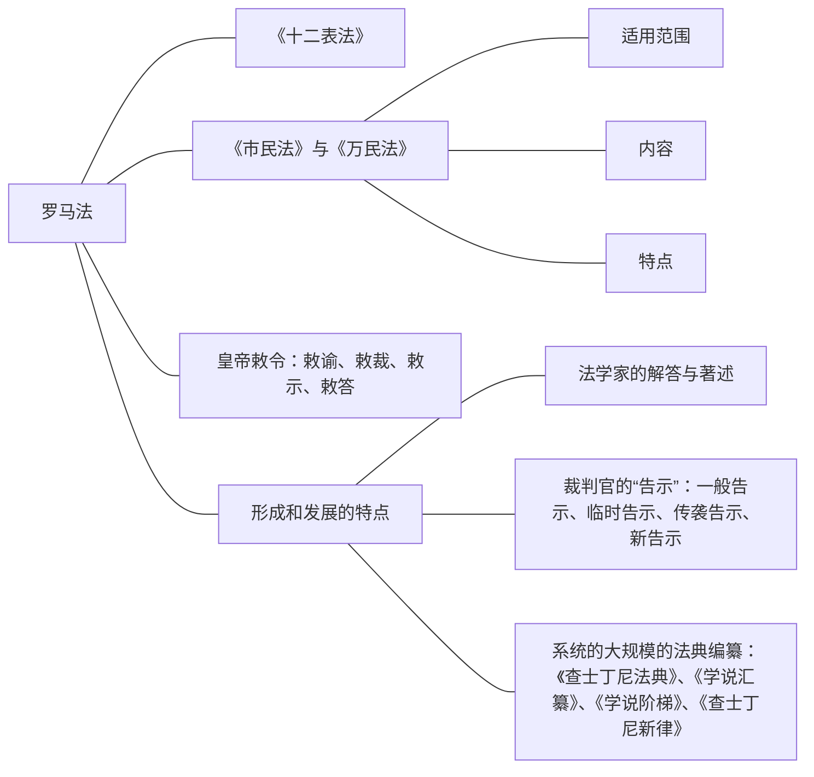

```mermaid
flowchart LR
1[罗马法]
2["《十二表法》"]
3["《市民法》与《万民法》"]
4[适用范围]
5[内容]
6[特点]
7["皇帝敕令：敕谕、敕裁、敕示、敕答"]
8[形成和发展的特点]
9[法学家的解答与著述]
10["裁判官的“告示”：一般告示、临时告示、传袭告示、新告示"]
11["系统的大规模的法典编纂：《查士丁尼法典》、《学说汇纂》、《学说阶梯》、《查士丁尼新律》"]
1---2 & 3 & 7 & 8
3---4 & 5 & 6
8---9 & 10 & 11
```