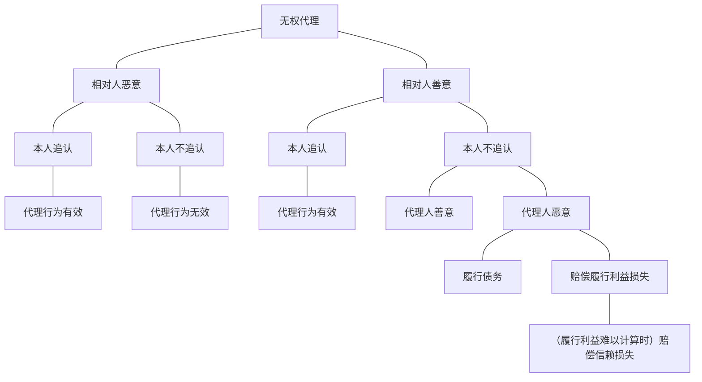

【考点摘要】
本节重点掌握无权代理的分类，要件及其效果。无权代理和表见代理的认定是本章的重点和难点。
# 一、有权代理与无权代理（2013年简答题）★★
代理以其代理权之有无为标准，可分为有权代理与无权代理两种。

无权代理有广义和狭义之分。广义无权代理包括所谓表见代理与狭义无权代理。狭义无权代理指不具表见代理的无权代理，可称为固有的无权代理。

表见代理，指无权代理人，具有代理权存在的外观，足以使人相信其有代理权时，法律规定本人应负授权责任之制度。
# 二、无权代理（2016年案例分析的考点）★★★★★
## （一）无权代理的要件及效果
无权代理的意义及要件

- 无权代理，指无代理权人以代理人的名义而为法律行为。其要件有四：
	1. 须为法所容许：
	2. 须为法律行为：
	3. 须以本人名义；
	4. 须欠缺代理权（代理权欠缺，其情形有四：未经授予代理权；授权行为无效或被撤销；逾越代理权的范围；代理权消灭）
## （二）法律效果
无权代理人以代理人的名义而为之代理行为，效力未定。

为使其发生效力或不发生效力，“台民”规定本人有追认权，相对人有撒回权。

若确定不生效力，则于无权代理人与第三人间发生损害赔偿责任的问题。

其法律构造相当于未成年人未得法定代理人允许订立契约。
### 1.本人与第三人的法律关系
#### （1）本人的承认权（《民法典》第171条第1款）
无权代理的法律行为，因本人承认而溯及于其成立时发生效力。

本人拒绝时，无权代理的法律行为确定不生效力。
#### （2）相对人的催告权或撤回权
A.催告权，即相对人可以规定相当期限，催告本人确定是否承认，如本人逾期未确定者，视为拒绝承认。催告应向本人为之。（《民法典》第171条第2款第1句）

B.撒回权，即相对人得撤回无权代理行为，阻止其因本人的承认而发生效力。

相对人的撤回权不因已经对本人发出催告而受影响；但其撤回应于本人作出承认前为之。撤回可以向本人或者无权代理人作出。需要注意的是，相对人在作出法律行为时，明知对方没有代理权，那么相对人只有催告权，没有撤回权。（《民法典》第171条第1款第2句）
### 2.无权代理人与第三人间的法律关系：无权代理人之责任（《民法典》第171条第3款）
台湾“民法”第110条规定，无权代理人，以他人之代理人的名义所为之法律行为，对于善意之相对人，负损害赔偿之责。
#### （1）构成要件
A.须无权代理人以本人名义而为法律行为，而该法律行为因本人拒绝追认（或视为拒绝承认，指相对人指定的期间不合适，在合适的期间经过后，本人不追认的，视为拒绝追认）确定不生效力。

B.须相对人主观善意，有无过失，在所不问。

总结：根据《民法典》第171条第3款规定，只有当代理人无权代理、被代理人未追认且相对人善意但不构成表见代理时，为保护相对人的合理信赖，始可向代理人寻求救济。若相对人知道或者应当知道行为人无权代理，人民法院应当按照各自的过错认定行为人与相对人的责任。（《民法典总则编解释》第27条）。
#### （2）法律效果
##### A.损害赔偿
- “台民”第110条所称损害赔偿，有四种见解：
	- 第一种：相对人仅得请求赔偿因该法律行为有效可取得的利益（履行利益）
	- 第二种：相对人仅得请求赔偿因信其有代理权而损失的利益（信赖利益）
	- 第三种：无论消极利益或积极利益，相对人均得主张；但信赖利益的请求，不得大于履行利益
	- 第四种：无权代理人如果在作出行为时不知其无代理权的，仅负赔偿信赖利益的损害赔偿（其数额不得大于履行利益），否则应负赔偿履行利益之责任。

补充：履行利益是指法律行为有效并得到履行后的利益，比如合同履行后的利润。信赖利益是因为信赖法律行为有效而做的履行费用，准备费用等。
##### B.消灭时效
最高法院判例认为，“台民”第110条损害赔偿请求权的消灭时效，在“台民”无明文规定的情况下，以“台民”第125条第1项所规定之15年期间内得应行使。

另一种思考方向是认为关于此项损害赔偿请求权，不必一概适用“台民”第125条规定，而应依无权代理人所为之法律行为有效成立时，其履行请求权的时效期间定之。
##### C.举证责任
相对人依“台民”第110条规定，请求损害赔偿时，须对代理人无代理权，以本人之代理人名义为法律行为，以及本人拒绝承认，负举证责任。

至于相对人是否善意，则由无权代理人负举证责任。

《民法典》第171条第3款规定流程表

### 3.代理人与本人间之法律关系
本人对于无权代理的行为不承认时，无权代理人对善意相对人应负损害赔偿责任；对于本人，无权代理人则得依“民法”关于无因管理的规定主张其权利。

本人承认无权代理的行为时，本人与代理人间的权利义务依其内部关系定之。而本人就其所受损害，得依其与代理人内部关系（如委任、雇佣）之债务不履行的规定，向无权代理人请求损害赔偿。
## （三）无权代理规定的类推适用
- “台民”关于无权代理的规定，在其他类似的情形中，应类推适用：
	1. 无权使者；
	2. 无权代表；
	3. 以事实上不存在之人的名义而为法律行为。
# 三、权利表见代理权★★★★★
本无代理权，但有一定事实表象足以认为其有代理权者，学说上成为权利表见的代理权。
## （一）代理权继续存在的表象：“台民”第107条
“台民”第107规定：代理权之限制及撤回，不得以之对抗善意第三人。但第三人因过失而不知其事实者，不在此限。

该条规定的是一种常见的表见代理，其所表象可见的是代理权的继续存在，外部授权、内部撤回对抗善意非因过失而不知其事实的第三人例如，甲对乙表示授予丙代理甲租屋，甲对丙表示撤回代理权，但是没有通知乙，丙和乙订立租赁合同时，甲不能以其撤回代理权来对抗善意非因过失而不知其事实的第三人乙。

实务上常见的是代理权的限制。即内部（本人和代理人）限制，而外部（相对人）不知的情形。
## （二）“台民”第169条的表见代理
“民法”第169条规定：由自己行为表示以代理权授予他人，或知他人为其代理而不为反对之表示者，对于第三人应负授权人之责任。但第三人明知或可得而知者，不在此限。
### 1.立法目的
在于保护交易安全及善意相对人的信赖。这里的本人责任是指履行责任，而不是损害
赔偿责任，所以本人是否有过失在所不问。
### 2.适用范围：不适用情形
（1）法定代理：“台民”第169条所规定的表见代理，只有意定代理可以适用，若法定代理则无适用该规定之余地。

（2）不法行为、事实行为：代理仅限于意思表示范围以内，不得为意思表示意外之行为，故不法行为及事实行为，不得成立代理，且不得成立表见代理。
### 3.表见代理的类型及成立要件
《民法典》第171条第3款＆第172条规定，是否存在差异？
为保障两者分别有独立适用的空间，第172条规定的表见代理须以有代理权外观可归责于被代理人为要件。
#### （1）由自己之行为表示以代理权授予他人（有代理权外观且其可归责于被代理人）
A.台湾法院肯定的表见行为：交付盖有私章及厂章的空白合约与收据。

B.台湾法院否定的表见行为：交付印章办理特定事项。
#### （2）本人明知他人表示为其代理人而不为反对之表示（有代理权外观且其可归责于被代理人）
#### （3）但书排除（消极要件）→相对人善意且无过失
- “台民”第169条规定，第三人明知其无权代理或可得而知者，不成立表见代理。按照《民法典》规定，表见代理构成要件如下：
	1. 须具备一般代理的基本特征：
	2. 须客观上存在使第三人相信无权代理人具备代理权的外观；
	3. 须第三人是善意且无过失：
	4. 须有代理权的外观可归责于被代理人（综合《民法典》第171条第3款与第172条规定得知）。
### 4.法律效力
台民”第169条为保护善意第三人而设，故本人有使第三人信以为以代理权授予他人之行为而与之交易，即应使本人负其责任。又因此责任系履行责任而言，而非损害赔偿责任，故本人有无过失在所不问。
## （三）法律适用
1. 在法律适用上，须无第107条规定的情形时，始适用第169条，二者不可混为一谈。
2. 在立法政策上，现行法上权利表见代理权体系是否周全，尚有研究余地。
# 【考点分析】
本节可能会考查案例，或者简答，前者如某一法律事实如何定性；后者如请简述无权代理的类型及效力。无权代理和表见代理这两个制度非常非常重要，并在2013年真题里出现过。命题方式既可能以简答题的形式出题，也可能结合意思表示的瑕疵，行为能力制度出现在案例题中。因此必须熟知无权代理与表见代理的各种类型，构成要件和法律效果。
# 【总结和思考】
总结：重点知识是代理制度，代理的构成要件，代理类型，授权行为的特征和效果，无权代理，表见代理的构成要件和效果都是代理常考的知识点，其中难点在于间接代理和一些类推适用无权代理的情形。至于诉讼时效和除斥期间的知识，大家学习过后了解即可。
# 【课后习题】
1. 表见代理的构成要件？
2. 区分表见代理和无权代理？
3. 类推适用无权代理的情形有哪些？