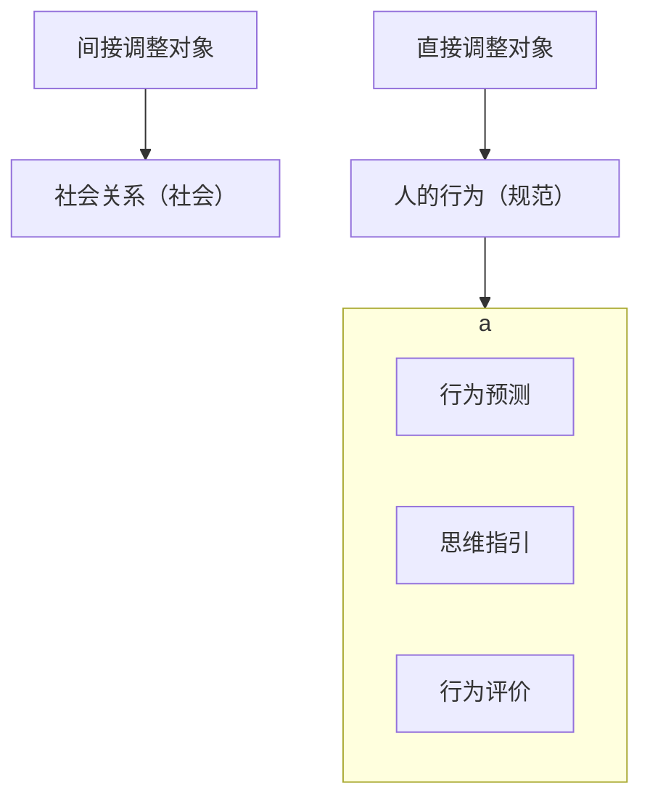

# 【考点摘要】
本节较为简单，重点掌握法律的三个规范作用及法律对行为的三种评价，记清这些概念即可，多以简答题的形式出现。
# 【法综真题】
2006年名词解释（法律的预测作用）
2008年名词解释（法律的预测作用）
# 【知识点总览】法律的规范作用

# 一、对行为的评价★★★
## （一）评价结果
- 法律作为一种行为准则，是判断、衡量人们的行为是否合法的标准和尺度。法律的评价作用是发生于人们作出一定的行为之后，是人们在事后对某一行为的合法性、有效性所作的判断。运用法律对人们的行为进行评价，会得出三种结论：
	- 第一种是被评价的行为系合法行为，即该行为符合法律的规定，是法律所允许的行为；
	- 第二种是被评价的行为系违法行为，即该行为违反法律的规定，是法律禁止的行为；
	- 第三种是被评价的行为系中性行为，即该行为没有被纳入法律的调整范围之内，法律既为允许也未禁止。
## （二）法律规范与其他规范的作用
任何社会规范都是评价人的行为的标准，但他们各自所包含的评价标准及评价的侧重点是不一样的，因此依据不同的社会规范对同一行为进行评价，得出的结论可能不一致。拿送律和道德来说，他们的评价标准即各自所包含的价值取向就不一样，法律的核心价值取向是“正义”，道德的核心价值取向是“和谐”。因此，法律评价与道德评价的分歧就在所难免合法的行为不一定符合道德，反过来违法的行为也不一定就违反道德。同时法律评价与道德评价的侧重点也不同。前者侧重于主体的外部行为及其结果，后者侧重于主体的思想动机和情感状态。所以，主体的行为在客观上合法，并不意味着其主观动机就是道德的，反之亦然。可见，对同一行为，法律评价和其他社会规范的评价之间存在着一定的矛盾和冲突，这就提醒立法者在制定法律时要尽量保持法律和其他社会规范之间的协调。法律评价总有其独特之处，法律在任何时候都不可能也不应该与其他社会规范完全一致。在法治社会中，出于法律至上的要求，必须维护法律评价的权威性，反对用其他社会规范的评价排挤法律评价
# 二、对思维的指引★★★
法律通过对人们的行为进行指引、预测、评价、保护和强制的过程中，直接或间接地影响人们的思想，进而影响到人们未来的行为选择。法律作为国家创制的行为规则，是国家所认可的价值观念的“载体”。因此，法律调整人的行为的过程，就是法律价值观作用于人的思想的过程。

- 法律实施会影响人们的思维方式和习惯。法律的实施包括两种形式：
	- 一是法律的遵守，即人们自觉按照法律的规定办事；
	- 二是法律的适用，即有关国家机关运用法律管理社会或处理案件。在法律的实施中，法律总作为一种精神力量对人们的思想和以后的行为发挥着巨大影响。
# 三、对行为的预测★★★
人们根据法律的规定，可以预先推测出，在特定情况下别人将会如何行为以及自己将会如何行为。

法律的预测作用，是法律秩序得以建立的前提。正因为人们根据法律的规定，可以预测到一定行为是否合法、会产生什么样的法律后果，所以，才会努力选择合法行为。在现代国家，法律必须向社会公开，这样，人们在作出一定的行为之前，就有机会事先预计到行为的性质及后果。这不仅是发挥法律预测作用的需要，也是法律文明的必然要求。
# 四、强制作用
法律的强制作用体现为法律对违法行为的惩罚。惩罚是法律基于国家强制力的特性而产生的，是法律这种社会调整方式特有的属性。同时,对违法犯罪行为进行惩罚，维护社会秩序，是社会管理所必需的。通过对违法犯罪行为的惩罚，明确社会行为的界限和后果，可以给公民和组织以明确的信号，从而防止违法犯罪行为的发生。

法律的强制作用是任何法律都不可或缺的一种规范作用。当没有出现违法犯罪行为时，法律的强制作用隐藏在法律后，而一旦出现违法犯罪行为，有关的国家机器就会运转起来,借助国家强制力对违法犯罪行为人进行惩罚。所以，法律的强制作用属于法律实施的最后保障是最后会岀现，但却是必要的,也是必需的。
## {增补说明}
法律强制作用为新增知识点，熟记，原笔记没有。