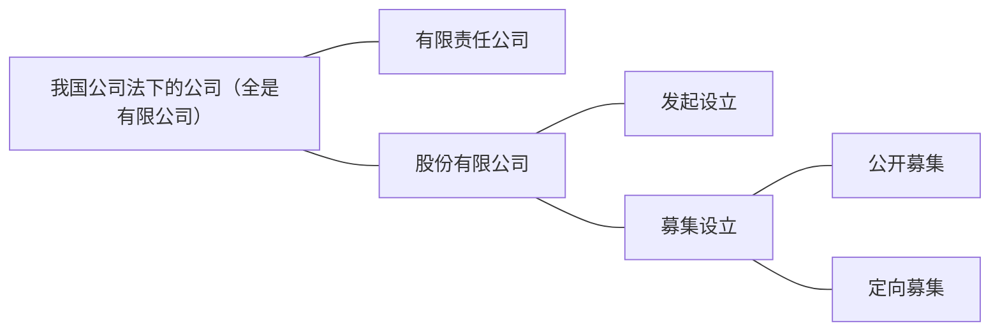
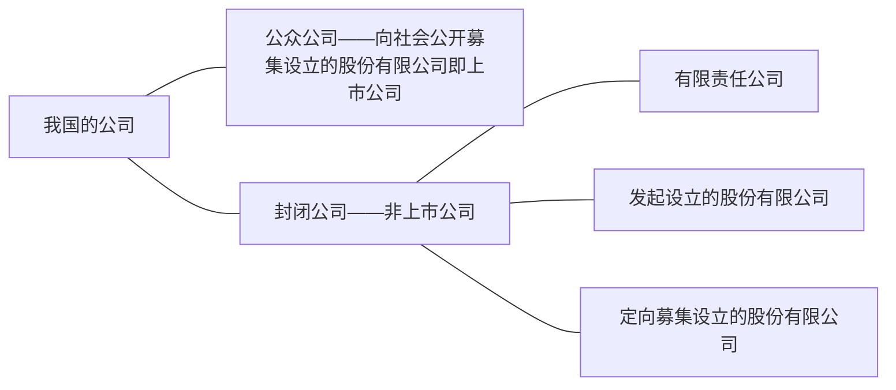

公司的种类很多，看起来令人眼花缭乱，其实无非是从不同的角度对公司所做的分类，有法律上的、学理上的、不同国家不同时期的，等等。了解这些分类，熟悉表达各种类型的名词术语，可以方便公司法的学习。

（一）按财产责任分，公司分为有限、无限和两合三大类。这是最重要的公司分类。有限公司的股东以其出资额为限对公司或公司债务负有限责任；无限公司的股东对公司债务负无限责任；两合公司部分股东负有限责任，部分股东负无限责任。

我国现行公司法只规定有限公司，没有规定无限公司和两合公司。该法规定“公司是企业法人，有独立的法人财产，享有法人财产权。公司以其全部财产对公司的债务承担责任”（第3条第1款）。可见，在我国公司法之下的公司全部都是有限公司。有限公司又进一步分为有限责任公司和股份有限公司（第2条）。“有限责任公司的股东以其认缴的出资额为限对公司承担责任；股份有限公司的股东以其认购的股份为限对公司承担责任”（第3条第2款）。有人据此将有限责任公司和股份有限公司的差别定义为前者的出资不分为等额股份，后者的出资划分为等额股份。其实，有限责任公司的投资额同样可以而且经常划分为等额股份，因为分为股份后计算比较方便。用是否分为股份来区分有限责任公司和股份有限公司是肤浅的和不正确的。

我国公司法还将股份有限公司分为发起设立的和募集设立的两个小类（第77条）。发起设立，是指由发起人认购公司应发行的全部股份而设立公司。募集设立，是指由发起人认购公司应发行股份的一部分，其余股份向社会公开募集或者向特定对象募集而设立公司。所以，我国公司法对公司所作的分类如图所示。

无限公司也叫无限责任公司，其全体股东承担无限连带责任，本质上与合伙相同；差别是非本质性的，例如，法律要求登记注册，对注册资本也有要求，因而相对于合伙更具有法定性，等等。

两合公司继无限公司之后出现，是部分股东对公司债务负无限责任，其他股东负有限责任的公司。一般说来，负有限责任的股东都是消极投资者，不参与公司的经营管理；凡是积极参与公司经营、对公司经营有决策权的股东都要负无限责任。两合公司与有限合伙或隐名合伙基本相同，现在已经被有限合伙取代。因此，两合公司基本上是一个历史现象。

在两合公司流行的时期，还出现了股份两合公司。它属于两合公司的一个分支，因而在本质上与一般的两合公司是完全相同的，只有一些非本质性的差异，如规模大一些，股份的划分清楚些、规范些，且更具流通性，法律对其注册资本的要求有所不同，等等。

（二）按有无公开义务分，有公公司（public company）和私公司（private company）， 这主要是英国的叫法，在美国，一般称公众公司（public corporation）和封闭公司（closecorporation）。[^1]这虽然只是英美法上的分法，但是影响很大，遍及全球。公众公司向社会公众公开发行它的证券，因而法律要求它公开财务和经营方面的重要信息及各种风险因素；封闭公司不向社会公众公开集资，所以没有公开公司信息的义务。一般说来，公众公司的规模较大，封闭公司的规模较小。[^2]

[^1]:显然，英美两国对于public company的称呼是相同的。之所以将同一个英文名称翻译为不同的中文名称，是考虑到音节的协调，公与私对应，公众与封闭对应。公众公司也叫开放公司。
[^2]:理解这个大小的说法要打点折扣，不能绝对化，因为有的封闭公司规模也很大，超过许多开放公司。

公众公司在公开发行证券之后一般都会申请让其证券在证券交易所挂牌交易。如果申请获得批准，公司就成为上市公司。市是市场的意思，具体指证券交易所的交易大厅，在那里挂牌就是上市了。在我国，所有公开发行证券的公司都会上市。

以公开义务为标准的分类比较客观严谨。相比之下，我国对有限责任公司和股份有限公司的划分就不够严谨，尤其是发起设立的股份有限公司，本来应当属于有限责任公司，其与有限责任公司的区分完全是人为的，比如注册资本大小不同[^3]，设立须经政府批准的要求不同，[^4]股东投资是否分为等额股份，[^5]等等。[^6]此外，定向募集设立的股份有限公司其实与有限责任公司也差不多，无非是有些公司的股东人数较多而已。如图所示，按照公开义务对我国公司法规定的公司重新分类如下，以供比较。

[^3]:以前公司法规定了公司注册资本的最低限额。但是以此来分类却没有道理，因为差别纯属人为，而非公司的自然属性。事实上，有些有限责任公司的注册资本远远超过法定的股份有限公司注册资本最低限额。2013年底，我国修改《公司法》，取消了注册资本最低限额的要求，这一人为的差别自然消失，学者们即不能以此作为分类标准了。
[^4]:1993年公司法规定设立股份有限公司须经省级人民政府批准，设立有限责任公司不需要这样的批准。2005年公司法修改时废除了设立股份有限公司须经省级人民政府批准的要求。
[^5]:有人机械地从公司法的字面规定进行推敲，认为股份有限公司的出资分为等额股份，股东按持有股份的多少投票；有限责任公司的出资不分股份，股东按出资比例投票。以此作为区分两类公司的一个标志。其实，有限责任公司的投资同样可以划分为等额股份，而且在事实上很多有限责任公司的资本也确实是分为等额股份的，划分的原因是计算方便，1000股是个常用数。
[^6]:上述三点区分曾经在我国公司法学界流行一时，反映出当时整体学术水平的低下。

（三）按内部管理分，有总公司与分公司。一个公司生意做大之后，往往在许多地方有业务，需要在那些地方设立分支机构，这些分支机构就是分公司，相应地公司自身就成为总公司。分公司作为总公司的分支机构，并不是独立的法人，也没有董事会，只有总公司任命的经理。不过分公司也需要在当地工商局登记注册，而后才能以自己的名义对外订立合同、起诉和应诉。《公司法》第14条第1款规定：“设立分公司，应当向公司登记机关申请登记，领取营业执照。分公司不具有法人资格，其民事责任由公司承担。”这所说的公司，指的就是总公司。

（四）按控股关系分，有母公司与子公司。母公司是子公司的股东，持有子公司的多数股份，对子公司拥有控股权；控股权意味着控制权，即控制子公司各种重大决策的权力，其中最关键、最核心的是选举或者任命子公司多数董事的权利。

英国人对母子公司关系的认定做过探索。该国1985年《公司法》原先只认持股50％以上的为母子公司。结果，一个没有控制权的公司因为持股50％以上就被认定为母公司，而一个有控制权的公司却因为持股不到50％而被认为不是母公司，从而逃脱了相应的责任。之所以出现这种情形，是因为公司发行了多类普通股，各类股票的投票权不同，所以50％的持股份额并不必定有50％的投票权，而持股少于50％的有时候投票权却大于50％。1989年公司法对1985年《公司法》第736条做了修改，把投票权作为认定母子公司关系存在与否的标准：（1）母公司持有它的多数投票权；（2）母公司是它的一个股东并且有权任命或撤换它的董事会的大部分成员；（3）母公司是它的股东并且能够单独或者与其他股东联合起来控制它的多数投票权；则可以认定该公司为子公司。

由于我国还没有出现一个公司发行多类普通股的现象，所以控股关系相对简单，主要取决于持股份额。如果持股超过50％，就必定有控股权。但这并不意味着持股不到50％的就一定没有控股权。因为在股份十分分散的情况下，持股20％～30％就显得相对集中，就可能取得控股权。基于这样的现实，我国[[中华人民共和国公司法#^ordvd6|《公司法》第216条]]第2项将控股关系分为绝对控股与相对控股两种情形。持股超过50％的为绝对控股；持股不到50％但“表决权足以对股东大会的决议产生重大影响”的为相对控股。这里所说的对股东大会产生重大影响，主要指能够选举半数以上的董事。

由此可见，一个公司持有另一个公司的股份并不自然成为该另一个公司的母公司。只有持股达到控股地位的时候才能成为母公司。

子公司虽然受母公司控制，但是享有独立的主体资格，是法人。这是子公司与分公司的最大区别。总公司可以对分公司直接下命令；母公司对子公司的控制却只能通过它所选举的董事去实现，而不能由它的行政系统直接向子公司下达命令。

母子公司关系的由来，有的是由一个公司收购另一个公司的股份达到多数而形成的，更多的则是在设立时就形成的。《公司法》第14条第2款说：“公司可以设立子公司，子公司具有法人资格，依法独立承担民事责任。”公司作为法人，像自然人一样具有独立的民事主体资格。自然人可以设立公司，公司也可以设立公司。公司设立的公司是子公司，两者之间自然形成母子公司关系。这时母公司往往持有子公司的全部股份。母公司持有全部股份的子公司叫作全资子公司。

一个公司可以设立多家子公司，子公司与子公司之间是姐妹关系。子公司也可以再设立子公司，从而出现孙公司、重孙公司，等等。由此可以形成一个公司集团。公司集团也叫集团公司，本身不是一个独立的公司，没有法人资格。但是在集团公司的内部，总有一家公司处于统治和支配的地位。一般地，这家处于支配地位的公司就是最初设立子公司的母公司，就像一个家族最老的祖宗一样。经常，集团公司内部还会出现交叉持股、循环持股等现象，使持股关系变得十分复杂，比如爷爷公司持有孙公司的股份，重孙公司持有叔叔公司的股份等等。这时候最重要的还是要看控股关系，即谁在起主导作用。

（五）关联公司。集团公司是由一个核心母公司持有一个或多个子公司以及孙子公司等形成的集团。集团公司内部各公司之间都具有关联关系。具有关联关系的公司叫作关联公司。但是除了这种集团内部具有“血缘”关系的关联公司之外，具有密切而稳定的业务联系的公司，如长期的原材料供应商等，也都称为关联公司。此外，持有较多股份，但是还没有达到控股地步的公司与被持股公司之间也有关联关系。可见，关联公司强调的是公司之间长期、稳定、密切的联系，其含义相对广泛和含糊。[^7]

[^7]:因为孤立使用含义模糊，所以当立法用到该词时，立法者会对它在该部法律中的特定含义作专门的解释。例如，美国1940年《投资企业法》定义“关联企业”为直接或间接持有其5％以上有投票权的股份的企业。我国《公司法》没有使用关联公司一词，只用了“关联关系”一词，所以只对关联关系在该法中的含义作了解释。见正文下段。可见，关联一词在不同的法律中使用时含义会有所不同。

当代公司制度发达，公司与公司之间的各种关联关系也变得越来越复杂，成为许多专家学者的研究对象，也引起了立法机构的重视。我国《公司法》第217条第4项专门对关联关系下了如下定义：“关联关系，是指公司控股股东、实际控制人、董事、监事高级管理人员与其直接或者间接控制的企业之间的关系，以及可能导致公司利益转移的其他关系。但是，国家控股的企业之间不仅仅因为同受国家控股而具有关联关系。”[^8]（六）按信用基础分，有人合公司与资合公司的说法。信用一词的含义很广泛，但是在生意场上，主要指借钱，别人肯不肯借钱给你。无限公司是典型的人合公司，因为无限公司的股东对公司债务负无限连带责任，别人发放贷款时除了考虑公司本身的经营状况之外，更主要是看股东个人的富裕程度和财产可靠程度。因为公司信用依赖于股东个人的信用，所以称为人合。上市公司是典型的资合公司，因为股东对公司债务负有限责任，债权人只看公司的资本是否雄厚，不看公司股东是否富有。

[^8]:这个定义还是比较狭义的，因为它既没有包括诸如原材料供应商等非持股关系，也没有包括非控股持有。当然，如果考虑它的兜底规定“可能导致公司利益转移的其他关系”，那就很广义了。《企业会计准则第36号—关联方披露》从会计计账的角度对企业之间的关联关系作了详细的规定。

不过人合和资合也不绝对。公司都具有资合性。即使是无限公司，债权人首先看的也是公司的财力而不是股东个人的财力。公司一旦破产，债权人也是首先瓜分公司的资产，瓜分完了还不够才向股东索要债权余额。有限责任公司的股东对公司债务负有限责任，但是债权人在放债时往往要求股东个人提供担保，这时的公司就依赖于股东个人的信用了。所以有限责任公司的人合性明显强于上市公司。

除了描述公司的对外信用之外，“人合”“资合”两词还可以形容股东之间的合作关系。合伙人之间、小公司的股东之间往往是互相信任的朋友关系，互相依赖，以此为基础的企业或公司是人合性质的；上市公司的股东之间互不相识，仅因为投资于同一家公司才共为股东，那就完全是资合关系。

人合、资合的说法是纯学理性的，立法上并没有这样的分法。

（七）按法源分，有一般法上的公司和特别法上的公司。这里的一般法指《公司法》，特别法指《公司法》以外的能创制公司的组织法，如《保险法》《银行法》以及《证券法》第六章对证券公司的规定等等。凡是按照《公司法》成立的公司都是一般法上的公司；按照某一特别法成立的公司是特别法上的公司。特别法上的公司在特别法没有具体规定的时候依然适用公司法。

（八）按国籍分，有本国公司、外国公司和跨国公司。认定国籍的标准各国不尽相同，住所、登记国、设立人、实际控制等皆可成为认定标准。我国采取的是“住所＋登记”标准：凡是按照我国法律在我国境内登记设立的公司都是中国公司。因此，三资企业（中外合资、中外合作、外资）都是中国公司，对中国来说都是本国公司。

这样，外国公司就只能指境外的公司在我国境内设立的分公司。因为分公司没有主体资格，是外国公司在我国境内的分支机构，所以我们称它们为外国公司。如果是外国公司在我国境内设立的子公司（三资企业中的外资企业），那就不是外国公司，而是中国公司了。

跨国公司的含义比较松散。如果一个公司在本国营业的同时，又在其他国家设立分公司，那是名副其实的跨国公司，因为同一个公司在多个国家做生意。但是更多的时候，是一个公司在其他国家设立子公司。从法律上看，它们都是互相独立的实体，各为所在国的本国公司；但是从经济现实上看，它们属于同一个公司集团。习惯上，人们把这样的公司集团也叫作跨国公司。

（九）按所有制分，有国有公司和民营公司。国有公司是由国家控股的公司，民营公司则是由私人控股的公司。我国自1956年完成对资本主义工商业的社会主义改造到20世纪80年代的经济改革之前没有公司制度，只有工商企业，分为国家所有制、集体所有制、个人所有制。国家所有制企业叫作国营企业；个人所有制企业叫作个体工商户。个体工商户数量很少，规模很小，主要是一些手工作坊，只收一两个学徒，没有雇工。国营企业无论在数量上还是规模上都在国民经济中占据绝对的统治地位。后来由于改革的需要，国营企业改称国有企业，意思是所有制不变，但是经营管理权可以下放，国有的不一定国营。1994年中央决定对国有企业进行公司制改造，很多国有企业被改制成国有公司。1999年中央又决定对部分国有企业进行所有制改革，允许私人和其他法人参股到原来纯国有的公司中，形成了所有权的多元化。现在，国有公司中有的是国家独有的，有的是多方持股但由国家控股的。另一方面，民营公司中也可能有地方政府的股份。因此，以前清一色按所有制划分的意义正在弱化。

（十）按股东数量分，有一人公司，即只有一个股东。一人公司是在西方发达的市场经济条件下，个人为了利用有限责任保护其家庭财产而设立的。典型例子如纽约的出租车司机成立的一人公司，用以保护其个人财产。我国在2005年通过公司法的修改首次承认了一人公司。

对于一人公司，人们首先想到的是只有一个自然人股东。但是在母子公司关系中，全资子公司其实也是一人公司，因为它的股东只有一个。只是该股东不是自然人，而是法人。宽泛地说，国有独资公司也是一人公司，因为股东只有一个—国家。但是按照我国公司法的体例，国有独资公司不算作一人公司，而单称国有独资公司。