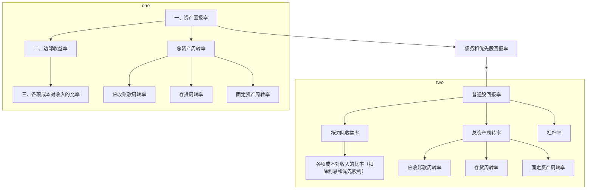

反映赢利能力最重要的指标是资产回报率；其次是普通股回报率。
# 一、资产回报率
资产回报率（利润／资产）表明公司运用资产产生利润的效率和能力，与资金来源（借来的还是股东投资的）无关。通俗地说，它表示在不借债因而不付利息的情况下，1元钱的资产能够创造出多少税后利润。

$$\frac{净利润+利息支出-省税部分}{平均资产}$$

所谓省税部分是指因支付利息而少交的所得税。资产回报率（利润÷资产）中的利润是税后利润，而利息是在税前扣除的。为了还原为无债状态下的税后利润，在加上了全部利息支出之后，必须从中减去对利息收入的应税部分，即公式中所说的省税部分，因为如果不付利息，这笔钱是要作为所得税上缴给国家的。换句话说，加到净利润上的利息必须是除去了所得税效应之后的利息。以样品公司第四年度的数据为例（见[[第一节 财会报表#^ud8li0|表3-1]]、[[第一节 财会报表#^uhd4o5|表3-2]]）。净利润为60万元，利息为16万元，税率为30％，那么省税部分便是（16x30％）万元。平均资产是指年初和年末资产的平均值，年初总资产为520万元，年末总资产为650万元，所以：

$$\frac{60+16\times（1-30\%）}{\frac{1}{2}\times（520+650）}=12.2\%$$

这就是说，每1元钱的资产，公司经过这一年的努力赢得了0.122元的利润。如果你对公式中“$利息支出-省税部分$”的含义感到费解，那么也可以换一个公式来表达：

$$\frac{（税前净收益+利息支出）\times（1-税率）}{平均资产}$$

代入数字得：

$$\frac{（86+16）\times（1-30\%）}{\frac{1}{2}\times（520+650）}=12.2\%$$

其计算结果是一样的。[^1]

[^1]:由于表格中四舍五入取整数，所以计算结果可能会稍有差异。但是如果取精确的小数或分数，计算结果就会完全一样。

资产回报率是企业赢利能力的集中反映。对股东来说，只有当它高于利率成本时，借钱才合算，风险才小；而对债权人来说，也只有当它高于利率成本时，债权才有充分的保障。

资产回报率笼统地显示企业资产的创利能力，但是不能更深入具体地揭示为什么会有这种能力，哪些因素在起作用。为了了解这些深层次的原因，必须对资产回报率进行分解：

$$资产回报率=边际收益率\times总资产周转率=\frac{净利润+利息-省税}{毛收入}\times\frac{毛收入}{平均资产}$$

第二年、第三年和第四年的资产收益率的分解

||$\frac{净收益+利息-所得税所省额}{平均总资产}=\frac{净收益+利息-所得税所省额}{收入}\times\frac{收入}{平均总资产}=$|
|:---:|:---:|
|第二年|$\frac{16+5-1.5}{\frac{1}{2}（250+400）}=\frac{16+5-1.5}{210}\times\frac{210}{\frac{1}{2}\times（250+400）}$ $6\%=9.3\%\times0.65$|
|第三年|$\frac{34+10-3}{\frac{1}{2}(400+520)}=\frac{34+10-3}{310}\times\frac{310}{\frac{1}{2}（400+520）}$ $8.9\%=13.2\%\times0.67$|
|第四年|$\frac{60+16-4.8}{\frac{1}{2}（520+650）}=\frac{60+16-4.8}{475}\times\frac{475}{\frac{1}{2}（520+650）}$ $12.2\%=15.0\%\times0.81$|

## 1.边际收益率分析
边际收益率又叫边际利润率，它表示每1元钱的销售收入中包含了多少利润，另一方面看也就是多少成本（所以用边际成本率也一样）。因为利润就是从总收入中减去各项成本开支后剩余的部分。开支少了，利润就高了。可见，边际收益率可以测量公司控制支出与增加收入的能力，或者说控制支出占总收入的比例的能力。在总收入相同的情况下只要能减少支出，就可以增加赢利。要找出边际收益率变化的原因，就必须检查产生收入的各项成本费用。

第二年、第三年和第四年的净收益和费用在收入中所占比率（%）

|科目\年份\日期（截至本年度12月31日）|第二年|第三年|第四年|
|:---:|:---:|:---:|:---:|
|销售收入|100.0|100.0|100.0|
|减：营业费用||||
|销售货物成本|56.7|57.7|58.9|
|销售费用|17.1|13.6|11.2|
|管理费用|7.1|5.5|4.6|
|折旧|5.7|4.5|3.8|
|合计|86.6|81.3|78.5|
|支付所得税与利息前的收入|13.4|18.7|21.5|
|上项税率为30%的所得税|4.1[^2]|5.5|6.5|
|支付利息前的收入除去相关所得税的效应|9.3|13.2|15.0|
|除去所得税效应的利息费用|1.7|2.2|2.4|
|净收益|7.6|11.0|12.6|
^8r7s87

[^2]:第二年税前息前的毛收入为23＋5＝28（万元）。所以无债状态下的所得税占比28÷210＝4％；或者13.4％x30％＝4.02％。0.1％是使用约数产生的误差。之所以如此排列是为了彰显13.4％这税前息前毛收入占比的具体构成，或者说利息、所得税各自在毛收入中所占的份额。

[[第二节 赢利分析#^8r7s87|表3-5]]将每一项成本以及净收入与销售收入进行对比分析，从中可以看到，样品公司在这三年中销售成本基本稳定，稍有增加，其边际收益率改进的主要原因是销售（广告）、管理（行政）和折旧的费用在减少，从而引起了边际收益率的提高。行政管理费用的减少是好事。但是广告的减少有可能会影响到将来的销售规模，也有可能是由于固定的投入因销售规模的扩大而分散了相对的支出，比如在一定的广告覆盖区域内增加了销售；折旧的减少有可能意味着在生产与销售扩大时厂房和设备没有扩大，因而会邻近厂房和设备承受的极限，也有可能是因为规模经济的效应，即原有的厂房本来就允许有扩大规模的生产。具体什么原因需要实地调查清楚，因为这些原因在会计账面上是反映不出来的。账面上的数字只提供入门的向导，入了门就要弄清真实的情况。此外，所售货物的成本逐年增加，可能是因为增加销售而降价所致，也可能是原材料涨价而产品不相应涨价所致，还可能因存货的增加和积压毁坏引起。具体原因也需要调查清楚。
## 2.总资产周转率分析
总资产周转率测量企业在一定的资产投资规模上创造收入的能力，换句话说，测量企业在一定收入水平上控制投资规模的能力。它取决于分资产周转率，包括应收账款周转率、存货（库存）周转率和固定资产周转率。[[第二节 赢利分析#^8l55vc|表3-6]]列出了样品公司第二、三、四年度的总资产周转率及各分资产周转率。

第二年、第三年和第四年的资产周转率

||第二年|第三年|第四年|
|:---:|:---:|:---:|:---:|
|总资产周转率|0.65|0.67|0.81|
|应收账款周转率|6.8|7.6|7.8|
|存货周转率|5.4|4.7|4.3|
|固定资产周转率|0.8|0.8|1.1|^8l55vc
### （1）应收账款周转率分析
$$应收账款周转率=总销售额\div平均应收账款$$

该等式反映了应收账款转变为现金的速度。不妨假设全部账面销售，即赊账销售（有部分现金销售也一样，因为现金销售无非是加速了应收账款的周转）。仍以样品公司第四年为例，$475\div\frac{1}{2}（46+76）=7.8倍$，这就是说，应收账款在一年内周转了7.8次。通常用应收款项存在的平均天数来表示周转率，365天÷7.8＝46.8天，也就是说，平均每笔销售在售出之后1.5月收到现金。接着，我们就要看销售合同规定的条件，如果规定45天付款，说明情况不错，顾客信誉良好。如果是30天付款，那就说明收款不及时，应该检查公司的讨债努力及顾客的信誉程度。
### （2）存货周转率分析。
$$存货周转率=所售货物成本\div平均存货$$
以第四年为例，$280\div\frac{1}{2}\times（46+83）=4.3倍$，即存货在一年中周转了4.3次，说明货物在销售之前的平均库存时间是84.9天（365÷4.3）。存货周转率是公司经营效率的一个重要指标。对它的审计要考虑两方面的因素：一方面，对公司来说，总是货物销售得越多越好，存货的积压越少越好，所以存货周转率的提高意味着存货投资的减少和存货资产的有效利用。另一方面，公司也不希望出现存货短缺的情形，因为这时候存货周转率的提高意味着失掉客户。公司应该有多少存货？这取决于很多因素。行业的种类和一年中的季节都与此有关。如中秋节前夕食品店储存了大量的月饼是好事，但是如果在中秋节之后还有这么多的月饼储存就不好了。端午节的粽子也一样。所以应根据行业特点和企业自身的特点保持适度的存货水平，而不能一味地追求周转率的提高。

有时候，存货周转率也可用“销售额÷平均存货”来表示，只要销售与其货物成本之间的比例稳定，就不影响分析，只是销售额不能反映货物的平均库存时间。
### （3）固定资产周转率分析。
$$固定资产周转率=总销售额\div平均固定资产$$

该等式反映了销售收入与土地、厂房、设备这些固定资产的投资规模之间的关系，或者说一定规模的固定资产能够支持多少销售收入。仍以样品公司第四年为例，$固定资产周转率=475\div\frac{1}{2}（420+479）=1.1倍$，即固定资产在一年内周转了1.1次，表示每1元钱的固定资产投入产生（支持）了1.1元的销售收入。

对固定资产周转率的审计必须十分小心。因为固定资产的投资常在投产前几年就发生了，因此，周转率低可能是由于公司在扩张，为将来的发展奠定基础。反过来，如果公司产品近期并不看好的话，也可能减少对固定资产的投资，从而提高固定资产周转率。具体什么情形需要调查清楚。

[[第二节 赢利分析#^8l55vc|表3-6]]显示：样品公司的总资产周转率在第二、三年度比较稳定，第四年迅速提高。其中应收账款周转率在三年中稳步提高，这一定是由于对客户的信誉作了更为小心的筛选，或者催款工作做得更好了。存货周转率不断下降，这与所售货物成本的微妙上升结合起来说明了存货积压或过期的可能。第四年总资产周转率的大幅度提高主要是由于固定资产周转率的提高。现金流量表显示对固定资产的投资在这三年中逐年下降，这可能是固定资产周转率上升的主要原因。对固定资产投资下降的原因应当调查清楚。
# 二、普通股回报率
普通股回报率反映对普通股投资的回报，是股东最关心的数据。它等于净利润除以平均普通股总值。普通股总值＝面额（股本）＋资本公积＋盈余公积；平均指年末与年初的平均。

$$样品公司第四年度的普通股回报率=\frac{净利润-优先股红利}{平均普通股总值}=\frac{60-0}{\frac{1}{2}\times（360+410）}=15.6\%$$

这就是说，股东投资1元钱，经过公司1年的经营，在年末获得了1角5分6厘的利润。

像资产回报率一样，普通股回报率同样测量企业的赢利能力。但与资产回报率不同，普通股回报率将资产的来源，特别是股东的投资考虑了进去，这样就将营业、投资、筹资三方面的活动结合了起来。按照上述公式计算，样品公司第二、三、四年的普通股回报率分别为7％、10.3％、15.6％。比较同时期的资产回报率6％、8.9％、12.2％可以看出，虽然两个率在这三年中都在迅速增长，但是普通股回报率的增长速度明显快于资产回报率。这是什么原因呢？两者之间究竟存在着什么样的关系？下面重点探究资产回报率与普通股回报率的关系。

资产回报率反映的赢利是在向任何一个资本提供者支付报酬之前的。赢利必须在不同的资本提供者之间分配：债权人获得合同规定的利息；优先股股东（如果有的话，样品公司没有优先股）获得票面上规定的优先股红利；剩余的部分属于普通股股东。

普通股回报率之所以高于资产回报率，是因为资产回报率大于税后实际利率［利息x（1-税率）÷年平均债务］。前面说过，资产回报率与资金来源无关，股东投资形成的资产每元钱创造了这么多利润，负债形成的资产每元钱也创造这么多利润。如果借来的钱创造的利润高于实际利息支出（即资产回报率大于税后实际利率），高出来的部分归普通股股东所有，[^3]就将普通股回报率推到了资产回报率之上。以样品公司第四年度为例，资产回报率为12.2％，而负债的税后利息费用仅为5.6％，其计算为：16x（1-0.3）÷（160＋240）÷2。二者相差6.6％。该差额归属于普通股股东，拔高了普通股回报率。

[^3]:作为对他们所承担的较大风险的回报，因为股东的风险大于债权人。

普通股股东承担了较高的投资风险，其获得较高的回报有其合理性。借债的利息到期必须支付；而普通股股东不但请求权排在最后，而且公司对他们没有确定的支付义务。这种用较高的风险换取潜在的较高的回报的现象叫作金融杠杆。

金融杠杆也叫利用剩余利益赚钱，就是通过举债和发行优先股来提高对普通股股东剩余利益的回报。只要借来资本的产出高于它的成本，普通股股东获得的回报就会增加。但是如果利息成本高于资产的回报，普通股回报率就会降到无债水平之下，也即资产回报率之下。为了说明金融杠杆的这种双刃剑作用，[[第二节 赢利分析#^xb7nk8|表3-7]]列举比较了两个公司：负债公司A和无债公司B。两公司各有资产10万元，没有发行优先股；但是A借债4万元，利率10%；B不借债，全部资产由股东投资；所得税税率都是30%。

杠杆率对普通股回报率的影响（税前收入的所得税税率为30%）

|公司类型|（长期权益）年利率10%的长期借款/元|（长期权益）所有者权益/元|税后利前利润/元|税后利息费用/元|净利润/元|总资产回报率/%|普通股回报率/%|税前利前利润分别为/元|
|:---:|:---:|:---:|:---:|:---:|:---:|:---:|:---:|:---:|
|（利好年份）负债公司|40000|60000|10000|2800|7200|10.0|12.0|14286|
|（利好年份）无债公司||100000|10000||10000|10.0|10.0|14286|
|（一般年份）负债公司|40000|60000|7000|2800|4200|7.0|7.0|10000|
|（一般年份）无债公司||100000|7000||7000|7.0|7.0|10000|
|（萧条年份）负债公司|40000|60000|4000|2800|1200|4.0|2.0|5714|
|（萧条年份）无债公司||100000|4000||4000|4.0|4.0|5714|
^xb7nk8

在利好年份，两个公司在税前和付利息前的毛利润都是14286元，B无债，按30％的税率交税后净利润是1万元，资产回报率10％。A在去除了所得税效应后的资产回报率也是10％（见前面关于资产回报率的计算公式）。但是普通股回报率则不同：B因为无债，资产回报率等于普通股回报率等于10％；A借了4万元要付4千元利息，而利息支出是成本，可以从税前利润中扣除，剩下10286元税前利润，按30％税掉3086元，剩7200元，普通股回报率是
$\frac{7.2}{60}＝12\%$。金融杠杆增加了对股东的回报，因为长期债权人贡献的资本的资产回报率是10％，而税后的实际利息费用是7％，其公式为：（1-30％所得税率）x10％利率。两者相抵后，借来的资本创造了3％的净利润。净利润归股东所有，于是就拔高了普通股回报率。

可见在利好年份中，只要资产回报率大于借款利息的税后成本，就可以通过举债来提高普通股回报率。债务比例越高，普通股回报率也越高。这么说大家都要借债了，或者干脆不要自己掏钱，完全举债经营。这当然是行不通的，因为随着负债的比例越来越高，债权人的风险也越来越大，就会要求更高的利率，最后会达到一个平衡点。在上述例子中，如果负债的比例增加到一半，即5万元的话，普通股回报率会达13％。但是增加的这1万元债是否利率还是10％可能会是一个问题。假如债权人要求14％的利率，那么即使在利好年份，杠杆率的正面作用也不明显了。一般说来，大公司的负债比率都在30％～60％之间。

[[第二节 赢利分析#^xb7nk8|表3-7]]还列出一般年份和萧条年份的情形。在一般年份中，由于去除所得税效应后的利率等于资产回报率，所以举债与不举债持平，普通股回报率都是7％；而在萧条年份，由于去除所得税效应后的利率（7％）高于资产回报率（4％），即举债的成本高于其产出，所以普通股回报率下降到2％，低于资产回报率。可见，金融杠杆是一柄双刃剑。它可以在利好年份提高所有者的回报率，也可以在萧条年份里降低所有者回报率。[^4]因此股东在利用金融杠杆赚钱的同时也承担了相应的风险。

[^4]:举一个简单的例子就可以说明金融杠杆的放大作用。假定一个企业借了1000万元债，毛利润是44万元，在支付了40万元的利息之后还有4万元留给普通股。但是如果它的赢利能力增长10％，即有48.4万元毛利润，就会有8.4万元留给普通股，比4万元长了110％。反过来，如果赢利降低了10％，普通股不但什么也得不到，而且赢利还不够支付利息，需要使用历年的留利。这是高债率股票的潜在风险，谨慎的投资者一般都会远离这样的股票。

像资产回报率一样，普通股回报率还可以进一步分解为：
$$净边际收益率\times总资产周转率\times杠杆率=\frac{净利}{总收入}\times\frac{总收入}{年平均总资产}\times\frac{年平均总资产}{年平均普通股总值}$$

总收入指即销售收入，也就是毛收人。净边际收益率表示毛收人在扣除了所有的营业成本、债务利息、所得税、优先股红利之后剩余的部分占毛收入的百分比。对该率的分析可参照前面对边际收益率的分析（二者只差利息因素）。总资产的周转，如前所述，是指每1元的资产所产生的收入。决定总资产周转率的各分资产周转率前面已经分析过了。杠杆率表示普通股股东提供了多少资本（在总资产中）。该率越高，普通股股东提供的资本就越少，债权人和优先股股东提供的份额就越大。所以杠杆率高表示杠杆的使用强度大。

[[第二节 赢利分析#^gz9dg2|表3-8]]列出了样品公司第二、三、四年度的普通股回报率、净边际收益率、总资产周转率和杠杆率。

普通股回报率的分解

||$普通股回报率=净边际收益率\times总资产周转率\times杠杆率$|
|:---:|:---:|
|第二年|$7.0\%=7.6\%\times0.65\times1.4$|
|第三年|$10.3\%=11.0\%\times0.67\times1.4$|
|第四年|$15.6\%=12.6\%\times0.81\times1.5$|
^gz9dg2

从[[第二节 赢利分析#^gz9dg2|表3-8]]可以看出，普通股回报率的提高主要来自于净边际收益率的提高和第四年中资产周转率的提高。杠杆率大致稳定。
# 三、普通股每股赢利
比普通股回报率更常用更通俗的是普通股每股赢利。它等于净利润除以年平均股数。它同样反映对普通股投资的回报，并且直接影响股票的市场价格，所以中小股东对此十分关心。样品公司第四年度的普通股每股赢利为：

$$\frac{净利-优先股红利}{年平均股数}=\frac{60-0}{16}=3.75（元/股）$$

如果公司发行了购股权、可转换债券或者可转换优先股，就应考虑冲淡因素。购股权是普通股的等价物，应视作已经行使而计入总股份数。可转换债券和可转换优先股应视具体情况做具体分析。如果它们的收益率与不可转换的同类证券相比低很多，这就说明它们的主要价值在于转换权，应该把它们视为普通股等价物，算入股份总数。否则就说明转换的可能性不大，不算入股份总数。这时要计算两个率：一个是首要率，即不冲淡率；另一个是冲淡率，即把所有可以转换成普通股的证券全部算作已经转换，在此基础上计算每股赢利。样品公司没有可转换证券，所以只有一个率。

每股赢利有两个毛病：一是忽略了资产的数量。两个比率相同利润相同的公司，效益不一定相同，因为如果一个公司比另一个公司大一倍的话，则大的公司显然低效。二是股份多少不一定。两个资产规模和结构、赢利能力完全相同的公司，如果一个公司发行的股份数是另一个公司的两倍，则每股赢利就会低一半。相比之下，普通股回报率就没有这些缺陷。

每股赢利经常被用来与每股价格比较，于是就有了市盈率。市盈率的确切叫法是价格和赢利之比（P／Eratio）：市价／股÷赢利／股；或者总市价÷年总赢利，行话是“该股票卖赢利的x倍”。两个式子的计算结果是一样的。样品公司第四年末在证券交易所的流通价格是每股40元，所以市盈率为10.67倍
（$\frac{40}{3.75}$）。

审计市盈率时应注意的问题是赢利是否来自正常的营业，有没有营业外的非常收入或损失，因为这些非常收入和损失容易扭曲正常的市盈率。此外，有的企业在亏损年份按照长远的预期市盈率递交报告。对此，应调查盈利有没有实际发生。
# 四、总结
资产回报率和普通股回报率将企业的赢利与产生该赢利所需要的资本联系起来，能够比较客观地反映企业的赢利能力。如[[第二节 赢利分析#^gs0wxa|图3-1]]所示，分三个层次总结了对企业赢利能力[^5]的分析。在第一个最普通的层次上，是企业笼统的赢利能力和杠杆效果；在第二个层次上，笼统的赢利能力测量标准被分解成边际收益率、总资产周转率和杠杆率几个组成要素；在第三个层次上，边际收益率和总资产周转率又被进一步分解，以便对企业赢利变化的原因获得更深入的了解。在实际案子中，还需要以账面分析为引导，对引起赢利变化的具体因素进行实地调查和观察，才能弄清原委，在深层次上掌握企业的真实情况。

[^5]:“→”表示资产回报率与利率、优先股回报率、普通股回报率之间存在着包含关系，因为对全部资产的回报最终是在债权人、优先股股东、普通股股东之间分配的。但是又不能画等号，所以就用“→”表示。

^gs0wxa

___