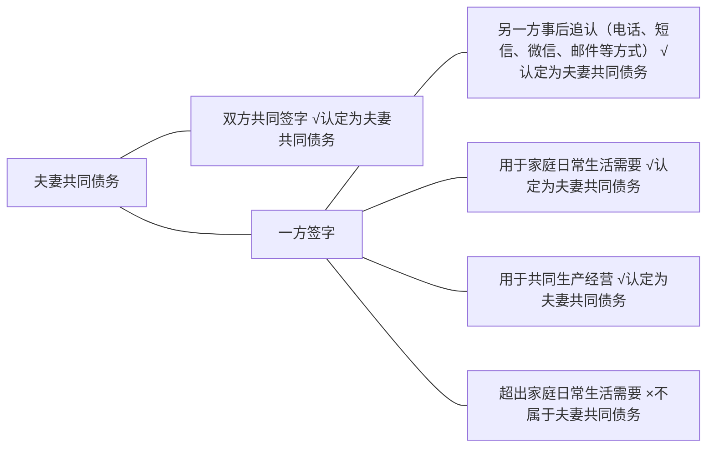

在整个婚姻家庭业务中，离婚案件是占比最大的，另外还有一些离婚后财产纠纷案件，然后是继承类案件，相对数量都较多。离婚和离婚后财产纠纷案件，必涉及夫妻共同财产的分割，而继承案件，由于我国适用婚后所得共同制的法定财产制度，继承时也要先析分出生存配偶的财产，剩余的才是死者遗产，所以，实际上也会涉及一些财产分割的内容。所以说，共同财产分割业务是婚姻家事律师业务的重中之重，是开庭时律师需使用最多的业务技能。

在此，笔者选择将夫妻共同财产分割的整体业务内容拿出来与大家一起探讨，并选择某些重点问题深入分析，同时讨论一些典型案例。
# 一、哪些财产属于夫妻共同财产
## （一）相关法律规定《民法典》
![[法律法规汇编/民商法/民法典/第五编 婚姻家庭#^8rh8as|第1062条]]

《民法典》第1062条列举了哪些财产归夫妻共同所有，是有关财产制度的基本条款。

此条款还规定了夫妻对共同财产，有平等的处理权。当然，对于财产的处理，夫妻还享有日常家事代理权，对此，《民法典》中已有专门的条款规定，即第1060条。同时，《民法典》在第1063条规定了哪些财产为夫妻一方的个人财产：

《民法典》

![[法律法规汇编/民商法/民法典/第五编 婚姻家庭#^zd63x9|第1063条]]
可以说，《民法典》第1062条和第1063条是有关我国财产制度的最基本的内容，整体上规定了哪些财产属于夫妻共有，哪些属于个人所有。相关司法解释都是在这两条的基础上进行的解释。如：

《婚姻家庭编解释（一）》

![[法律法规汇编/民商法/民法典配套司法解释/最高人民法院关于适用《中华人民共和国民法典》婚姻家庭编的解释（一）（2021.1.1）#^qjsoln|第24条]]

![[法律法规汇编/民商法/民法典配套司法解释/最高人民法院关于适用《中华人民共和国民法典》婚姻家庭编的解释（一）（2021.1.1）#^ilua90|第25条]]

![[法律法规汇编/民商法/民法典配套司法解释/最高人民法院关于适用《中华人民共和国民法典》婚姻家庭编的解释（一）（2021.1.1）#^r6m4fw|第26条]]

![[法律法规汇编/民商法/民法典配套司法解释/最高人民法院关于适用《中华人民共和国民法典》婚姻家庭编的解释（一）（2021.1.1）#^o14fzr|第27条]]

![[法律法规汇编/民商法/民法典配套司法解释/最高人民法院关于适用《中华人民共和国民法典》婚姻家庭编的解释（一）（2021.1.1）#^qwbv1s|第30条]]

![[法律法规汇编/民商法/民法典配套司法解释/最高人民法院关于适用《中华人民共和国民法典》婚姻家庭编的解释（一）（2021.1.1）#^fys9ql|第71条]]

关于债务问题，新出台的《民法典》，已将原来的司法解释的内容正式规定进主文中，即[[法律法规汇编/民商法/民法典/第五编 婚姻家庭#^2jwfj3|《民法典》第1064条]]，基本上是原来法释〔2018〕2号《最高人民法院关于审理涉及夫妻债务纠纷案件适用法律有关问题的解释》中的规定，实际上明确了对债务性质如何认定的标准，简言之，如图8.1所示：

^pmekg1

**图8.1 夫妻债务性质认定标准**

根据以上法律和司法解释的规定，我们来看一个案例：

王杰（男）与李娟（女）于2003年10月结婚，当时王杰24岁，是军人，18岁时即入伍，王杰两年前退伍，军队为其发放复员费和自主择业费20万元。现在王杰33岁，二人感情不睦，协商离婚。对于其他财产均能达成一致分割意见，唯独对于王杰的复员费和自主择业费20万元，不能达成一致分割意见。王杰认为属于自己的个人财产，不应分割，李娟认为应为夫妻共同财产，一人一半。为此诉至法庭要求分割，请问，该20万元应否分割，如可以分割，如何分割？

- 根据前文列举的[[法律法规汇编/民商法/民法典配套司法解释/最高人民法院关于适用《中华人民共和国民法典》婚姻家庭编的解释（一）（2021.1.1）#^fys9ql|《婚姻家庭编解释（一）》第71条]]的规定，首先要计算出年平均值，即发放到军人名下的上述费用总额按具体年限均分得出的数额，而具体年限为人均寿命70岁与军人入伍时实际年龄的差额，具体到本案的情况：
	- 年平均值：200000÷（70－18）＝3846
	- 然后要计算出婚姻存续期间，即：
		- 婚姻存续年限：33－24＝9
	- 用年平均值乘以婚姻存续年限即是夫妻共同财产的部分：
		- 夫妻共同部分：3846x9＝34614
	- 一般情况下，夫妻共同财产平均分割，李娟可获得其中的一半，即：
		- 李娟可获得：34614÷2＝17307
## （二）财产形态
- 在前述第四章第二节证据准备中，关于[[实务书籍/婚姻家事律师养成手册（张静，2021）/第二部分 诉讼/第四章 接案后准备工作/第二节 证据准备#五、财产证据|财产证据的准备和调查]]内容里，我其实已经列举了相关的财产形态，在此再简单列举一下主要财产形态，因为作为专业律师我们要明白重点从哪些方面提醒当事人示明夫妻共同财产情况，即：
	1. [[实务书籍/婚姻家事律师养成手册（张静，2021）/第二部分 诉讼/第四章 接案后准备工作/第二节 证据准备#（一）房屋|房屋]]及家具家电；
	2. [[实务书籍/婚姻家事律师养成手册（张静，2021）/第二部分 诉讼/第四章 接案后准备工作/第二节 证据准备#（三）公司股权|公司股权]]／股份／合伙份额／公司期权；
	3. [[实务书籍/婚姻家事律师养成手册（张静，2021）/第二部分 诉讼/第四章 接案后准备工作/第二节 证据准备#（二）汽车|汽车]]；
	4. [[实务书籍/婚姻家事律师养成手册（张静，2021）/第二部分 诉讼/第四章 接案后准备工作/第二节 证据准备#（四）存款|存款]]；
	5. [[实务书籍/婚姻家事律师养成手册（张静，2021）/第二部分 诉讼/第四章 接案后准备工作/第二节 证据准备#（五）股票|股票]]、有价证券；
	6. [[实务书籍/婚姻家事律师养成手册（张静，2021）/第二部分 诉讼/第四章 接案后准备工作/第二节 证据准备#（六）基金、理财、期货|基金]]；
	7. [[实务书籍/婚姻家事律师养成手册（张静，2021）/第二部分 诉讼/第四章 接案后准备工作/第二节 证据准备#（六）基金、理财、期货|期货]]；
	8. [[实务书籍/婚姻家事律师养成手册（张静，2021）/第二部分 诉讼/第四章 接案后准备工作/第二节 证据准备#（七）住房公积金|住房公积金]]、住房补贴；
	9. [[实务书籍/婚姻家事律师养成手册（张静，2021）/第二部分 诉讼/第四章 接案后准备工作/第二节 证据准备#（八）保险|保险金]]；
	10. [[实务书籍/婚姻家事律师养成手册（张静，2021）/第二部分 诉讼/第四章 接案后准备工作/第二节 证据准备#（十）古董、价值较高的首饰|古董、价值较高的首饰]]；
	11. [[实务书籍/婚姻家事律师养成手册（张静，2021）/第二部分 诉讼/第四章 接案后准备工作/第二节 证据准备#（九）知识产权|知识产权的收益]]；
	12. [[实务书籍/婚姻家事律师养成手册（张静，2021）/第二部分 诉讼/第四章 接案后准备工作/第二节 证据准备#（十一）债权债务|债权及债务]]。

以上是最常见的财产形态，当然，财产可能还有其他的类型，很难穷尽。
# 二、哪些财产性质易产生纠纷
虽然《民法典》第五编婚姻家庭及相关司法解释中对于哪些财产属于夫妻共有，哪些是个人所有，作了许多规定，但是在司法实践中，具体到某些财产，还是会在性质方面产生争议，即对到底是共同所有还是个人所有，产生截然不同的认识，而这往往会成为案件中的焦点。下面我们来讨论几种财产：
## （一）一方以个人财产投资取得的收益
根据[[法律法规汇编/民商法/民法典配套司法解释/最高人民法院关于适用《中华人民共和国民法典》婚姻家庭编的解释（一）（2021.1.1）#^ilua90|《婚姻家庭编解释（一）》第25条]]的规定，一方以个人财产投资取得的收益属于民法典第一千零六十二条规定的“其他应当归共同所有的财产”。据此一方的个人投资本金部分还是属于个人所有，但是婚后产生的收益就是共同所有了。乍一看，规定得十分清晰，应该不会产生什么争议，但是实际上，具体到个案，可能非常具有争议。

首先从概念上，什么是“收益”就是问题，在司法实践中对“收益”的认识就不一致，如房子在婚后的增值算不算“收益”，一方婚前的股权，在婚后的增值算不算“收益”，一方以炒股为主要职业，其婚前购买的股票婚后的增值利益算不算“收益”？对此，[[法律法规汇编/民商法/民法典配套司法解释/最高人民法院关于适用《中华人民共和国民法典》婚姻家庭编的解释（一）（2021.1.1）#^r6m4fw|《婚姻家庭编解释（一）》第26条]]进行了解释，该条规定：夫妻一方个人财产在婚后产生的收益，除孳息和自然增值外，应认定为夫妻共同财产。也就是说，孳息和自然增值不属于共同财产，是个人财产。以房屋为例，婚前一方全款购买的房屋，婚后的增值利益完全来自通货膨胀及市场行情变化，与个人的劳务付出、投资管理等没有什么关系，属于“自然增值”，因此，也就不是“收益”，应为婚前购买一方的个人财产。

尽管如此，在具体案件中，“收益”的认定有可能还是会成为争议焦点。以我代理过的一个案件为例。在该案中，一方用自己的婚前存款支付了房屋的全部首付款，然后将房屋出租，以租养贷，租金完全可以涵盖每月房贷数，这种情况下，我们主张房租是购买方的个人财产，因为首付款全部来自其个人婚前的存款，所以整个房款均来自个人财产，房子也应该属于购买方个人所有。这个案件中，房租到底是个人所有还是共同所有成为了认定房屋性质的关键。如果房租被认定为个人所有，则所有购房款和贷款均来源于个人，那么房屋是其个人财产，如果房租被认定为“一方以个人财产投资取得的收益”，则属于夫妻共同所有，还贷就来源于夫妻共同财产，房子相应地也就不会被认定为个人财产，而属于夫妻共有。所以，这个法律适用问题必然会成为本案的焦点。最终，法庭认为该房屋不是购房者名下的唯一住房，应视为一种“投资”，房租也就成了“投资收益”，属于夫妻共同所有，所以房屋最终被认定为夫妻共有。

其实，关于房租到底是属于“孳息”还是“收益”始终是有争议的，每个法官的认识不一样，个案的情况也不同，以本案为例，法官之所以将房租认定为“收益”，与该房屋不是当事人名下唯一的房子这个事实有关，法官认为属于投资行为，所以将房租认定为“收益”。但是，如果这是当事人名下的唯一房屋呢？房租到底是“孳息”还是“收益”恐怕就不一定了。所以说，认识不同，事实不同，可能导致的认定也不同。在实践中，表面上十分清楚的法律规定，在适用时也可能会有争议。之前有调查称，这个世界上最不容易被人工智能代替的职业之一包含法律工作，笔者深以为然，法律专业问题向来不是一个一加一等于二的简单问题，它是复杂的、具体的，法律规定有时候也只是原则，在法律的适用上，永远都会存在“争议”。这可能也是法律工作的魅力之一吧。
## （二）养老保险金等保险类财产
在夫妻共同财产分割中，保险类的财产如何分割是难点之一。这和保险这种财产的特点有关，关于保险合同相关权益是否系夫妻共同财产、可否分割、以什么标准进行分割等，存在诸多的争议。

[[法律法规汇编/民商法/民法典配套司法解释/最高人民法院关于适用《中华人民共和国民法典》婚姻家庭编的解释（一）（2021.1.1）#^gamu9r|《婚姻家庭编解释（一）》第80条]]规定：“离婚时夫妻一方尚未退休、不符合领取基本养老金条件，另一方请求按照夫妻共同财产分割基本养老金的，人民法院不予支持；婚后以夫妻共同财产缴纳基本养老保险费，离婚时一方主张将养老金账户中婚姻关系存续期间个人实际缴纳部分及利息作为夫妻共同财产分割的，人民法院应予支持。”也就是说，如果当事人还未退休，只能对于婚姻关系存续期间个人实际缴付部分主张分割，这种规定就具有可操作性，实践中这样的案例我也见了不少。当然有些案件，考虑到双方都有养老保险，或者数额不高，不分割或者归各自所有的情况也非常多。

- 那商业保险呢？人寿保险呢？是不是也可以参考这个做法，即对婚姻存续期间实际缴付部分进行分割？我们来看一下《第八次全国法院民事商事审判工作会议（民事部分）纪要》的相关规定：
	1. 婚姻关系存续期间以夫妻共同财产投保，投保人和被保险人同为夫妻一方，离婚时处于保险期内，投保人不愿意继续投保的，保险人退还的保险单现金价值部分应按照夫妻共同财产处理；离婚时投保人选择继续投保的，投保人应当支付保险单现金价值的一半给另一方。
	2. 婚姻关系存续期间，夫妻一方作为被保险人依据意外伤害保险合同、健康保险合同获得的具有人身性质的保险金，或者夫妻一方作为受益人依据以死亡为给付条件的人寿保险合同获得的保险金，宜认定为个人财产，但双方另有约定的除外。
		婚姻关系存续期间，夫妻一方依据以生存到一定年龄为给付条件的具有现金价值的保险合同获得的保险金，宜认定为夫妻共同财产，但双方另有约定的除外。

根据上述规定，在婚姻关系存续期间以共同财产投保的，投保人和被保险人同为夫妻一方的，保险的现金价值可以作为共同财产进行分割。对于意外伤害保险金，一般认定为个人财产。

在实践中，我们对于被保险人和受益人是子女的保险利益，一般会不同意作为夫妻共同财产分割，因为夫妻双方都有抚养子女的义务，不应把这种保险权益视为夫妻的共同财产，这种主张也得到过法院的支持。对于夫妻中一方作为投保人和受益人的以投资理财为目的的非人寿保险，我们也提出过按婚姻存续期间实际投入的部分作为共同财产予以分割，也获得了法庭的支持。

对于婚姻存续期间投保并已取得的保险金，只要不是与人身有密切联系的性质，一般可以作为夫妻共同财产处理。但是，对于尚未取得保险金的保险合同，尤其是投保人和被保险人不一致的情况，再加上受益人也可能是夫妻之外的人如子女，如何分割情况复杂，没有相应的法律规定，实践中也很难处理。要根据具体情况具体分析。

- 总体来说，比较确定的情况有：
	1. 养老保险金的处理有明确的规定，按[[法律法规汇编/民商法/民法典配套司法解释/最高人民法院关于适用《中华人民共和国民法典》婚姻家庭编的解释（一）（2021.1.1）#^gamu9r|《婚姻家庭编解释（一）》第80条]]的规定，离婚时夫妻一方尚未退休、不符合领取养老保险金条件的，只处理婚姻关系存续期间实际缴付的部分。
	2. 与人身有关系的意外险、或者夫妻一方作为受益人依据以死亡为给付条件的人寿保险合同获得的保险金，一般认定为个人财产。这一点在[[法律法规汇编/民商法/民法典配套司法解释/最高人民法院关于适用《中华人民共和国民法典》婚姻家庭编的解释（一）（2021.1.1）#^qwbv1s|《婚姻家庭编解释（一）》第30条]]中也有类似规定：
		第三十条军人的伤亡保险金、伤残补助金、医药生活补助费属于个人财产。
	1. 以分红及理财为目的的其他商业保险利益，投保人和受益人同为夫妻一方的，或投保人与被保险人同为夫妻一方的，法官一般按保险现金价值或婚姻关系存续期间投入部分予以分割。
## （三）与公房相关的财产权
众所周知，公房的所有权属于产权单位，如政府或企事业单位，而不属于公房的承租人，所以离婚案件肯定不能直接分割公房本身。但是拥有公房的承租权，可以使承租人以极低的价格承租并使用房屋，承租权益是具有明显的财产属性的。所以公房承租权，历来在继承和离婚财产分割中，很易成为焦点问题。虽然法律上对于公房承租权不是遗产这一结论，基本上是通识，但争议仍然以其他方式存在。比如，在公房承租人去世后，新的承租人的确定上，继承人极易产生纠纷，或者在公房承租人去世后未变更新的承租人之前，公房拆迁，所获拆迁利益的归属上，仍然极易引发继承纠纷。

同样，对于离婚时夫妻一方作为承租人的公房，如何处理，相关权益可否作为共同财产分割，仍然是经常遇到的问题之一。对此，之前法院需要对照《最高人民法院关于审理离婚案件中公房使用、承租若干问题的解答》这一司法解释，现该司法解释虽已失效，但并未出台新的相关司法解释，法院应当还是沿用之前的做法或参考之前相关判例。

例如，对于在什么情况下，离婚后双方均可承租公房，在实践中，我们遇到的最多的情形是“婚前由一方承租的公房，婚姻关系存续5年以上的；”或者“婚后一方或双方申请取得公房承租权的”，这两种情形最为常见，也就是说，即便是婚前一方承租的公房，如果婚姻关系存续期间超过5年，另一方也是可以申请继续承租的。但是我们在实践中发现，如果公房单位出具证明，表示只同意本单位员工继续承租，而配偶非本单位员工的，法官一般会尊重公房单位的意见，采用给另一方适当经济补偿的方式处理。该解答[[法律法规汇编/民商法/最高人民法院印发《关于审理离婚案件中公房使用、承租若干问题的解答》的通知（已废止、失效）#^1qadu7|第4条]]明确：“对夫妻双方均可承租的公房而由一方承租的，承租方对另一方可给予适当的经济补偿。”但是，该经济补偿采用何种标准，实际上并没有规定，所以实践中基本上是法官自由裁量，但该种经济补偿都不会太高，与产权房的折价是完全无法相比的。

另外，该解答[[法律法规汇编/民商法/最高人民法院印发《关于审理离婚案件中公房使用、承租若干问题的解答》的通知（已废止、失效）#^pr1szj|第5条]]还规定，夫妻双方均可承租的公房，如其面积较大能够隔开分室居住使用的，可由双方分别租住。在笔者代理的案件中，也有法官将两间公房判决双方各承租一间的。该解答对于公房的分割原则也作了规定，即“（一）照顾抚养子女的一方；（二）男女双方在同等条件下，照顾女方；（三）照顾残疾或生活困难的一方；（四）照顾无过错一方。”总体上，法院处理公房问题，应该还是沿用这些原则。