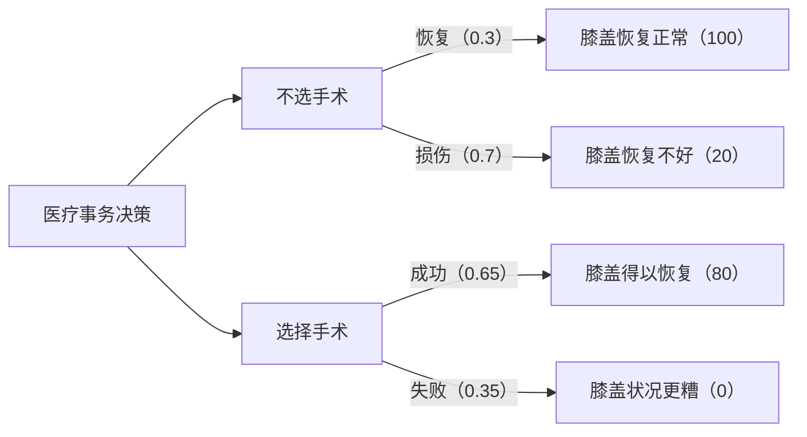
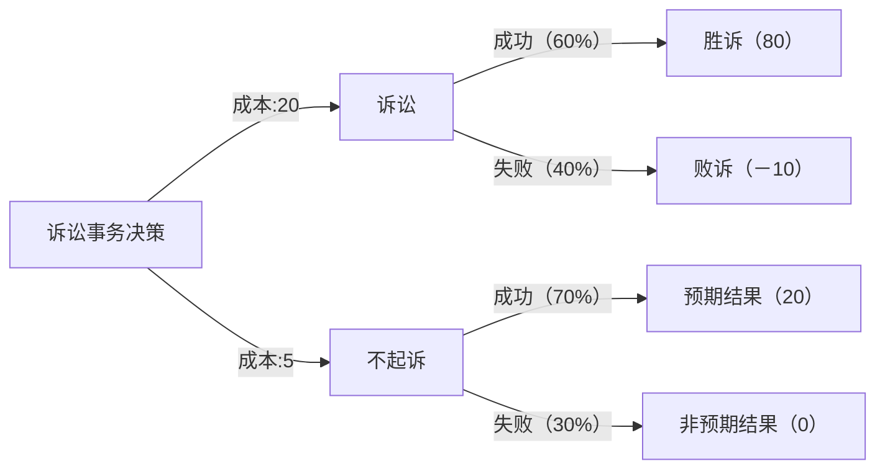
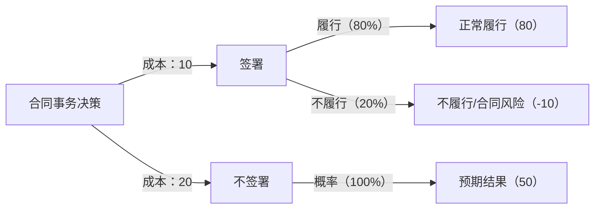

所谓风险，就是不确定的成本或收益。收益确定是200万元，成本确定是100万元，则该笔交易该不该做，很好计算和权衡。但如果收益有一定的慨率是200万元，也有一定的概率是50万元，成本有一定的概率能控制在50万元，但也有可能成本会上升到150万元。也就是收益与成本都存在风险，该怎么权衡与决策呢？这就需要用到理性预期原则了。
# 一、理性预期原则与“决策树”
理性预期原则可以给我们在不确定性下的决策提供一定指导。请看雷德•海蒂斯和罗宾•道斯所著的《不确定世界的理性选择》中的一个示意图（见图1-5）。 

图1—5表示“一个假想的医疗决策情境：面对一个显而易见的膝盖损伤时，需要做出是否手术的决策”，该图形又称为“决策树”。最左侧是一个“选择点”，用方框来表示，“选择点”表明决策者要选择一个行动方案；线表示不同的行动方案将会导致的不同结果。圆圈表示一些不确定的结果。
书中提到：如果我们确信已经获得了被试在决策树状图中面对的决策情境，那么计算那些能带来最高预期结果的决策就变得相对容易了······这一规则被称为理性预期原则（rational e×pectation principle），它通常可以用一个方程式来概括：效用＝Σ（概率×价值）。这个方程的意思是：对于每一个备选行动方案（决策树中每一个主要的分支），我们都需要以其发生的概率，为其潜在后果赋予一个权重，然后把所有组成成分相加，从而产生出一个概括性的评估，我们将其称为每一备选行动方案（最左侧的每一个分支）的期望效用。在医疗决策的例子中，根据该计算方法，我们可以得出“做手术”的期望效用为＋52［（＋80×0.65）＋（0×0.35）］，而不做手术的期望效用为＋44［（＋100×0.30）＋（＋20×0.7）］，也就是说，理性的决策应该是去做手术。[^1]

请注意，《不确定世界的理性选择》是一本判断与决策领域的科学著作，相当于教科书，不是普通的散文随笔。理性预期原则和计算方法也不是这两位作者的发明，而是公认的科学决策方法。

[^1]:［美］雷德·海斯蒂、罗宾·道斯：《不确定世界的理性选择 判断与决策心理学》，人民邮电出版社2013年版，第27页、第31页。该书是决策、认知理论的优秀教材，可作为深入了解决策理论的学习材料。下文中将“期望效用”称为“期望值”。

根据上述理性预期原则和计算方法，我们可以画出两个在法律事务中的决策树:

**诉讼事务决策的决策树**

图1-6是诉讼事务决策的决策树。当遇到一个法律事务时，我们可以列出各种可能的行动方案，列出各种方案的概率和结果的值。比如诉讼事务中，诉讼的成本是20，诉讼成功的概率为60％，可获得80；失败的概率为40％，若败诉会损失10。则诉讼的期望值为［80×60％＋（-10×40％）］-20＝24。

而如果选择不起诉方案，成本为5万元，此时成功的概率是70％，若成功，预期拿到20；失败的概率为30％，什么也得不到。这种方案的期望值为（20×70％＋0×30％）-5＝9。由此可见，本情形下应选择诉讼方式。

**合同事务决策的决策树**

图1-7是合同事务决策的决策树。在这个决策树中，我们列出了签署合同与不签署合同这两个行动方案的可能结果和概率的值。签合同的期望值为［80x80％＋（-10x20％）］-10＝52，不签的期望值为50x100％-20＝30。由此可见，应选择签合同。

按照一般的决策树画法，后面这两个图给每个行动方案增加了一个“成本”值，但本质上与“医疗事务决策情境”图示是相通的。“医疗事务决策情境”图中虽然未列成本，但是每一个结果的价值的计算中显然应该反映成本，与“诉讼事务决策情境”“合同事务决策情境”的单列成本出来相比，在数学上其实是一样的。另外，“诉讼事务决策情境”“合同事务决策情境”按一般人更习惯的百分数来表示概率，即用20％代替0.2。

从上面的分析可以看出，如果我们能够知道各种不确定事件的概率、价值、成本（或者把成本在价值中予以考虑），那么我们就可以通过理性预期原则计算各种方案的期望值，并根据期望值的比较作出决策。
# 二、考虑风险承受能力
仅用理性预期原则还不足以作出理性决策。假设这两种情形：

第一种情形：你有权取得下列两张彩票中的一张，现在要决策选哪一张：
A彩票：中奖概率20％，奖金450万元；
B彩票：中奖概率25％，奖金300万元。

利用前面的理性预期原则计算，A彩票的期望值为90万元（450万元x20％），B彩票的期望值为75万元（300万元x25％）。如果只考虑理性预期原则，则应该选择期望值更高的A彩票。

但你面临的状况是：你迫切需要与女友结婚，而未来丈母娘要求必须有一套房，否则免谈。无论你得到300万元还是450万元，都能使你买得起房，只是100平方米还是130平方米的房子的区别，但未来丈母娘并不在乎这一点，只要求你必须有房才能结婚。

那么此时，你应该选择哪一种彩票呢？应该选B。你更重要的是得到这一笔钱买房，而不是买大一点还是小一点的房。

第二种情形：下列两个方案你必选其一，分别有如下风险（无其他风险）：
A方案：出事概率30％，亏100万元；
B方案：出事概率2％，亏1000万元。

只算期望值的话，A为-30万元，B为-20万元，应该选择B。但是对你来说，亏100万元尚不至于使生活过不下去，亏1000万元却能让你倾家荡产、不能承受。那么你应该选择A，不能冒险。

也就是说，当人们迫切的需要得到某一些东西（因此哪怕只要提高一点概率都非常重要），或者无法承受某种结果（坏的结果虽然概率低，但无法承受）时，则无法完全按照期望值来决策。

换到法律事务决策中，如果某项结果是绝对无法接受的，则决策时应当考虑如何确保不出现该结果（实际上等于把有可能发生该项结果的方案删除不作为备选行动方案）。例如，有一份合同有风险，用理性预期原则来计算正常履行和出现意外的期望值，能看出签署合同的期望值较高，按理说应该签署。但问题是，如果出现意外，这份合同就能使客户破产、无法承受，那么就不应该签署这份合同。所以，我们要将“理性预期原则”与“考虑风险承受能力”两者相结合，这样就可以对存在风险的各项事务进行判断、决策了。
# 三、理性决策方法的补充说明
## 1.理性预期原则并非只能计算有形的价值。
对客户来讲，价值不一定就等于赔偿。有的时候，虽然得到了现金赔偿，但客户认为影响了双方关系，得不偿失。这不是说明上述方法有问题，而是应该在计算“价值”时考虑这一损失，从而降低“价值”的值。反过来讲，也有可能现金赔偿不高，但其他方面的无形收益很高，也应该反映到上述价值中。

律师提供法律服务时，需要了解客户的目标、关注点，帮助客户进行多方面的权衡。但这些权衡都可以反映到“价值”之中。正如“医疗事务决策情境”中所列的“膝盖得以修复”的值，同样并非一个金钱数额，而是指对当事人的价值（同样是膝盖修复，对一个顶级运动员和一个脑力劳动者价值明显不同）。而“诉讼事务决策情境”“合同事务决策情境”的决策树中的“价值”并非只代表得到多少钱的赔偿，而是表示这种结果下客户所获得的全部价值，负数则表示全部损失，包括金钱方面的收益或损失，也包括其他无形的收益或损失。

上述决策方法是“理性”决策方法，以“理性”的决策结果为最优的、值得追求的决策结果。如果不认同“理性”决策方法，当然就不会认同上述计算方法。但是对一般人而言，并非不认同“理性”决策方法，而是误以为“理性”决策方法不适用于“包括感情因素在内的决策情境”（如婚姻家庭，也包括某些诉讼），这其实是错误的。如前所述，只需要把你认为的“感情因素”（或者其他任何无形的，但是对你而言存在正面或负面价值的因素）以一定的值反映出来，就完全可以适用上述决策方法。如果有人认为无形因素无法量化，就等于是说这些因素无法比较从而无法决策，即意味着排除了任何理性的决策方法，那就只能是非理性的决策—这又并非其本意。
## 2.数字式的决策方法强于“专家判断”。
《不确定世界的理性选择》中还提到：“无数的研究文献惊人一致的显示出，专家判断很少获得令人满意的准确率，几乎从未比机械判断更好······这一章的基本原理就是“只有数字才是真实的”，不管这些数字的质量是好是坏……然而在使用数字时要克服“神秘的人脑”这个观点（目前没有研究可以支持这个观点）……我们所有人无一例外都对自己的判断能力过度自信。想要做出好的判断，并且对他人公平，就必须克服不使用数字信息的坏习惯。当我们确实这样做的时候，就应当像我们利用数字的帮助修建一座历久弥坚的桥梁一样，由衷地感到骄傲。”[^2]作为专业人士，律师习惯于“专家判断”，未必能接受或习惯上述通过数字的计算方法，在《不确定世界的理性选择》也提到了对上述理性预期原则的多种反对意见。本书作者并非决策理论方面的专家，仅在此提供上述模型，供律师参考。无论如何，这已经是在决策理论方面一般通行的科学做法了。

[^2]: ［美］雷德·海斯蒂、罗宾·道斯：《不确定世界的理性选择 判断与决策心理学》人民邮电出版社2013版第62页、第69页