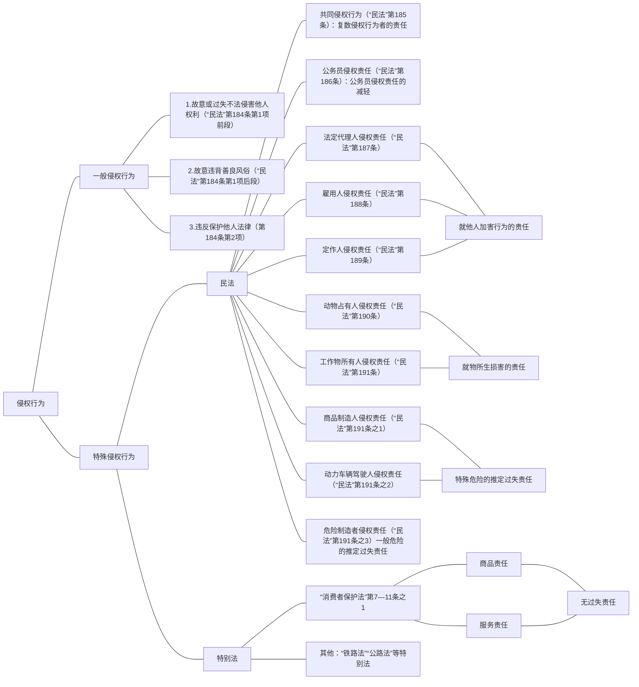

```mermaid
flowchart LR
1[侵权行为]
2[一般侵权行为]
3[特殊侵权行为]
1---2 & 3
4["1.故意或过失不法侵害他人权利（“民法”第184条第1项前段）"]
5["2.故意违背善良风俗（“民法”第184条第1项后段）"]
6["3.违反保护他人法律（第184条第2项）"]
2---4 & 5 & 6
7[民法]
8[特别法]
3---7 & 8
9["共同侵权行为（“民法”第185条）：复数侵权行为者的责任"]
10["公务员侵权责任（“民法”第186条）：公务员侵权责任的减轻"]
11["法定代理人侵权责任（“民法”第187条）"]
12["雇用人侵权责任（“民法”第188条）"]
13["定作人侵权责任（“民法”第189条）"]
14["动物占有人侵权责任（“民法”第190条）"]
15["工作物所有人侵权责任（“民法”第191条）"]
16["商品制造人侵权责任（“民法”第191条之1）"]
17["动力车辆驾驶人侵权责任（“民法”第191条之2）"]
18["危险制造者侵权责任（“民法”第191条之3）一般危险的推定过失责任"]
7---9 & 10 & 11 & 12 & 13 & 14 & 15 & 16 & 17 & 18
19[就他人加害行为的责任]
20[就物所生损害的责任]
21[特殊危险的推定过失责任]
11 & 12 & 13---19
14 & 15---20
16 & 17---21
22["“消费者保护法”第7—11条之1"]
23[商品责任]
24[服务责任]
25[无过失责任]
26["其他：“铁路法”“公路法”等特别法"]
8---22 & 26
22---23 & 24---25
```