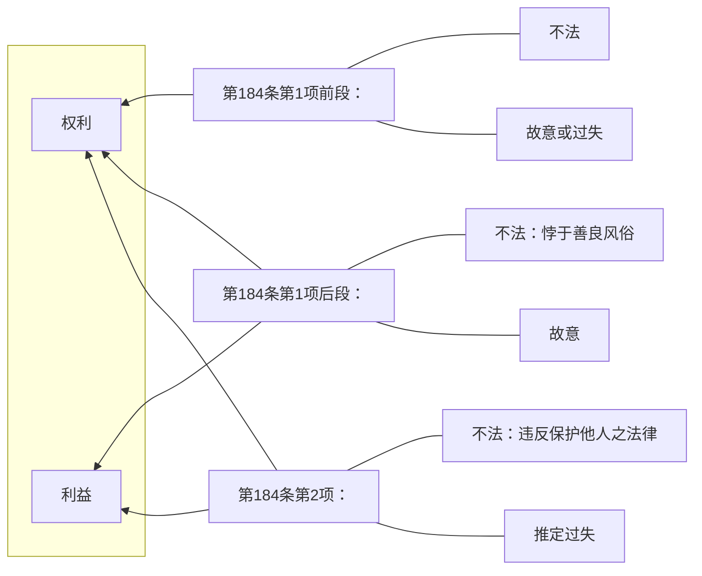

```mermaid
flowchart RL
subgraph  
1[权利]
2[利益]
end
3["第184条第1项前段："]
4["第184条第1项后段："]
5["第184条第2项："]
3 & 4 & 5-->1
4 & 5-->2
6[不法]
7[故意或过失]
6 & 7---3
8["不法：悖于善良风俗"]
9[故意]
8 & 9---4
10["不法：违反保护他人之法律"]
11[推定过失]
10 & 11---5
```