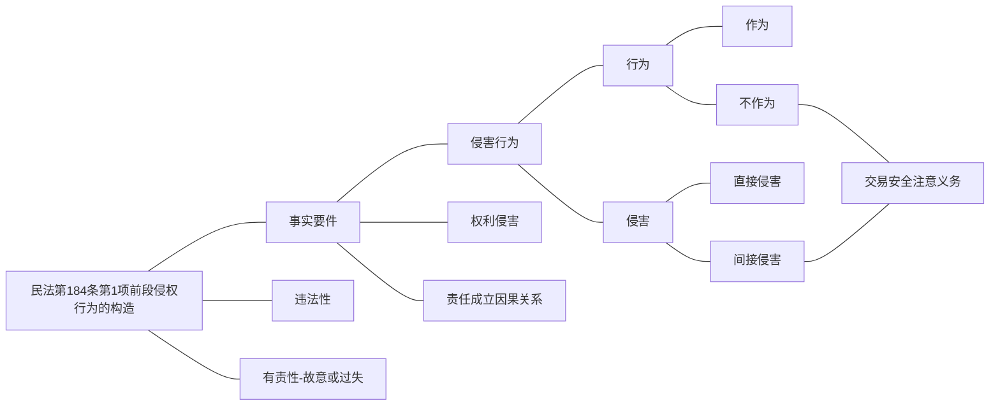

```mermaid %%第184条第2项请求权基础%%
flowchart LR
a[民法第184条第1项前段侵权行为的构造]
b[事实要件]
c[违法性]
d[有责性-故意或过失]
e[侵害行为]
f[权利侵害]
g[责任成立因果关系]
h[行为]
i[侵害]
j[作为]
k[不作为]
l[直接侵害]
m[间接侵害]
n[交易安全注意义务]
a---b & c & d
b---e & f & g
e---h & i
h---j & k
i---l & m
k & m---n
```