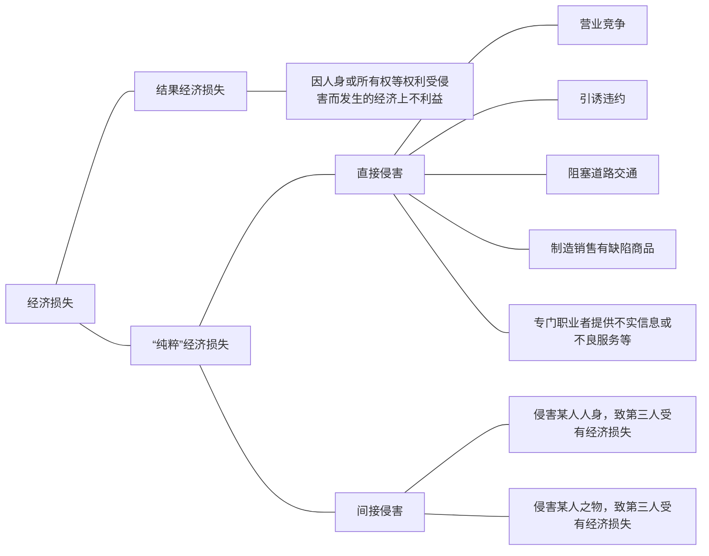

```mermaid
flowchart LR
1[经济损失]
2[结果经济损失]
3["“纯粹”经济损失"]
1---2 & 3
4[因人身或所有权等权利受侵害而发生的经济上不利益]
2---4
5[直接侵害]
6[间接侵害]
3---5 & 6
7[营业竞争]
8[引诱违约]
9[阻塞道路交通]
10[制造销售有缺陷商品]
11[专门职业者提供不实信息或不良服务等]
5---7 & 8 & 9 & 10 & 11
12["侵害某人人身，致第三人受有经济损失"]
13["侵害某人之物，致第三人受有经济损失"]
6---12 & 13
```