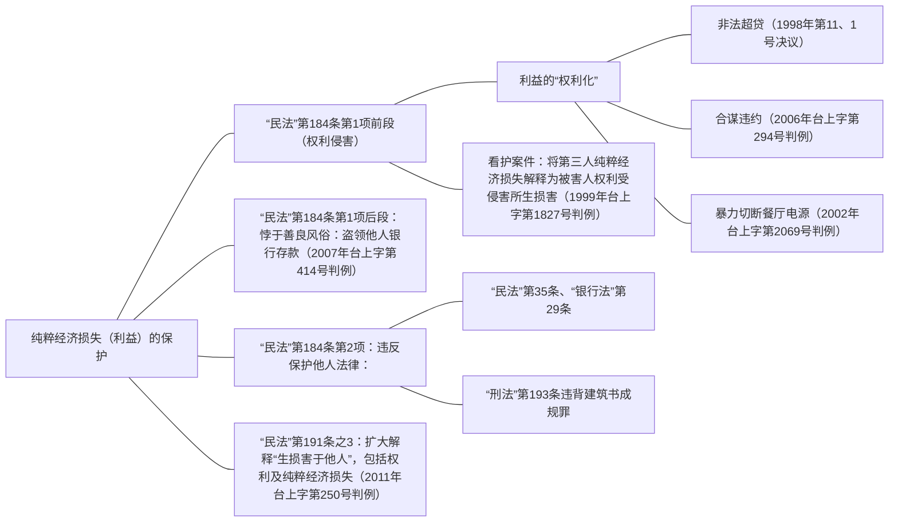

```mermaid
flowchart LR
1["纯粹经济损失（利益）的保护"]
2["“民法”第184条第1项前段（权利侵害）"]
3["“民法”第184条第1项后段：悖于善良风俗：盗领他人银行存款（2007年台上字第414号判例）"]
4["“民法”第184条第2项：违反保护他人法律："]
5["“民法”第191条之3：扩大解释“生损害于他人”，包括权利及纯粹经济损失（2011年台上字第250号判例）"]
1---2 & 3 & 4 & 5
6["利益的“权利化”"]
7["看护案件：将第三人纯粹经济损失解释为被害人权利受侵害所生损害（1999年台上字第1827号判例）"]
2---6 & 7
8["非法超贷（1998年第11、1号决议）"]
9["合谋违约（2006年台上字第294号判例）"]
10["暴力切断餐厅电源（2002年台上字第2069号判例）"]
6---8 & 9 & 10
11["“民法”第35条、“银行法”第29条"]
12["“刑法”第193条违背建筑书成规罪"]
4---11 & 12
```