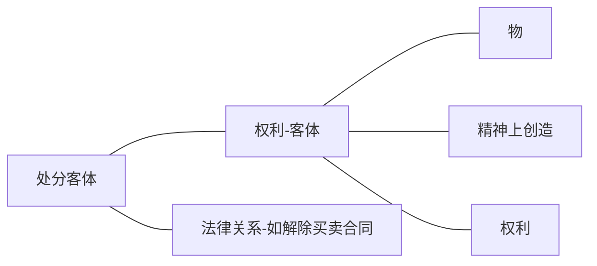

>某甲的财产包括汽车1部，银行存款100万元及某书著作权。试说明甲的权利及其“权利客体”。设甲将其汽车（所有权）让与他人，以其对银行的债权设定权利质权，并将著作权让与他人时，其“处分客体”为何？试说明“权利客体”及“处分客体”的意义。又“民法”将“物”规定于总则编，其理由何在？ #案例/王泽鉴九阴真经/民法总则 

# 一、权利客体的概念

权利的主体为人，包括自然人及法人。有主斯有客，然则权利的客体，究指何而言？著名的民法学者史尚宽先生谓：“权利以有形或无形之社会利益为其内容或目的，例如，物权以直接排他的支配一定之物为其内容或目的，债权以要求特定人之一定行为为其内容或目的，为此内容或目的之成立所必要之一定对象，为权利之客体( Rechtsgegenstand)。即物权之客体为一定之物，债权之客体为特定之行为，人格权之客体为人之本身，亲属权之客体为立于一定亲属关系之他人，无体财产权之客体为精神之产物。故权利之客体，依各种之权利而有不同。”关于此项见解，应说明有三：
(1)狭义的权利客体，指在法律上得为支配的对象,除物、精神上之创造外，尚包括物权及债权等财产权在内。
(2)人格权的客体为人之本身，系以人之本身为人格权的存在基础，及其直接现实的表现，乃应受法律保护的对象，而非得受支配的客体。亲属权（身份权）涵蕴人格关系，并具义务性质，亦非以立于一定亲属关系之人为支配客体。所谓债权的客体为特定之人，乃指债权以特定债务人为对象，债务人负有一定作为与不作为的义务，债权人有请求给付的权利，但对债务人的人身或给付行为并无支配的权利。债务人在债之关系上乃居于主体的地位。
(3)财产（或企业）系各种权利的总体，其本身不得作为权利的客体。在现行法上并无一种得以“财产”（或企业）作为客体的权利。

# 二、权利客体及处分客体

权利得以物、精神上创造或权利为其支配的客体，是为第一阶层的权利客体。权利本身则得作为权利人处分的对象，乃第二阶层的权利客体。此项得为处分之客体者，除物权、无体财产权（智慧财产权）及债权外，尚包括一定的法律关系(如买卖、租赁)。例如，所有权得为让与，于债权、著作权得设定权利质权([[第900条]]，“著作权法”第39条)，买卖契约得为解除。兹以下图表示此二种阶层关系：
