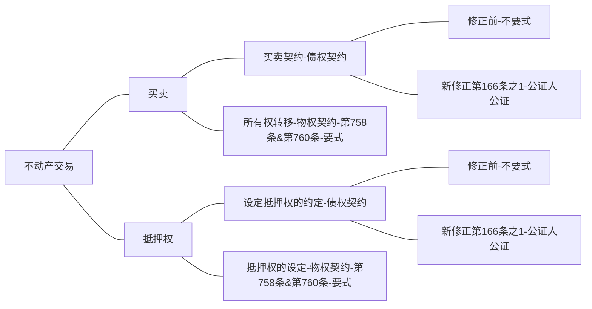

```mermaid
flowchart LR
1[不动产交易]
2[买卖]
3[抵押权]
1---2
1---3
4[买卖契约-债权契约]
5[所有权转移-物权契约-第758条&第760条-要式]
2---4
2---5
6[修正前-不要式]
7[新修正第166条之1-公证人公证]
4---6
4---7
8[设定抵押权的约定-债权契约]
9[抵押权的设定-物权契约-第758条&第760条-要式]
3---8
3---9
11[修正前-不要式]
12[新修正第166条之1-公证人公证]
8---11
8---12
```