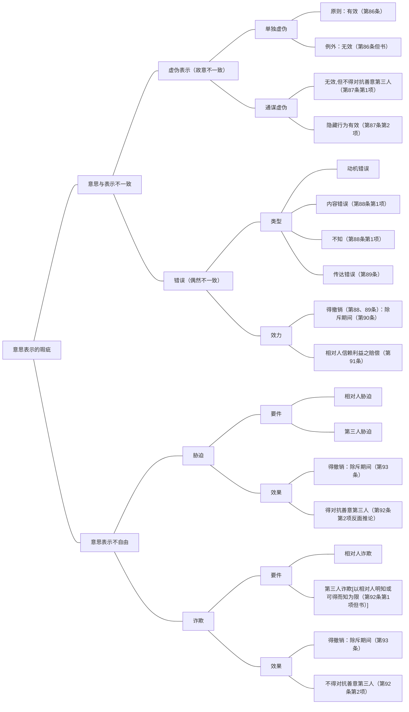

```mermaid
flowchart LR
1[意思表示的瑕疵]
2[意思与表示不一致]
3[意思表示不自由]
1---2
1---3
4["虚伪表示（故意不一致）"]
5["错误（偶然不一致）"]
2---4
2---5
6[单独虚伪]
7[通谋虚伪]
4---6
4---7
8["原则：有效（第86条）"]
9["例外：无效（第86条但书）"]
6---8
6---9
11["无效,但不得对抗善意第三人（第87条第1项）"]
12["隐藏行为有效（第87条第2项）"]
7---11
7---12
13[类型]
14[效力]
5---13
5---14
15[动机错误]
16["内容错误（第88条第1项）"]
17["不知（第88条第1项）"]
18["传达错误（第89条）"]
13---15
13---16
13---17
13---18
19["得撤销（第88、89条）：除斥期间（第90条）"]
21["相对人信赖利益之赔偿（第91条）"]
14---19
14---21
22[胁迫]
23[诈欺]
3---22
3---23
24[要件]
25[效果]
22---24
22---25
26[相对人胁迫]
27[第三人胁迫]
24---26
24---27
28["得撤销：除斥期间（第93条）"]
29["得对抗善意第三人（第92条第2项反面推论）"]
25---28
25---29
31[要件]
32[效果]
23---31
23---32
33[相对人诈欺]
34["第三人诈欺[以相对人明知或可得而知为限（第92条第1项但书）]"]
31---33
31---34
35["得撤销：除斥期间（第93条）"]
36["不得对抗善意第三人（第92条第2项）"]
32---35
32---36
```

[[第86条]]、[[第87条]]、[[第88条]]、[[第89条]]、[[第90条]]、[[第91条]]、[[第92条]]、[[第93条]]