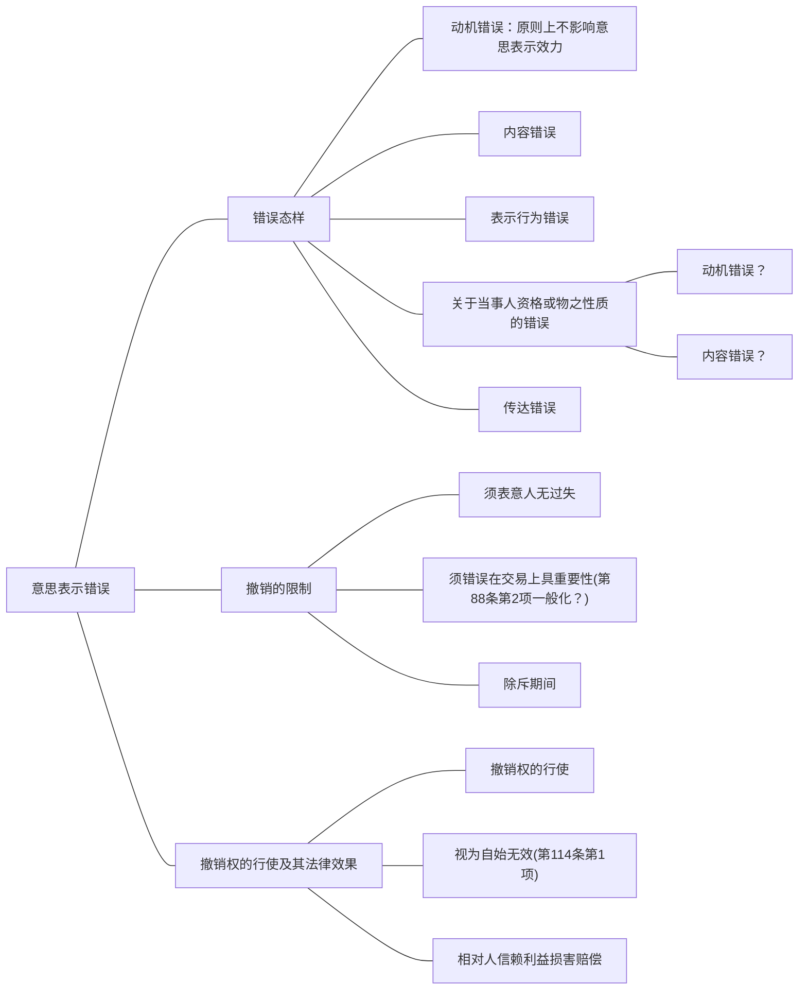

```mermaid
flowchart LR
1[意思表示错误]
2[错误态样]
3[撤销的限制]
4[撤销权的行使及其法律效果]
1---2
1---3
1---4
5["动机错误：原则上不影响意思表示效力"]
6[内容错误]
7[表示行为错误]
8[关于当事人资格或物之性质的错误]
9[传达错误]
2---5
2---6
2---7
2---8
2---9
11["动机错误？"]
12["内容错误？"]
8---11
8---12
13[须表意人无过失]
14["须错误在交易上具重要性(第88条第2项一般化？)"]
15[除斥期间]
3---13
3---14
3---15
16[撤销权的行使]
17["视为自始无效(第114条第1项)"]
18[相对人信赖利益损害赔偿]
4---16
4---17
4---18
```
