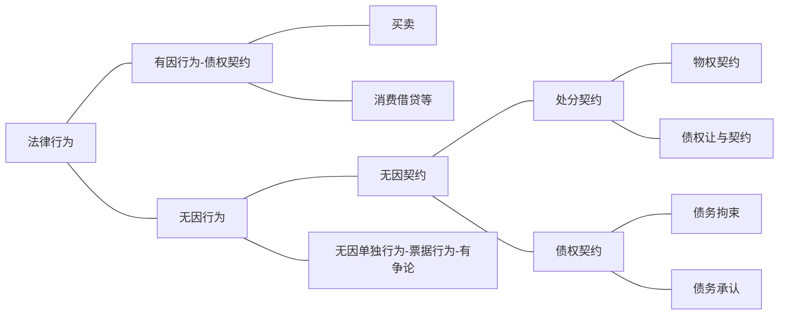

```mermaid
flowchart LR
1[法律行为]
2[有因行为-债权契约]
3[无因行为]
1---2
1---3
4[买卖]
5[消费借贷等]
2---4
2---5
6[无因契约]
7[无因单独行为-票据行为-有争论]
3---6
3---7
8[处分契约]
9[债权契约]
6---8
6---9
11[物权契约]
12[债权让与契约]
8---11
8---12
13[债务拘束]
14[债务承认]
9---13
9---14
```