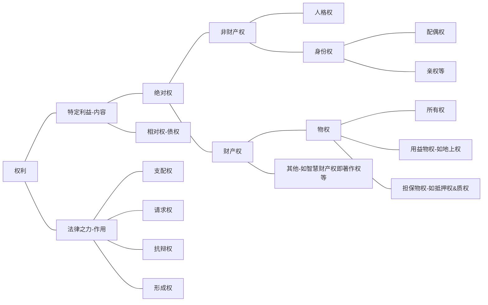

```mermaid
flowchart LR
A[权利]
a[特定利益-内容]
b[法律之力-作用]
A---a & b
c[绝对权]
d[相对权-债权]
e[支配权]
f[请求权]
g[抗辩权]
h[形成权]
i[非财产权]
j[财产权]
k[人格权]
l[身份权]
m[物权]
n[其他-如智慧财产权即著作权等]
1[配偶权]
p[亲权等]
q[所有权]
r[用益物权-如地上权]
s[担保物权-如抵押权&质权]
a---c 
a---d
b---e
b---f
b---g
b---h
c---i 
c---j
i---k 
i---l
l---1
l---p
j---m
j---n
m---q
m---r
m---s
```