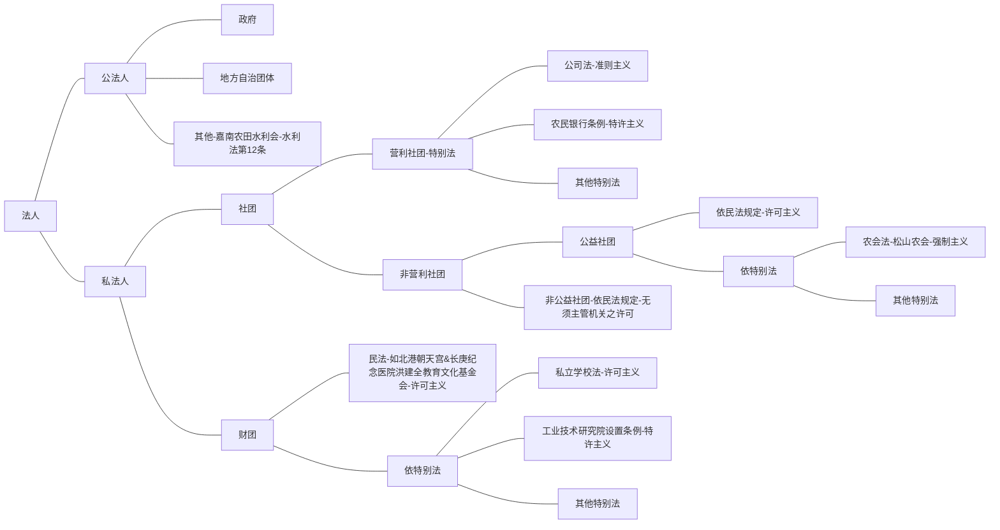

```mermaid
flowchart LR
1[法人]
2[公法人]
3[政府]
4[地方自治团体]
5[其他-嘉南农田水利会-水利法第12条]
6[私法人]
7[社团]
8[营利社团-特别法]
9[公司法-准则主义]
11[农民银行条例-特许主义]
12[其他特别法]
13[非营利社团]
14[公益社团]
15[依民法规定-许可主义]
16[依特别法]
17[农会法-松山农会-强制主义]
18[其他特别法]
19[非公益社团-依民法规定-无须主管机关之许可]
21[财团]
22[民法-如北港朝天宫&长庚纪念医院洪建全教育文化基金会-许可主义]
23[依特别法]
24[私立学校法-许可主义]
25[工业技术研究院设置条例-特许主义]
26[其他特别法]
1---2
2---3
2---4
2---5
1---6
6---7
7---8
8---9
8---11
8---12
7---13
13---14
14---15
14---16
16---17
16---18
13---19
6---21
21---22
21---23
23---24
23---25
23---26
```