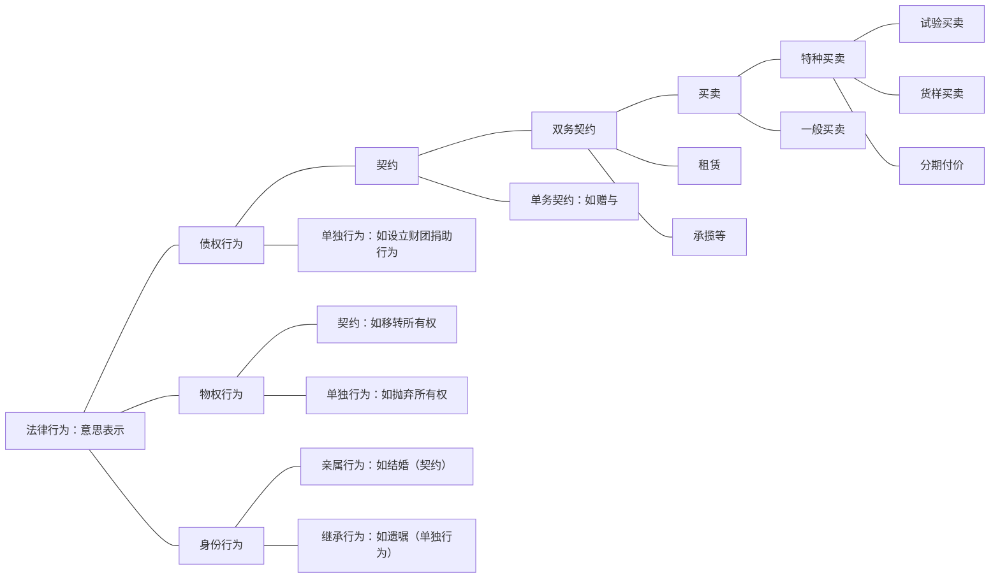

```mermaid
flowchart LR
1["法律行为：意思表示"]
2[债权行为]
3[物权行为]
4[身份行为]
1---2 & 3 & 4
5[契约]
6["单独行为：如设立财团捐助行为"]
2---5 & 6
7[双务契约]
8["单务契约：如赠与"]
5---7 & 8
9[买卖]
10[租赁]
11[承揽等]
7---9 & 10 & 11
12[特种买卖]
13[一般买卖]
9---12 & 13
14[试验买卖]
15[货样买卖]
16[分期付价]
12---14 & 15 & 16
17["契约：如移转所有权"]
18["单独行为：如抛弃所有权"]
19["亲属行为：如结婚（契约）"]
20["继承行为：如遗嘱（单独行为）"]
3---17 & 18
4---19 & 20
```