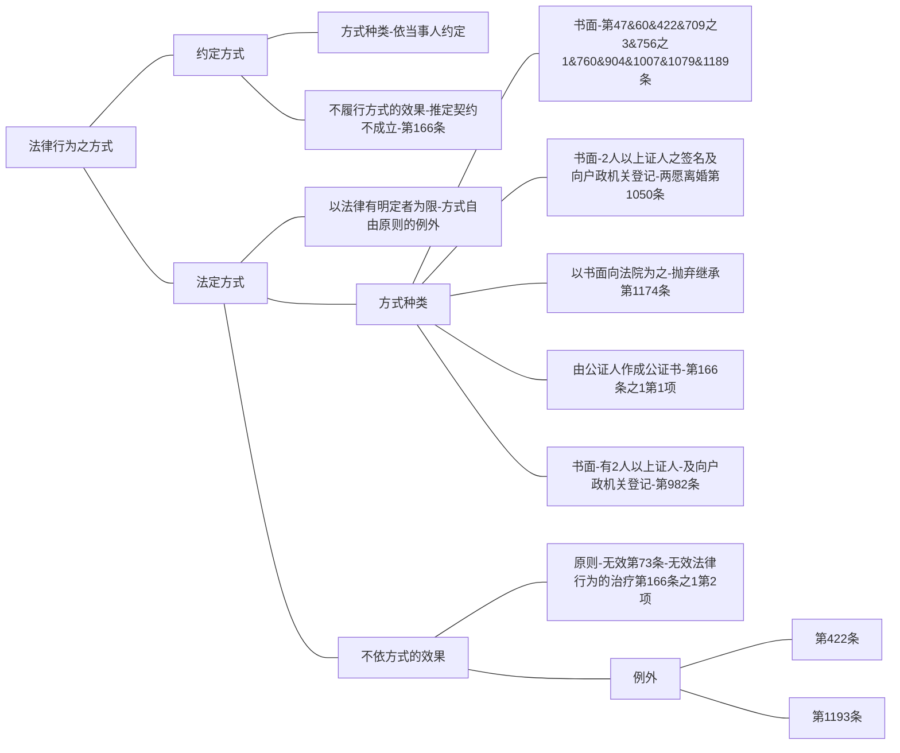

```mermaid
flowchart LR
1[法律行为之方式]
2[约定方式]
3[法定方式]
1---2
1---3
4[方式种类-依当事人约定]
5[不履行方式的效果-推定契约不成立-第166条]
2---4
2---5
6[以法律有明定者为限-方式自由原则的例外]
7[方式种类]
8[不依方式的效果]
3---6
3---7
3---8
9[书面-第47&60&422&709之3&756之1&760&904&1007&1079&1189条]
11[书面-2人以上证人之签名及向户政机关登记-两愿离婚第1050条]
12[以书面向法院为之-抛弃继承第1174条]
13[由公证人作成公证书-第166条之1第1项]
14[书面-有2人以上证人-及向户政机关登记-第982条]
7---9
7---11
7---12
7---13
7---14
15[原则-无效第73条-无效法律行为的治疗第166条之1第2项]
16[例外]
8---15
8---16
17[第422条]
18[第1193条]
16---17
16---18
```