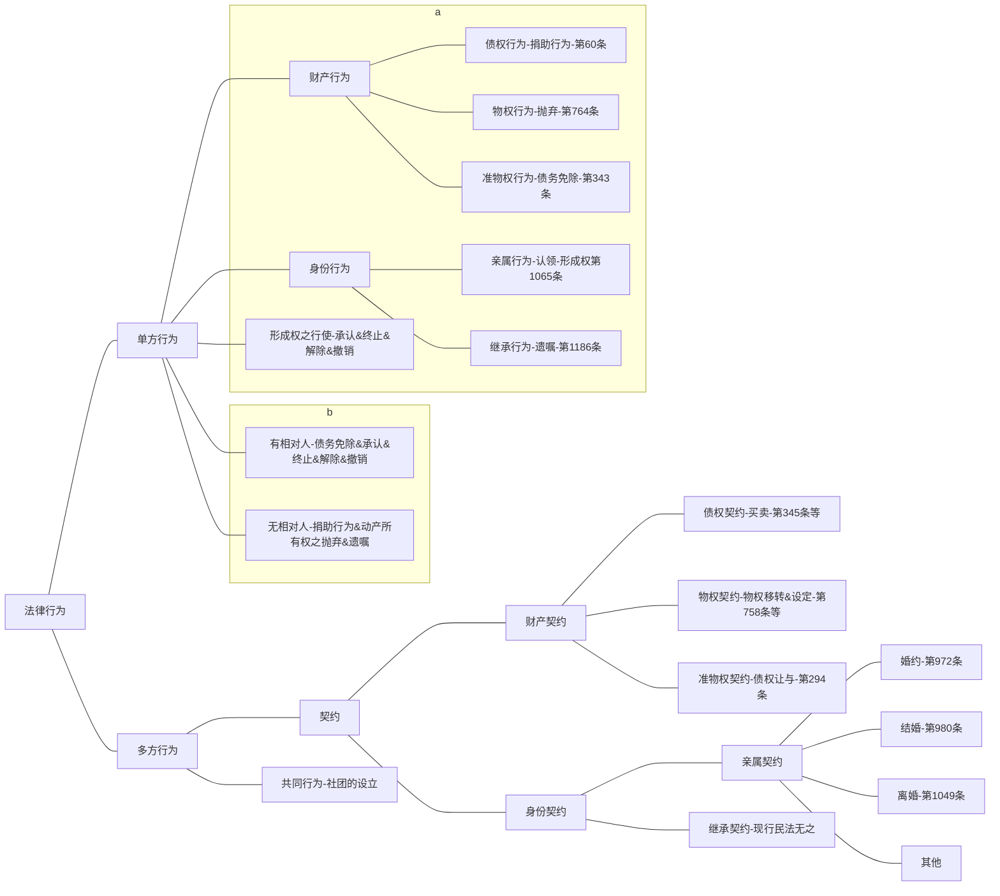

```mermaid
flowchart LR
1[法律行为]
2[单方行为]
3[多方行为]
1---2
1---3
2---4
2---5
2---6
2---13
2---14
subgraph a
4[财产行为]
5[身份行为]
6[形成权之行使-承认&终止&解除&撤销]
7[债权行为-捐助行为-第60条]
8[物权行为-抛弃-第764条]
9[准物权行为-债务免除-第343条]
4---7
4---8
4---9
11[亲属行为-认领-形成权第1065条]
12[继承行为-遗嘱-第1186条]
5---11
5---12
end
subgraph b
13[有相对人-债务免除&承认&终止&解除&撤销]
14[无相对人-捐助行为&动产所有权之抛弃&遗嘱]
end
15[契约]
16[共同行为-社团的设立]
3---15
3---16
17[财产契约]
18[身份契约]
15---17
15---18
19[债权契约-买卖-第345条等]
21[物权契约-物权移转&设定-第758条等]
22[准物权契约-债权让与-第294条]
17---19
17---21
17---22
23[亲属契约]
24[继承契约-现行民法无之]
18---23
18---24
25[婚约-第972条]
26[结婚-第980条]
27[离婚-第1049条]
28[其他]
23---25
23---26
23---27
23---28
```