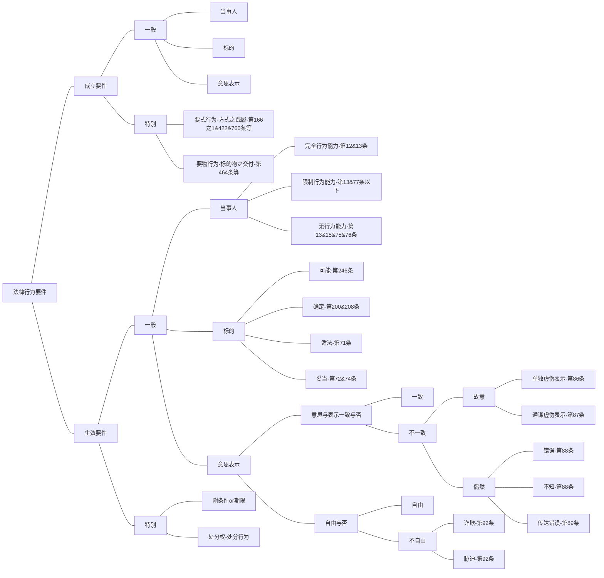

```mermaid
flowchart LR
1[法律行为要件]
2[成立要件]
3[生效要件]
1---2
1---3
4[一般]
5[特别]
2---4
2---5
6[当事人]
7[标的]
8[意思表示]
4---6
4---7
4---8
9[要式行为-方式之践履-第166之1&422&760条等]
11[要物行为-标的物之交付-第464条等]
5---9
5---11
12[一般]
13[特别]
3---12
3---13
14[当事人]
15[标的]
16[意思表示]
12---14
12---15
12---16
17[完全行为能力-第12&13条]
18[限制行为能力-第13&77条以下]
19[无行为能力-第13&15&75&76条]
14---17
14---18
14---19
21[可能-第246条]
22[确定-第200&208条]
23[适法-第71条]
24[妥当-第72&74条]
15---21
15---22
15---23
15---24
25[意思与表示一致与否]
26[自由与否]
16---25
16---26
27[一致]
28[不一致]
25---27
25---28
29[故意]
31[偶然]
28---29
28---31
32[单独虚伪表示-第86条]
33[通谋虚伪表示-第87条]
29---32
29---33
34[错误-第88条]
35[不知-第88条]
36[传达错误-第89条]
31---34
31---35
31---36
37[自由]
38[不自由]
26---37
26---38
39[诈欺-第92条]
41[胁迫-第92条]
38---39
38---41
42[附条件or期限]
43[处分权-处分行为]
13---42
13---43
```
