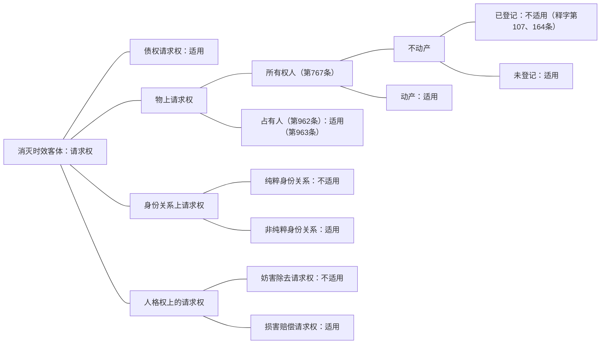

```mermaid
flowchart LR
1["消灭时效客体：请求权"]
2["债权请求权：适用"]
3[物上请求权]
4[身份关系上请求权]
5[人格权上的请求权]
1---2 & 3 & 4 & 5
6["所有权人（第767条）"]
7["占有人（第962条）：适用（第963条）"]
3---6 & 7
8[不动产]
9["动产：适用"]
6---8 & 9
11["已登记：不适用（释字第107、164条）"]
12["未登记：适用"]
8---11 & 12
13["纯粹身份关系：不适用"]
14["非纯粹身份关系：适用"]
4---13 & 14
15["妨害除去请求权：不适用"]
16["损害赔偿请求权：适用"]
5---15 & 16
```