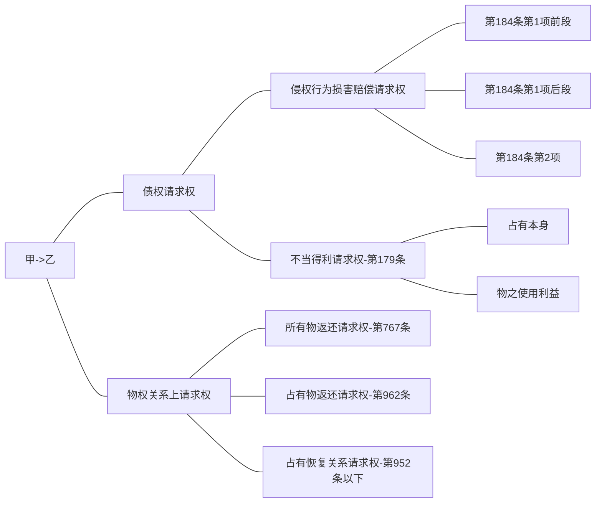

```mermaid
flowchart LR
a[甲->乙]
b[债权请求权]
c[物权关系上请求权]
d[侵权行为损害赔偿请求权]
e[不当得利请求权-第179条]
f[所有物返还请求权-第767条]
g[占有物返还请求权-第962条]
h[占有恢复关系请求权-第952条以下]
i[第184条第1项前段]
j[第184条第1项后段]
k[第184条第2项]
l[占有本身]
m[物之使用利益]
a---b
a---c
b---d
b---e
c---f
c---g
c---h
d---i
d---j
d---k
e---l
e---m
```
[[第179条]] [[第767条]] [[第962条]] [[第952条]] [[第184条]]