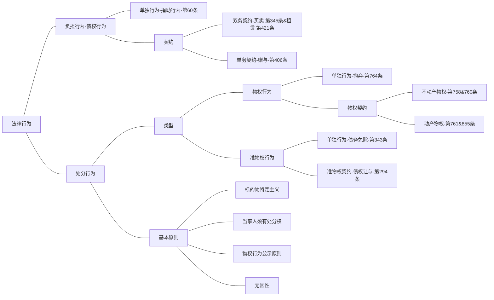

```mermaid
flowchart LR
1[法律行为]
2[负担行为-债权行为]
3[处分行为]
1---2
1---3
4[单独行为-捐助行为-第60条]
5[契约]
2---4
2---5
6[双务契约-买卖 第345条&租赁 第421条]
7[单务契约-赠与-第406条]
5---6
5---7
8[类型]
9[基本原则]
3---8
3---9
11[物权行为]
12[准物权行为]
8---11
8---12
13[单独行为-抛弃-第764条]
14[物权契约]
11---13
11---14
15[不动产物权-第758&760条]
16[动产物权-第761&855条]
14---15
14---16
17[单独行为-债务免除-第343条]
18[准物权契约-债权让与-第294条]
12---17
12---18
19[标的物特定主义]
21[当事人须有处分权]
22[物权行为公示原则]
23[无因性]
9---19
9---21
9---22
9---23
```