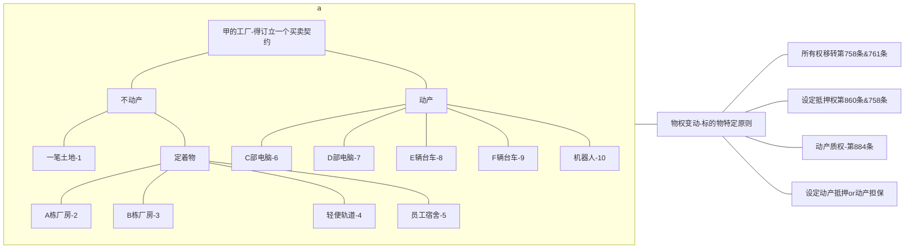

```mermaid
flowchart LR
subgraph a
1[甲的工厂-得订立一个买卖契约]
2[不动产]
3[动产]
4[一笔土地-1]
5[定着物]
6[A栋厂房-2]
7[B栋厂房-3]
8[轻便轨道-4]
9[员工宿舍-5]
11[C部电脑-6]
12[D部电脑-7]
13[E辆台车-8]
14[F辆台车-9]
15[机器人-10]
1---2
1---3
2---4
2---5
5---6
5---7
5---8
5---9
3---11
3---12
3---13
3---14
3---15
end
16[物权变动-标的物特定原则]
17[所有权移转第758条&761条]
18[设定抵押权第860条&758条]
19[动产质权-第884条]
21[设定动产抵押or动产担保]
a---16
16---17
16---18
16---19
16---21
```