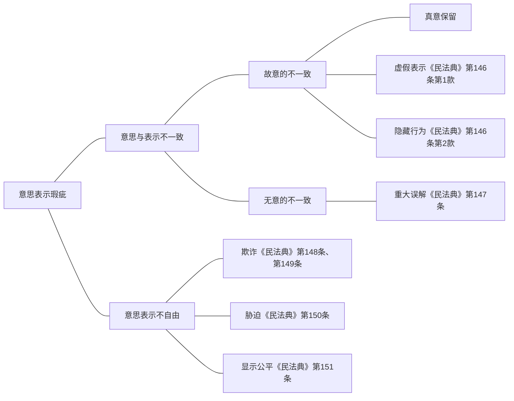
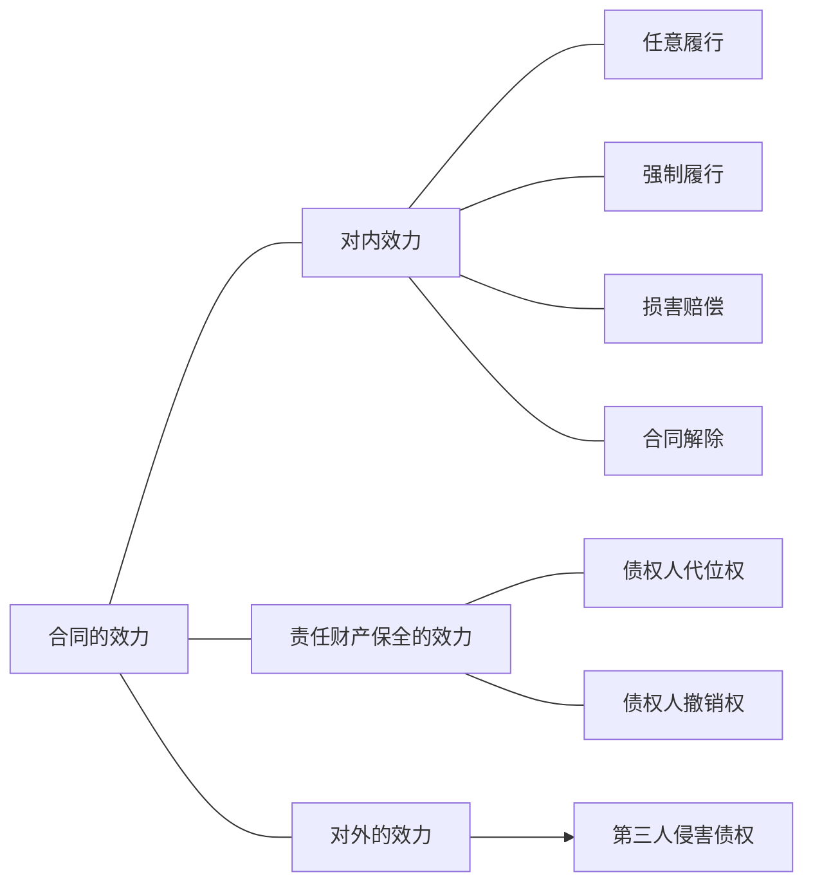

# 一、合同生效的一般要件
合同作为一种法律行为，其有效（wirksam）是指完全地发生了意思表示所表达的法律后果。在我国法上，民事法律行为应当具备以下条件：行为人具有相应的民事行为能力、意思表示真实、不违反法律、行政法规的强制性规定，不违背公序良俗（《民法总则》第143条）。

《民法总则》第143条的规定，是一切民事法律行为所应具备的一般生效要件，对合同当然适用。另外，也并不排除有的场合，合同还应具备其他特殊要件才能生效，比如，死因行为要以行为人死亡为特别生效要件；再如，对外合作开采石油需要经过国家有关部门的批准才能生效。以下仅论及合同的一般生效要件。
## （一）当事人缔约时具有相应的缔约能力
缔约能力，是指合同行为主体（自然人、法人、其他组织）据以缔结合同的法律资格。“当事人订立合同，应当具有相应的民事权利能力和民事行为能力”。（《合同法》第9条第1款）据此，缔约能力包括权利能力和行为能力两个方面。就权利能力而言，对于一般的民事行为，推定当事人均有相应的权利能力，不生问题；唯对特殊的合同，比如，需要具备特殊资格，才能缔结，大多体现在法人或其他组织场合，也可体现在自然人场合（如在特定城市或者地区要求具备购房或者购车的资格）。就行为能力而言，对于限制民事行为能力人及无民事行为能力人，需要通过代理人实现缔约目的。
### 1.自然人
自然人签订合同，通常应有完全行为能力。限制行为能力人可以独立实施线获利益的民事法律行为或者与其年龄、智力、精神健康状况相适应的民事法律行为，其他的民事法律行为由其法定代理人代理，或者征得其法定代理人的同意、追认（参照《民法总则》第19条、第22条）。无民事行为能力人由其法定代理人代理实施民事法律行为（《民法总则》第20条、第21条）。

- 限制民事行为能力人，可以独立实施与其年龄、智力、精神健康状况相适应的民事法律行为，主要为：
	- 纯获利益的合同，比如，接受奖励、赠与、报酬等纯获利益、或被免除义务的合同（参见《民通意见》第6条）；
	- 必需合同，[^1]如购买食物或饮料；
	- 社会类型行为，如利用自动售货机、搭乘交通工具、进入公园。

[^1]:学说受英美法法理（contract for necessaries法理）的启发而展开此类议论，以往多称为“生活必需品合同”，唯并不以物的买卖为限，尚包括若干服务在内，故宜称“必需合同”。内田貴「民法I総則·物権総論」（東京大学出版会，1994年）105頁。

对无民事行为能力人是否有例外，容于后述。
### 2.法人
法人是具有民事权利能力和民事行为能力，依法独立享有民事权利和承担民事义务的组织（《民法总则》第57条）。在我国法上，法人被区分为营利法人、非营利法人与特别法人。

营利法人是以取得利润并分配给股东等出资人为目的成立的法人（《民法总则》第76条第1款）。营利法人经依法登记成立（《民法总则》第77条）。依法设立的营利法人，由登记机关发给营利法人营业执照。营业执照签发日期为营利法人的成立日期（《民法总则》第78条）。营利法人要从工商行政管理部门申领“企业法人营业执照”，记载内容包括名称、住所、法定代表人姓名、注册资本、实收资本、公司类型、经营范围、成立日期、营业期限、年度检验情况。“企业法人营业执照”是营利法人资格和合法经营的凭证。

按照《民法通则》第42条，“企业法人应当在核准登记的经营范围内从事经营”。依我国原来的理论，法人签订合同严格地受其宗旨、目的、章程及经营范围的制约，超越经营范围的合同无效。这种做法受到了学说的批评，并有相当数量的判决已转变立场，认定在合同内容不违反强行性规范时合同有效。故《民法总则》已不再规定类似规则。另依《合同法司法解释（一）》第10条，“当事人超越经营范围订立合同，人民法院不因此认定合同无效。但违反国家限制经营、特许经营以及法律、行政法规禁止经营规定的除外”。不过，专为特定目的而设立的法人签订合同，仍不得超过其营业执照上规定的经营范围及其辐射的合理范围。否则，合同无效。

公司的法定代表人依法代表公司对外进行民事活动。法定代表人发生变更的，应当在工商管理部门办理变更登记。公司的法定代表人在对外签订合同时已经被上级单位决定停止职务，但未办理变更登记，公司以此主张合同无效的，人民法院不予支持。[^2]

[^2]:“北京公达房地产有限责任公司诉北京市祥和三峡房地产开发公司房地产开发合同纠纷案”［最高人民法院民事判决书（2009）民提字第76号］裁判摘要，载《中华人民共和国最高人民法院公报》2010年第11期。

非营利法人是为公益目的或者其他非营利目的成立，不向出资人、设立人或者会员分配所取得利益的法人。非营利法人包括事业单位、社会团体、基金会、社会服务机构等（《民法总则》第87条）。

特别法人，包括机关法人、农村集体经济组织法人、城镇农村的合作经济组织法人、基层群众性自治组织法人（《民法总则》第96条）有独立经费的机关和承担行政职能的法定机构从成立之日起，具有机关法人资格，可以从事为履行职能所需要的民事活动（《民法总则》第97条）。居民委员会、村民委员会具有基层群众性自治组织法人资格，可以从事为履行职能所需要的民事活动。未设立村集体经济组织的，村民委员会可以依法代行村集体经济组织的职能（《民法总则》第101条）。

依《合同法》第50条，“法人或者其他组织的法定代表人、负责人超越权限订立的合同，除相对人知道或者应当知道其超越权限的以外，该代表行为有效”。
### 3.其他组织（非法人组织）
《合同法》第2条第1款中的“其他组织”，在《民法总则》中称为“非法人组织”。非法人组织是不具有法人资格，但是能够依法以自己的名义从事民事活动的组织。非法人组织包括个人独立企业、合伙企业、不具有法人资格的专业服务机构等（《民法总则》第102条）。《民事诉讼法》（2012年修正）第48条第1款规定：“公民、法人和其他组织可以作为民事诉讼的当事人。”

《民法通则》对民事主体采“二分法”，区分为公民（自然人）与法人两类。“两户一伙”（个体工商户、农村承包经营户及个人合伙）被放置在“公民（自然人）”章；联营被放置在“法人”章。《合同法》对民事主体采“三分法”，新增“其他组织”—类。“其他组织”作为第三类主体，内涵广泛，且具有兜底功能。依通常学理解释，可以包括法人的分支机构、合伙企业、设立中的法人等。若整合现行法律规定，作体系解释，“两户一伙”及非法人型联营等，似亦应纳人“其他组织”。

《民诉法司法解释》第52条规定："民事诉讼法第四十八条规定的其他组织是指合法成立、有一定的组织机构和财产，但又不具备法人资格的组织，包括：（一）依法登记领取营业执照的个人独资企业；（二）依法登记领取营业执照的合伙企业；（三）依法登记领取我国营业执照的中外合作经营企业、外资企业；（四）依法成立的社会团体的分支机构、代表机构；（五）依法设立并领取营业执照的法人的分支机构；（六）依法设立并领取营业执照的商业银行、政策性银行和非银行金融机构的分支机构；（七）经依法登记领取营业执照的乡镇企业、街道企业；（八）其他符合本条规定条件的组织。”

- 法人的分支机构，依其是否领取营业执照，可区分为两种类型。
	- 对于领取营业执照的法人分支机构（如某某有限公司北京分公司），由工商行政管理部门核发“营业执照”（而非“企业法人营业执照”），该营业执照记载的内容为：名称（法人分支机构的名称）、营业场所、负责人、经营范围、成立日期、年度检验情况。另外，营业执照的“须知”1注明：“《营业执照》是企业合法经营的凭证。”反映出分支机构虽非法人,却是企业。“须知”7注明:"《营业执照》被吊销后,不得开展经营活动。”这里的“经营活动”，主要借助于合同。因而，领取营业执照的法人分支机构就取得了对外签订合同的合法资格，当然有缔约能力。
	- 对于未领取营业执照的法人分支机构（或者非依法设立的分支机构），宜认为不得以自己的名义独立缔约，而只能以法人的名义缔约。在我国民事诉讼实务中，这类分支机构不具有诉讼当事人资格，而是以设立该分支机构的法人为当事人（参见《民诉法司法解释》第53条）。
	- 对于合伙企业，《合伙企业法》（2006年修订）第11条规定：“合伙企业的营业执照签发日期，为合伙企业成立日期。”“合伙企业领取营业执照前，合伙人不得以合伙企业名义从事合伙业务。”合伙企业自成立之日起即成了具有相对独立地位的享有一定民事权利、承担民事责任的经营性组织。合伙企业可以凭营业执照刻制印章，开立银行账户，申请纳税登记，开始以企业名义从事经营活动。合伙企业设立的分支机构且领取相应的营业执照的（参见《合伙企业法》第12条），亦具有相应的独立缔约能力。

设立中的法人，如果从事一定的经营活动，就称为“非法人经营体”，属于非法人团体中的一种类型。依学者通说，法律法规也承认这些不具有法人资格的组织体可以自己的名义订立合同，享受权利和承担义务，其与法人的差别仅在于，当这些组织体不能清偿它们的债务时，应由他们的开办人或上级承担责任。
## （二）当事人意思表示真实
### 1.意思表示与合同
意思表示，是将企图发生一定私法上效果的意思表示于外部的行为，是合同等法律行为的构成要素。要约、承诺均属意思表示（参见《合同法》第14条、第21条），合同即是意思表示合致（合意）的结果；依意思表示的内容赋予相应的法律效果，是意思自治原则的当然要求。
### 2.意思表示的构造
#### （1）三要素说
关于意思表示的要素，包括我国法律在内的通常所能见到的立法例，均不设规定，而是归由学理解释。

历来的民法学理大多是从意思主义（Willenstheorie）的立场出发，对意思表示的构造作心理学的分析。即先有某种“动机”，经由“效果意思”、“表示意思”与“表示行为”三个阶段而成立意思表示。这便是意思表示构造上的“三要素说”，依据该说，动机本身不具有法律上的意义，不算是意思表示的构成要素。效果意思，指使法律效果发生的意思；表示意思，指将效果意思向外部发表的意思；表示行为，则是效果意思的向外部的表明（不限于语言，也可包括手势等）。
#### （2）表示意思不要说（二要素说）
在举手意味着以更高的价格作拍卖中的报价的德国某葡萄酒拍卖场，某位不知该习惯的观光客，是要向朋友打招呼而举手，于此场合，是否发生要约的效力呢？依三要素说，此时由于欠缺表示意思，故不构成意思表示。以此表明“表示意思”对于意思表示的必要性。另外也有见解认为，此时不仅没有表示意思，而且也没有效果意思，因而作为错误问题处理便足够了。

出卖人A打算向相对人B出卖自己所有的房屋，将买卖的要约写成信件，装入信封并写清B的地址等，置于桌上外出，其间家人贴上邮票代为投寄，于此场合是否发生要约的效力呢？在该例中，仅表示意思欠缺，如将表示意思作为意思表示的必需的要件的话，当然不生意思表示的效力。但是，从对方的角度来看，到达的信件（表示行为）是完全的，并且也有效果意思，仅凭没有打算投寄一点，便使要约无效，对于B实属预料不到的不利益，难谓妥当。因而，学说上认为，解释上以不要求表示意思较为适当。在以我妻荣先生为代表的日本民法学通说上，便不再将表示意思作为意思表示的要素。在德国，如今表示意思（Erklärungswillen oder Erklarungsbewusstsein）已不再构成意思表示的一项要素。我国的主导学说也倾向于此一立场，认为意思表示的成立，仅须具备表示行为与效果意思两个要素，表示意思不必加入要素之内。
### 3.意思表示真实
意思表示真实，指表意人的表示行为应真实反映其内心的效果意思。意思表示中含有效果意思和表示行为这两个要素即告成立，但须真实始能有效。

>**意思主义与表示主义**
根据对构成意思表示的要素中的哪一个更重视，区分为意思主义（Willenstheorie）与表示主义（Erklarungstheorie）两种不同立场。前者重视内心的意思；后者则重视表示行为。回依意思主义，内心的效果意思、表示意思二者如果欠缺其一，则认为不成立意思表示。与此相反，依表示主义，彼二者均非不可欠缺者，只要对于相对人而言，有在交易观念上可得认为表意人有意欲发生法律上效果的表示，意思表示即为成立。

意思表示不真实，合同的效力会因此而受影响，有的被作为无效，有的作为可撤销。
### 4.意思表示瑕疵
意思表示不真实，在民法理论上称为“意思表示瑕疵”（Willensmängel）。依瑕疵是否基于表意人本身的原因，不真实的意思表示又可以分为“意思与表示不一致”及“意思表示不自由”两类。
#### （1）意思与表示不一致
意思与表示不一致是指表意人的表示行为与其内心的效果意思不一致。这种不一致并非由外力因素所致，而纯属表意人自己的因素所致。又可分为故意的意思与表示不一致及非故意的意思与表示不一致，前者表现为真意保留、虚假表示和隐藏行为三种；后者表现为错误和误传两种，在我国法上统一由重大误解制度规范，且面临着由意思主义向表示主义的转型（详见后述）。
#### （2）意思表示不自由
不自由的意思表示，从外部行为和内心意思的关系来看，虽然表意人的表示行为与效果意思是一致的，但这种一致系他人不正当干涉的结果。如果没有这种干涉，表意人绝不会进行这种意思表示。所以，表意人的这种效果意思并非其真实的效果意思，因而不能成为意思表示行为有效的根据。不自由的意思表示分为被欺诈、被胁迫和被乘人之危所为的意思表示。

对各种意思表示不真实的情形，应作具体的分析，有的应使合同无效，有的应使合同得以撤销，个别特殊情况下仍可使合同生效，如真意保留。[^3]

[^3]:《民法总则》中没有关于真意保留的规定，似有不认为表意人可以其表示行为不符效果意思而主张合同无效之意，解释上宜遵循表示主义。表意人因实施这种行为而处于不利地位，纯属咎由自取，理由是正常人应当对其言行负责，而不能视合同为儿戏。

与国外立法例不同的是，《民法通则》将不自由的意思表示，如受欺诈、受胁迫以及处于危难之际的意思表示，规定为无效而不是可撤销。这种立法意图对于制裁有欺诈、胁迫或乘人之危行为的当事人，防止其获取不正当利益，固无不妥，但与此同时，绝对确认这种合同无效，对处于受害方地位的表意人，未必能有周全的保护，在某些情况下，还可能适得其反。[^4]所以学说向来认为，对意思表示不自由的效力，似以可撤销为宜。这一意见基本上被《合同法》采纳了（参照第54条第2款）；《民法总则》进一步肯定了这一立场。

[^4]:比如，甲以欺诈手段与乙订立了货物买卖合同，价格条件对乙殊为不利，后来乙因市场价格看涨反而受益，这时如确认合同无效无疑会给表意人带来比履行合同更大的损失，相反却使欺诈方获得更多的不正当利益。
## （三）不违反法律、行政法规的强制性规定，不违背公序良俗
合同因违反法律而归于无效，是为各国民事立法通例，我国亦然（《合同法》第52条第5项）。合同如欠缺合法性要件，则绝对不可能采取措施予以补救，只能归于完全无效。

合同不违背公序良俗（原来称为不损害国家利益和社会公共利益），是合同适法性的一项重要内容。公序良俗，即公共秩序（public policy）与善良风俗（gute Sitten），是一个抽象的概念，凡我国社会生活的政治基础、社会秩序、道德准则和风俗习惯等，均可列入其中。另外，我国法院在司法实务中，有时也会将违反不属于行政法规的部委规章等规范性文件的情形，作为违反社会公共利益，认定其行为无效。[^5]

[^5]:“巴菲特投资有限公司诉上海自来水投资建设有限公司股权转让纠纷案”，载《中华人民共和国最高人民法院公报》2010年第4期。

民法理论上所称的合同不违反法律、行政法规的强制性规定，不违背公序良俗，既指合同的目的，又指合同的内容。合同的目的，指当事人缔结合同的直接内心原因；合同的内容，指合同中的权利义务及其指向的对象。合同内容违法，有的体现为标的违法，有的体现为标的物违法，比如，非法出版物的加工承揽合同。[^6]合同内容违法固然使合同无效，内容虽不违法，但其目的违法者，如租赁房屋以开赌场或妓院，也同样使合同无效（《合同法》第52条第3项）。

[^6]:“中国统计出版社诉北京码记电信信息咨询中心加工承揽合同纠纷案”，（2000）海经初字第2342号。

>**关于合同内容的确定和可能**
《民法通则》第55条关于民事行为生效要件中，未包括民事行为的内容应否确定和可能；《合同法》没有从正面规定合同的生效要件。学说解释通常认为，依民事行为的本质，其内容不确定，不能据以划定双方当事人权利义务范围；以不可能事项为民事行为内容，违反民事行为制度的本旨。因此，民事行为的内容必须确定和可能，为题中应有之义。故对《民法通则》第55条应采当然解释，解为有第四项生效要件：民事行为的内容必须确定和可能。[^7]标的不能的合同不发生法律效力。依学理通常解释，“法律行为为实现私法自治之行为，故法律行为之内容原得当事人自由订定。然其内容必须有实现之可能；若无实现之可能，则虽法律亦无法予以助力，促其实现。故标的不能之法律行为，应为无效”。不过，就此亦有相反见解，认为《民法通则》第58条、第59条并没有区分自始不能与嗣后不能的问题；司法实践对标的履行不能问题通常按照欺诈、重大误解等情况来处理，并且被证明是行之有效的。
在合同纠纷案件中，主张合同关系生效的一方当事人对合同生效的事实承担举证责任（《民诉证据司法解释》第5条第1款）。
>
[^7]:梁慧星：《民法总论》（第2版），法律出版社2001年版，第188页。值得注意的是，梁慧星教授在该书第三版中已修正上述观点，对《民法通则》第55条采当然解释，解为有第四项生效要件：民事行为的标的必须确定。不再要求“可能”。梁慧星：《民法总论》（第3版），法律出版社2007年版，第169页。
# 二、合同效力及其具体表现
在现代社会，财富多半是由合同债权的形式构成，合同债权的实现，对于债权人至关重要，对于社会信用体系，同样如此。合同债权的实现，不可单纯地系于债务人的道德自律，法律必须为之提供强有力的保障，始可期盼稳定的经济秩序及良好的道德秩序的形成。法律保障合同债权的方法，就在于对依法成立的合同赋予法律上的效力。

狭义的合同效力，指为了实现合同的内容，法律上可以认定的当事人之间的权利义务关系，以及为此所可采用的法律措施。在当事人之间，首先是权利义务关系，其次是权利义务非正常展开时的法律后果问题。此外，有时还可能涉及第三人，如第三人的行为使债权有难以实现之虞，还可能发生对第三人的效力问题，即债权人为保障其债务的实现，对第三人所可采取的法律对策，具体包括债权人代位权和撤销权以及第三人侵害债权制度。

上述诸项内容，固然是普通合同效力的一般表现，在特别场合，法律还会有特别的规定，比如，双务合同的履行抗辩权，即是双务合同效力的特别表现。

>**为债权之实现而奋斗**
为债权之实现而奋斗，乃是现实社会中的常见现象。如何增强债权实现的可能性，实是所有债权人及法律人为之不遗余力、苦苦求索的事情。正因如此，一方面，推动了法律不断成长和发展，合同法律效力的内容也随之成长和发展，因而，应该用一种运动的、变化的、发展的眼光，看待合同效力；另一方面，为保障债权的实现，当事人也可以作出特别约定，增强和充实合同的法律效力，约定特别担保，即是典型的例子。

以下仅就普通合同效力的内容进行论述。又由于合同的效力体现为权利义务关系，而权利与义务是相对应的，故以下论述，侧重于从合同债权的角度进行分析。
## （一）对内的效力
当事人订立合同的主要目的在于通过合同的履行而追求某种特定效果的实现，或为物品之拥有，或为物品之使用，或为服务之利用，不一而足。因而，合同的最基本的效力在于履行，为了保障合同的履行及债权的实现，法律上有一系列的措施，具体包括：（1）任意履行；（2）强制履行；（3）损害赔偿等。
### 1.任意履行：债权的第一次的效力
自债权人的角度观察，合同权利作为一种债权，是一种可以请求债务人给付的权利，这种请求为给付的权能被称为债权的“请求力”；在债务人依债务本旨为给付后，则债权人有权予以受领，称为“给付受领权”；对于所受领的给付可以有合法基础地保有，称为“给付保持力”。请求力与给付保持力，被称为是债权的最小限度的法律效力。

自债务人的角度观察，合同义务作为一种债务，要求债务人自觉地按照债务本旨履行。因而，任意履行，即由债务人依其自由意思所为的履行，是债务履行本来应有的方式。然而，如债务人被请求履行而没有履行，则债权人债权的第一次效力便可终结，转入债权的第二次效力阶段，这便是强制履行或者损害赔偿的问题。第二次效力虽亦追求债权的实现，但与第一次效力仍有差异，它体现了国家公权力的介人。这一阶段上的债权的效力，实即债务人承担责任的问题。
### 2.强制履行
#### （1）履行请求权与强制履行
大陆法系原则上承认履行请求权，[^8]我国法律虽然没有直接使用“履行请求权”这一用语，但仍然体现了这一精神（《合同法》第109条、第110条）。履行请求权在责任层面的体现即是法律对于强制履行的承认（《合同法》第109条、第110条）。

[^8]:以美国最高法院的霍姆斯（Oliver Wendell Holmes，Jr．1841—1935）大法官为代表，主张允诺人有权选择是履行允诺或是反之而支付损害赔偿，原则上对债权人的履行请求权予以否定。
#### （2）强制履行的局限
在近现代法制中，强制力为国家所独占，原则上不允许私人为实现其权利而动用私力（所谓“实力行使”），此即所谓“自力救济、自力执行之禁止”。因而在近现代法上，一方面，要借助于国家机关的强制力，实现债权的内容；另一方面，又要对债务人的人格予以最大限度的尊重，如此，如何调和债务人人格的尊重与债权的保护，是一项重要问题。
#### （3）强制履行与强制执行
强制履行又称继续履行（《民法总则》第179条第1款第7项），是在实体法上使用的概念，是作为一种民事责任；强制执行则是在程序法上使用的概念，是执行生效裁判文书或其他执行名义的手段。二者有着紧密的联系，常被混同。另外，《合同法》中的强制履行，指的是直接强制；在我国《民事诉讼法》中，作为强制执行的措施，有直接强制、代替执行与间接强制，此三者在日本的民事立法及学说中，则被作为强制履行的内容。
### 3.损害赔偿
在我国法上，损害赔偿与强制履行实居于并列地位，可由债权人选择适用；换言之，不但在不能够适用强制履行之场合（《合同法》第110条后段），即使在可能履行之场合，债权人仍然可以请求损害赔偿。作为履行之替代的损害赔偿，称为填补赔偿；除此之外，如果债权人还因债务人履行迟延而受有损害，尚可继续请求赔偿，称为迟延赔偿；在不完全履行致生债权人固有利益损害场合，对于该固有利益（人身或者财产）之损害，仍可请求赔偿。
### 4.合同解除
债权人对于债务人债务不履行的救济，除强制履行与损害赔偿之外，还可以有解除合同。这一救济措施通常仅在双务合同场合显其优势，即可以免去解除权人（债权人）自己的对待给付义务的履行。同时，通过解除合同，解除权人也可以另行安排替代交易，使自己所遭受的损害降至最低程度。
## （二）责任财产保全的效力
债权的实现最终要靠债务人的一般财产做保障，债务人的一般财产便被称为“责任财产”。债务人责任财产的有无及多寡，直接决定着债权的实质价值（名义价值或者名义上的数额则属另外一回事）。这样，如债务人怠于维持其责任财产，甚或通过积极的行为减少其责任财产，便会使债权人债权的实质价值降低，此时，法律便应赋予债权人一些手段，使之能够保全自己的债权。为适应这一要求，便有债权保全制度之创设，《合同法》规定了债权人代位权（第73条）与债权人撤销权（第74条和第75条）。
## （三）对外的效力
为了使债权的内容获得实现，除了要赋予债权人一些对于债务人可以采取的法律手段之外，在第三人对债权不法地予以侵害场合，对债权人也应给予一定的法律保护。起初的理论碍于债的相对性，并不承认侵害债权为一种侵权行为。然而，债权作为一种可以获取财产的可能性，与物权相并列而成为财产权的组成部分，且债权本身也已成为交易的对象，因而，当债权受第三人不法侵害时，实有必要赋予债权人一定的救济措施。因而，债权可成为侵权法保护的对象，这在许多国家的民法理论和实践中已渐次获得承认，学说多将对债权的这种法律保护作为债权的对外的效力加以理解。当然，在理论上如何构成，尚有诸多值得探讨的问题，比如，在侵害债权的构成要件上是否应仅限于故意的侵害之问题；在效果方面，损害赔偿的范围问题以及应否承认妨害排除请求权之问题等。以上是普通合同效力的一般内容。

___