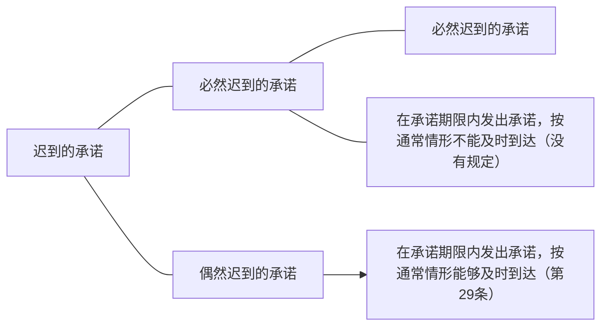

# 一、承诺的概念
承诺（英：anacceptance；德：Annahme），是受要约人同意要约的意思表示（《合同法》第21条）。

《合同法》规定的“承诺”其实有两种类型：一是需要受领的意思表示(empfangsbeduerftige Willenserklarung),二是不需要受领的意思表示(nichtempfangsbedirftige Willenserklarung),它们虽然都是意思表示,都属于广义上的承诺，但二者之间的差异性大于共同点。《合同法》对于“承诺”的规定，不是以包括上述两种类型的广义的承诺，而是以“需要受领的意思表示”为预想模型，“不需要受领的意思表示”被作为“除外”（参照第22条），这样，与其分析抽象的、广义的承诺，不如针对《合同法》规范的特点，分别讨论两类“承诺”。故本节所分析的是狭义的“承诺”，即作为需要受领的意思表示的承诺。作为不需要受领的意思表示的承诺，于后述“[[依要约承诺以外的方式成立合同#二、意思实现|意思实现]]”中分析，以之为“依要约承诺以外的方式成立合同”，[^1]因为它有别于依要约和（狭义的）承诺方式成立合同。或谓此种表述自相矛盾，其实，只要结合《合同法》的特点，不以“广义的承诺”为参照，尚不得认为这种表述自相矛盾。

[^1]:这种表述的使用，至少可以见我妻栄『債権各論（上卷）」（岩波書店，1954年）69頁以下，星野英一「民法概論V契約』（良書普及会，1986年）34頁，三宅正男『契約法（総論）』（青林書院，1978年）24頁以下，水本浩『契約法』（有斐閣，1995年）25頁，内田貴『民法II債権各論』（東京大学出版会，2001年）42頁；王家福主编：《中国民法学·民法债权》［叶安民］，法律出版社1991年版，第301页；韩世远：《合同法总论》，法律出版社2004年版，第115页以下。

# 二、承诺的构成要件
一项有效的承诺应符合下列要件：
## （一）由受要约人作出
依要约实质拘束力原则，唯有受要约人才能获得承诺的资格。受要约人为特定人时，承诺应由该特定人作出；受要约人为不特定人时，承诺可由该不特定人中的任何人作出。受要约人的承诺行为，可由其本人或其授权的代理人作出。除此之外，任何第三人作出同意要约的意思表示，都不能视为承诺，不能因此而成立合同。
## （二）向要约人作出
承诺是对要约的同意，据此成立的合同应由要约人作为一方当事人。因此，承诺应向要约人作出，始能达缔约目的。非向要约人作出同意表示不构成承诺。向要约人的代理人作出承诺，视为向要约人作出。要约人死亡后，要约并非当然失效，在一定条件下，如合同的履行不具有特定人身性质，受要约人仍可向要约人的继承人作出承诺。
## （三）与要约的内容一致
承诺是受要约人愿意按照要约的全部内容与要约人订立合同的意思表示，它应当是无保留的，不应对要约加入任何新的因素（有时称此为“镜像规则”，mirror—imagerule）。不过，严格的“镜像规则”要求承诺须与要约完全一致，就像物体与其镜中的成像一样，不允许对要约作出任何变更。如绝对地贯彻这一规则，未免过于极端，不利于实际交易，因而，《合同法》原则上采纳这一规则，同时作了修正，允许存在例外。

如果受要约人在答复中对要约的内容作出实质性变更，便不构成承诺，而是视为对原要约的拒绝，是一项新要约（《合同法》第30条前段），或称反要约。承诺对要约的内容作出非实质性变更的，除要约人及时表示反对或者要约表明承诺不得对要约的内容作出任何变更的以外，该承诺有效，合同的内容以承诺的内容为准（《合同法》第31条）。此一规则借鉴自CISG第19条第2款，学者称为"lastshotrule"，有关合同标的、数量、质量、价款或者报酬、履行期限、履行地点和方式、违约责任和解决争议方法等的变更，是对要约内容的实质性变更（《合同法》第30条后段）。[^2]

[^2]:《合同法》的规定参考了UCC第2—207条，CISG第19条。

## （四）在承诺期限内到达要约人
### 1.到达主义
承诺是应在承诺期限内发出，抑或进而要求其在承诺期限内到达要约人，做法不一。英美法系国家对非即时的承诺采“发信主义”，故其承诺仅需在承诺期限内发出即可；以德国为代表的大陆法系国家对承诺（意思表示）生效多采“到达主义”，故要求承诺应在承诺期限内到达始为有效。《合同法》第23条第1款规定：“承诺应当在要约确定的期限内到达要约人。”[^3]承诺的生效虽采到达主义，有必要说明的是，承诺的发出并非毫无效力，因承诺的发出，依《合同法》第18条，便排除了要约的撤销。

[^3]:查合同法“建议草案”起章理由，有谓：“鉴于我国对承诺的生效传统上采取，到达主义，故本法从大陆法及《联合国国际货物销售合同公约》的规定。”

>**承诺的生效：发信主义与到达主义**
就承诺的生效时期，存在两种主流见解：一为发信主义，二为到达主义。
提到发信主义，人们容易想到英美法。其实，将英美法中的承诺生效规则完全等同于发信主义，并不准确。英国法（以及包括美国法在内的普通法域）区分对话方式(instantaneous communication)与非对话方式(noninstantaneous communication）。在对话方式场合（面对面讲话或者通过电话交谈），适用到达主义（receipt theory）。对此，丹宁勋爵（Lord Denning）曾经举过一个有名的例子："假如说，我冲着河对岸或者庭院对面的某人大喊着发出要约，可由于头顶刚好掠过飞机，淹没了他的回答，我没有听清，那么这时并不成立合同。如果他想要成立合同，他就必须等到飞机飞走后喊回来他接受，以使我能够听到他所说的内容，直到我得到了他的答复，我才受约束。”在非对话方式场合（比如邮寄信件），英国法则不采到达主义，反而是采发信主义（expedition theory），在英格兰亦称投邮规则（postal rule）或者邮箱规则（mailbox rule）。该规则确立于1818年的Adams v． Lindsell案，那时使用邮政服务越发稀松平常。投邮规则的结果是，承诺是在投邮时而非要约人收到时生效。对此，应予注意的是，第一，投邮规则意味着，即便承诺的信件从未抵达收件人，比如在邮递过程中丢失了，合同依然成立。与到达主义相反，投邮规则由于把承诺迟到或者丢失的风险分配给了要约人，故有利于受要约人。这一规则的历史原因在于，确立该规则时，邮政服务还不太可信，证明一个人寄了一封信要比证明对方收到它相对容易些。第二，投邮规则的实际效果是，它限制了要约人撤销要约的可能性。由于按照英国法，在承诺前要约总是可以撤销的，一旦承诺的信件投邮后承诺便生效了，留给撤销要约的可用时间便缩小了，尤其是要约的撤销须以其到达受要约人方为有效。对此规则的经典说明见于Byrne ＆ Co v. Leonvan Tienhoven ＆ Co（1880）案，van Tienhoven于10月1日在英国加的夫市（Cardiff）寄出信件，向纽约的Byrne发出要约出售马口铁。Byrne于10月11日收到信件，并立即发电报承诺。可是，在10月8日van Tienhoven已经邮寄了另一封信，撤销其要约，原因是马口铁的价格上涨了25％。法院认为，对于撤销不适用投邮规则，结果自然是合同成立。另外，《日本民法典》第526条第1项规定：“隔地者间的契约，于发承诺通知时成立。”没有采到达主义，而采发信主义。
到达主义，即承诺须于到达要约人时，才发生法律效力。德国法等对包括承诺在内的意思表示的生效时间采到达主义（参照《德国民法典》第130条第1款）。CISG（第18条第2款）、PICC（第2.1.6条第2款）及PECL（第2：205条）均采到达主义。

要约没有确定承诺期限的，要约以对话方式作出的，应当即时作出承诺，但当事人另有约定的除外；要约以非对话方式作出的，承诺应当在合理期限内到达（参见《合同法》第23条第2款）。
### 2.承诺期限的起算
对于承诺期限的起算，《合同法》第24条规定：“要约以信件或者电报作出的，承诺期限自信件载明的日期或者电报交发之日开始计算。信件未载明日期的，自投寄该信件的邮戳日期开始计算。要约以电话、传真等快速通讯方式作出的，承诺期限自要约到达受要约人时开始计算。”[^4]

[^4]:参见CISG第20条第1款；PICC第2.8条第1款。“建议草案”的起草理由谓：“承诺的期限主要是为要约人的利益而设，则承诺期限的起算，也应与此一致。因此我们做出有利于要约人的规定，首先使其有权决定承诺期限的起算时间，其次推定承诺期限从要约由邮局发出时起算。”“以电话、电传、传真等快速通讯方法发出的要约，由于该要约发出后即刻就到达受要约人，该到达的时刻既然为要约人控制，亦为受要约人所知，以双方均能知道的时刻作为承诺期限起算的时刻，更能体现公正平等原则。本款照顾了受要约人的利益，是对前款的平衡。”

### 3.迟到的承诺
承诺在承诺期限届满后或在合理期限过后始到达要约人的，构成迟到的承诺。具体可区分若干类型。

《合同法》关于迟到的承诺分别在第28条和第29条两个条文中予以规定，一个规定必然迟到的承诺，另一个规定偶然迟到的承诺。这在外在形式上，《合同法》的上述规定与CISG第21条以及PECL第2：207条有所差异，但实质内容大致相似。

《合同法》第28条和第29条在功能上相当于第23条（承诺期限）及第26条（承诺的生效）的但书（aproviso），2按照第23条和第26条的推论，未按时到达要约人的承诺无效。而依第28条和第29条则规定，迟到的承诺在有些场合仍然可以有所补救进而成立合同。

无论是必然迟到的承诺还是偶然迟到的承诺，是否补救，均取决于要约人，且二者在法律构造上有所区别，以下分别说明。
#### （1）必然迟到的承诺
![[第三编 合同#^mtl9tw|民法典486]]
受要约人超过承诺期限发出承诺的，除要约人及时通知受要约人该承诺有效的以外，为新要约（《合同法》第28条）。该条规定有两层意思，其一，迟到的承诺原则上为新要约；其二，迟到的承诺得因要约人及时通知受要约人而获得补救，进而有效。[^5]从文字表面来看，是迟到的承诺因要约人及时的补救通知而有效，这种解释可称为“原要约承诺模式”，这种解释模式也是CISG第21条第1款所采的模式。不过，透过现象看本质，本质上是受要约人的一个意思表示（迟到的承诺），再加上要约人的一个意思表示（及时通知），进而使合同成立。对此，仍有另外一种解释的可能，即迟到的承诺实为新要约，要约人及时通知可解释为对新要约的承诺，同样可以达到成立合同的结论。这种解释可称为“新要约承诺模式”。而后面一种解释，可能更为自然，更为符合当事人的真实意思。因为承诺的迟到本来为受要约人所知道或者应当知道，受要约人理应知道这样的承诺是无效的，按“原要约承诺模式”解释，就是受要约人明知其不可为而为之，是不自然的，也不符合其真实的意思。受要约人真实的意思是，他在作出一个意思表示，并且希望这个意思表示实现其效果。如此，像“新要约承诺模式”解释成为新要约，经由原要约人承诺后成立合同，当然是更为自然和更为符合当事人真实意思的。[^6]不过，对第28条如果按“新要约承诺模式”解释，则该条中的“但书”便没有多少实际意义了。本书立场是，对第28条进行解释论展开，不宜脱离其可能的文义，故仍应采“原要约承诺模式”；但若对该条进行立法论分析，将来如重新起草，则不妨考虑改采“新要约承诺模式”。

[^5]:这第二层意思单纯地从法条文字表述来看，似乎并不清楚；不过，通过参考比较法（CISG第21条第1款；PECL第2：207条），实不难理解。不过，客观地说，第28条的文字表述有欠精当，但作解释论展开时，仍有必要揭明，上述第二层意思亦符合该条文规范目的。
[^6]:CISG第21条第1款虽属于此处所说的“原要约承诺模式”，对其作解释时，仍有学者愿意透过现象看本质，指出“受要约人须始终明白，他承诺晚了，因而他知道，他的承诺实际上是一个反要约，且需要一个承诺加以确认".See Fritz Enderlain & Dietrich Maskow,International Sales Law:United Nations Conventionon Contracts for the International Sale of Goods;Convention on the Limitation Period in the International Sale of Goods 103（1992）.

受要约人即使是在承诺期限内发出承诺，如果按通常情形不能及时到达要约人，比如受要约人在承诺期限届满前一天以邮寄信件方式承诺，而该信件的正常邮递通常需要三天时间，故该信件到达要约人时必然迟到。此种情形，并没有包括在第28条可能的文义范围之内，因为第28条明确规定的是“受要约人超过承诺期限发出承诺的”情形。对于这种必然迟到的承诺，依《合同法》第23条及第26条的推论，原则上亦不发生承诺的效力。但是，对于此种情形，是否有补救的余地，《合同法》并没有规定，且无法通过对第28条作扩张解释加以涵盖。相对于第28条所规定的超过承诺期限发出承诺的情形，这种情形虽然同样是迟到，但毕竟没有迟到那么晚；在法律上迟到更晚的情形尚且有补救的余地，举重以明轻，对于迟到相对较轻的情形，也应允许补救。在此意义上讲，对于在承诺期限内发出但迟到的承诺，《合同法》可谓存在法律漏洞。就此漏洞，基于第28条的规范目的，实应通过对该条作目的性扩张的方式，加以填补。[^7]

[^7]:关于目的性扩张与扩张解释的区别，请阅读梁慧星：《论法律解释方法》，载《比较法研究》1993年第1期；杨仁寿：《法学方法论》，中国政法大学出版社1999年版，第155页。

对于必然迟到的承诺，是否成立合同，决定权在于要约人。如果他希望成立合同，则需要及时通知受要约人其承诺有效；如果他不再希望成立合同（比如由于价格波动），则无须任何举动。
合同成立的时间在实践中会是一个问题，可能的方案包括：其一，迟到的承诺到达时；其二，要约人的通知到达受要约人时（对新要约的承诺到达新要约人时）。从第28条字面分析，既言“该承诺有效”，就意味着该迟到的承诺仍然发生承诺的法律效果（成立合同），故第一种方案可以成立。
#### (2)偶然迟到的承诺
![[第三编 合同#^iybymn|民法典487]]
受要约人在承诺期限内发出承诺，按照通常情形能够及时到达要约人，但因其他原因承诺到达要约人时超过承诺期限的，可以称为“偶然迟到的承诺”。依《合同法》第29条，除要约人及时通知受要约人因承诺超过期限不接受该承诺的以外，该承诺有效。[^8]

[^8]:参见我国台湾地区“民法”[[第159条]]（承诺迟到之通知）。

偶然迟到的承诺场合，受要约人会以为自己订立了合同，因为他并不知道承诺在传递过程中被耽搁了。因此，第29条的原则立场是“该承诺有效”。

偶然迟到的承诺毕竟是迟到的承诺，为了顾及要约人的利益，立法依旧将决定权交给要约人。要约人如果依旧希望成立合同，只要默不作声即可；要约人如果不再希望成立合同，则须及时通知受要约人因承诺超过期限不接受该承诺。

>**承诺的自由与承诺的强制**
承诺的作出应当是自由的，这是合同自由原则的当然要求，除个别国家的立法明确规定以外（比如，《奥地利民法典》第869条规定承诺必须是“自由地、严肃地、确切地及易理解地”作出的），大多数国家的立法并未明文规定，而视为当然自明之理。唯在现代社会，对于上述当然自明之理发展出了一些例外，使一方当事人负有缔约义务（adutytocontract），称强制缔约。最典型的代表是关于电力、煤气、火车、航空等公用事业（publicutilities），于诸此场合，消费者（或旅行者）一般说来“有权”要求这些服务的提供者接受其利用这些服务的要约。另外，有些国家的竞争法出于维护市场正常竞争秩序的需要，也以特别立法的形式规定了一些缔约义务，比如，德国《反不正当竞争法》（1989年修订）第26条便禁止在市场上居于优势地位的企业的通过歧视行为或限价行为以排挤弱小企业进入市场。在我国，邮政、电信、电业、煤气、天然气、自来水、铁路、公共汽车等公用事业单位，负有缔约义务，非有正当理由，不得拒绝用户的缔约请求（参见《合同法》第289条、《电力法》第26条第1款、《电信条例》第41条第4项等）。
# 三、承诺的方式
承诺的方式，指承诺人以何种方式将承诺的意思传达给要约人。如当事人有特别指定，通常应依其指定；如没有特别指定，则可依交易习惯或具体情形，采用适当的方式承诺。

在要约特别指定承诺方式场合，比如，要约要求“承诺须以返回所附表格的方式作出”，或者要求“须以挂号信回复”，由此引发一项实务上重要的问题：如果受要约人没有严格遵从上述要求，而是以电子邮件表示承诺，是否发生承诺的效果呢？换言之，要约所要求的承诺方式是不是唯一有效的承诺方式呢？答案自然取决于如何解释要约。通常，受要约人理应按照要约要求的方式承诺，但是，如果要约人限定特定承诺方式的唯一原因是想确保迅速的回应，受要约人使用其他能够实现相同目的的其他方式，亦得构成有效的承诺。如果所要求的是“邮寄信件”，以更快的方式自然也可以；0如果要求“挂号信函”，普通平信也是可以接受的。

《合同法》第22条规定：“承诺应当以通知的方式作出，但根据交易习惯或者要约表明可以通过行为作出承诺的除外。”3这是关于承诺方式的基本规定，据此，承诺通常以承诺通知（Annahmeerklarung）的方式作出，唯不以明示者为限，亦得包括以行为表示承诺意思，于例外场合，承诺尚得表现为沉默或者不作为。
## （一）明示的承诺
承诺是一种意思表示，须采取一定的方式，使要约人知道此种同意缔约的意思，始发生效力。《合同法》规定“承诺应当以通知的方式作出”，但对于究竟以什么方式通知，并没有具体的限定，因而，承诺通知既可以采用口头方式，也可以采用书面方式，只要能够明确表达同意接受要约的意思（承诺意思）即可。且没有必要一定要与要约的方式保持相同，对于以信件形式作出的要约，也可采取电报甚至电话的方式承诺。这种以通知的方式作出的承诺，称为明示的承诺。承诺原则上采此方式。
## （二）默示的承诺
承诺是受要约人同意要约的意思表示，意思表示既可有明示与默示两种方式，且已被《民法总则》第140条第1款所明确肯定，因而自然也就会有“明示的承诺”与“默示的承诺”之分。且可以认定为依默示的意思表示进行承诺的场合，并不少见，比如，按照要约的内容实际送货，或者对与要约同时送来的物品付款等，属对要约人的因承诺而成立之合同的履行行为，作出此等行为即属默示的承诺。依前述结论,默示的承诺可表述为依可推断之行为发出的承诺(Annahme durch schlussiges Verhalten),默示的承诺可作广义与狭义的区分。就广义而言,凡从特定的行为（甚至不作为）中间接地推知行为人承诺的意思表示，均属之，不论此意思表示是否需要通知要约人。就狭义而言，默示的承诺仅限于需要将默示作出的承诺的意思表示通知要约人的情形，承诺无须通知的情形排除在外。）此处主要是在狭义上使用“默示的承诺”这一概念。

关于默示的承诺，《合同法》虽然没有直接规定，宜理解为《合同法》没有特别区分明示的承诺与默示的承诺而异其规则，有关承诺的一般规则，对二者均有适用。默示的承诺，虽然没有用语言或者文字的形式，向要约人表达承诺意思，但通过向要约人作出特定的行为，也同样表达了承诺的意思，因而，仍然需要"承诺的通知”。

在要式合同场合，如果只是存在默示的承诺，合同原则上不成立，有的场合合同无效，不过，受要约人所作出的如属履行行为，且符合“履行主要义务”的要件时，仍可因此修正形式要求，依《合同法》第36条或第37条，合同成立。
“默示的承诺”与“意思实现”的区别，容于后述。
## （三）沉默
沉默，即既不表示同意，也不表示反对，故又称“不作为的默示”。普遍接受的准则是，单纯的沉默（inblossomSchweigen）并不构成对于要约的承诺，即使要约人在其要约中表明沉默将被作为承诺，亦是如此。否则，如果把一切沉默都看作意思表示，就会引起秩序的混乱。《合同法》对此虽未明文规定，[^9]但应作如此解释。原因在于，要约人主动建议订立合同，受要约人承诺与否是自由的，不予理会也是自由的。承诺作为一种意思表示，除了承诺的意思之外，尚须经过表示，始具法律意义。

[^9]:“建议草案”第15条第2款曾规定：“沉默或者不作为本身不构成承诺。”系借鉴了CISG第18条第1款及PICC第26条第1款的规定。

对于上述原则，存有例外场合，沉默仍具有意思表示（承诺）的意义。依《民法总则》第140条第2款，“沉默只有在有法律规定、当事人约定或者符合当事人之间的交易习惯时，才可以视为意思表示”。首先，在个别场合，法律直接规定了沉默视为承诺。比如，《合同法》第171条：“试用买卖的买受人在试用期内可以购买标的物，也可以拒绝购买。试用期间届满，买受人对是否购买标的物未作表示的，视为购买。”其次，当事人可约定沉默具有表示的意义。比如，当事人双方事先已约定，一方如未在某一既定期限内作出拒绝的表示，就视为承诺。最后，如果当事人之间有交易习惯，也可能存在例外。对于商事关系中的沉默，可否或者应否基于交易习惯或者惯例、双方当事人之间的往常做法等交易环境因素，进一步承认若干例外，应持肯定立场。

>**商事关系中的沉默：法国与德国**
从比较法来看，法国破弃院（Cour de Cassation）在1988年裁判过一起案件，案中双方当事人一致同意，买方可以通过报价方式行使选择权，购买卖方的露天游乐场，卖方接下来会在14天内给予答复。买方表示愿出10万法郎（合15000欧元），行使了该选择权，此后，再未收到卖方的任何回复。法院认为，在本案中，沉默构成了承诺。显然在这类案件中，沉默并非是一个孤立的存在，它通常伴随着一系列的周边环境，比如当事人之间先前的交涉、长期的商业关系以及双方当事人业已习惯了的商业惯例（a course of business）、对迅速回复的现实需要，等等。法国人称此为“依环境而定的沉默”（法：silence circonstancié；英：circumstantial silence）。另外一个例子是商业实践中所谓的确认书（英：confirmatory notes；德：Bestätigungsschreiben）。如果当事人经过讨价还价几乎准备签订合同了，一方会就双方口头同意的事项给对方发一份“确认”，总结要点，且可能会附上自己的格式文本。德国判例法确定地认为，如果对方不同意此文件，则须立即拒绝，以免受其约束。
# 四、承诺的生效时间
承诺生效时合同成立（《合同法》第25条），当事人通常自此时开始负有履行合同的义务，因而承诺生效的时点意义重大。在我国法上，承诺通知到达要约人时生效（《合同法》第26条前段），不论明示的承诺还是默示的承诺，均应当适用该规则。承诺通知于到达要约人支配的范围内时生效，这与大陆法系多数国家所采取的“到达主义”原则是相一致的，也符合我国参加的CISG。另外，依到达主义，承诺传递中的风险应当由受要约人承担，承诺函电遗失将使承诺不生效。
# 五、承诺的撤回
承诺的撤回，是承诺人阻止承诺发生法律效力的一种意思表示。由于承诺一经送达要约人即发生法律效力，合同也随之成立，受要约人应受合同的约束，不得撤销承诺。所以，撤回承诺的通知须先于或同时与承诺到达要约人，才能发生阻止承诺生效的效果。因而，《合同法》第27条规定：“承诺可以撤回。撤回承诺的通知应当在承诺通知到达要约人之前或者与承诺通知同时到达要约人。”
# 六、“格式之争”问题
在现代商业实践中，发生有所谓“格式之争”（battle of forms）的特殊问题，“此一问题发生在一方当事人发出一个表格，声称合同依据他的条款，而另一方当事人返还一个表格答复道：该合同依据他的条款！”“格式之争”直接关系到合同是否成立，以及以什么内容成立合同，是一项重要的现实问题。

无论英美法系还是大陆法系，传统的缔约理论均认为承诺须是（或至少应该被要约人理解为是）毫无保留的，有保留地同意之表示并不构成承诺，尽管它可构成一个反要约。依据这种传统缔约理论，“格式之争”的解决之道即所谓“最后用语规则"（last word doctrine，或称last shot principle）。换言之，每一个被采纳的表格都应被当作一个反要约，这样最后一个表格被看作收到者以沉默的方式接受。与此不同，德国判例拒绝追随“最后用语规则”，认为双方当事人的一般交易条件，在它们相互冲突的范围内，并不构成合同的组成部分，由此产生的合同漏洞，则依法律的任意规定（dispositives Recht）确立的规则予以填补，或称此为“其他部分有效说"(Restgitigkeitstheorie)。

自《合同法》第30条及第31条的规定来看，对“格式之争”采取了有限制的“最后用语规则”，即在承诺对要约的内容作出非实质性变更的场合，以承诺的内容成立合同；如果变更属于实质性的，则合同并不成立，其承诺为新要约。
___