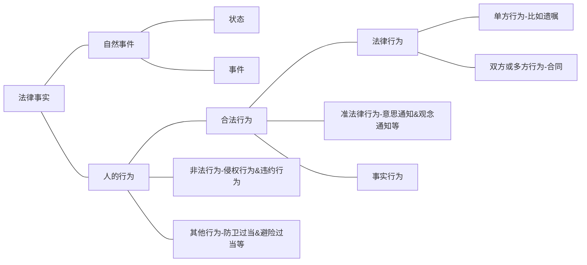

```mermaid
flowchart LR
a[法律事实]
b[自然事件]
c[人的行为]
d[状态]
e[事件]
f[合法行为]
g[非法行为-侵权行为&违约行为]
h[其他行为-防卫过当&避险过当等]
i[法律行为]
j[准法律行为-意思通知&观念通知等]
k[事实行为]
l[单方行为-比如遗嘱]
m[双方或多方行为-合同]
a---b & c
b---d & e
c---f & g & h
f---i & j & k
i---l & m
```