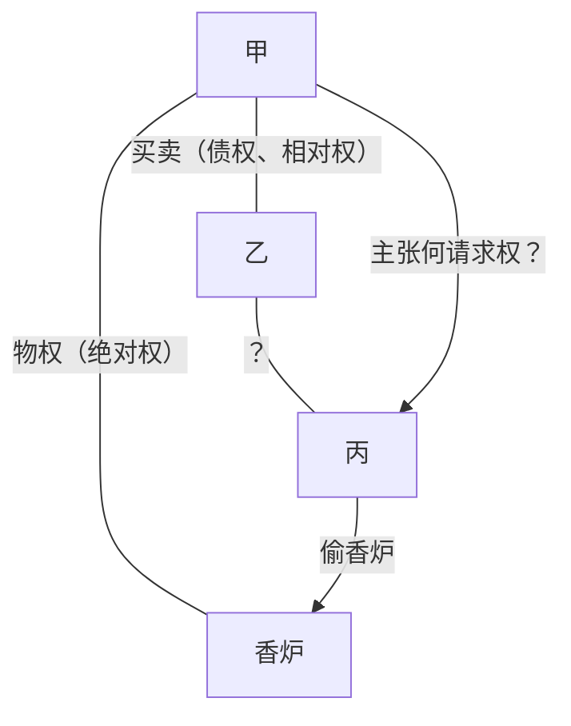

【考点摘要】
本节重点掌握物权与债权的区别，可能会以简答题形式考查。
# 一、物权与债权的区别★★★★★
## （一）绝对性与相对性
物权具有绝对性，以一般不特定人为义务人，要求其不为一定行为；

债权具有相对性，以特定人为义务人，要求其为一定行为。
## （二）优先性与平等性
物权之间具有排他的优先效力问题；

债权适用平等原则，即债权不论发生先后，均居于同等地位。
## （三）非创设性与创设性
物权适用物权法定原则，除法律另有规定外，不得创设；

债权适用契约自由原则，除法律规定者（如侵权行为、不当得利）外，原则上当事人得依契约加以创设。
## （四）公示方法不同
物权变动一般需要完成交付或者登记的公示方法；

债权变动无需公示，例如债权让与，自合意时生效。
## 【例题解说】
债权与物权的性质不同，在第三人侵害时最为显著，详见以下举例说明。

某甲在3月1日将祖传的香炉出卖给收藏家某乙，双方约定于3月5日交付。该香炉在3月4日因为甲保管不当，被某丙所偷。乙在3月20日在丙所经营的古玩店里发现了该香炉。试问当事人之间的法律关系如何？

### （一）甲对丙主张何种请求权？
#### 1.所有物返还请求权
音先应当检讨的是甲能依[[../../../../法律法规汇编/民商法/民法典/第二编 物权#^axo3xh|《民法典》第235条]]的规定向丙请求返还香炉，这时需要甲是香炉的所有权人，丙为无权占有为要件。

甲对香炉原有所有权所有人在法律允许的范围内，可以自由占有、使用、收益、处分其所有物，并排除他人的干涉。现在，甲将该香炉出售给乙（法律上处分），在甲乙之间成买卖合同，乙因此可以向甲请求交村该香炉并移转香炉的所有权（债权）。动产物权的设立和转让，自交付时发生效力[[../../../../法律法规汇编/民商法/民法典/第二编 物权#^n3trw7|《民法典》第224条]]），甲出卖给乙的香炉在交付前夕被偷，所有权尚未移转，甲仍然是香炉的所有权人。丙侵夺香炉，欠缺占有上的本权，应成立无权占有。因此，甲可依[[../../../../法律法规汇编/民商法/民法典/第二编 物权#^axo3xh|《民法典》第235条]]的规定，向丙返还该香炉。
#### 2.侵权行为损害赔偿请求权（《民法典》第1165条第1款）
甲为香炉的所有人，丙偷走香炉，侵害了甲对香炉的占有、使用、收益，属于故意不法侵害其所有权、甲可依[[../../../../法律法规汇编/民商法/民法典/第七编 侵权责任#^0jplgg|《民法典》第1165条]]第1款规定，要求丙承担侵权责任。
### （二）乙对甲可主张的权利
基于有效成立的买卖合同，乙可向甲请求交付香炉，并移转其所有权。在约定交付的前夕，买卖标的物被盗，并且已经查明香炉的去处，并没有在客观上构成给付不能，也就是说债权人乙对甲的债权请求权还未消灭，乙仍可以向甲请求交付香炉。甲可依[[../../../../法律法规汇编/民商法/民法典/第二编 物权#^axo3xh|《民法典》第235条]]的规定，从丙处取回该香炉，再交付给乙；另外，债务人甲的履行义务有确定的期限，在期限届满后，也就是过了3月5日，甲还没完成交付，乙可以追究甲因履行迟延而产生的违约责任。
### （三）乙对丙主张的权利
#### 1.乙能否基于买卖合同而生的债权，向丙请求交付买卖标的物（香炉）？
基于有效成立的买卖合同，乙固然可以向甲请求交付买卖标的物，并移转香炉的所有权。问题在于乙能否基于这项债权向丙请求交付香炉？关于这个问题，应该采纳否定说。因为债权人只能向债务人请求履行债务，对买卖标的物本身并没有直接支配的权利，所以乙对第三人丙没有请求交付买卖标的物的权利。（债权的相对性）
#### 2.乙对丙是否有侵害债权而产生的损害赔偿请求权？
依照参考书的观点，债权是特定人间请求特定行为的权利，不具有公示性，第三人不知道这种债权的存在，并且为了维护交易自由，原则上应认为债权不属于侵权法上所保护的民事权益。但加害人故意以有背于善良风俗的方式侵害他人债权的，则可以构成侵权。本案中，丙仅想将香炉据为己有，并没有侵害乙债权的恶意，因此对乙不构成侵权。如果丙盗窃香炉的目的是不让乙实现自己的债权（即取得香炉的所有权），则丙构成以有背于善良风俗的方式侵害乙的债权，乙可以向丙主张侵权损害赔偿请求权。
# 【考点分析】
可能考查简答题，如请简要迷物权与债权的区别。本节【例题解说】不仅在于帮助大家更清晰地明白物权与债权的区别，也是作答民法案例题的一个范本，请考生务必认真阅读！
# 【知识拓展】
可见[[../../../../民法专著/王泽鉴九阴真经/民法总则/法律关系与权利体系/物权与债权#一、物权与债权的区别|王泽鉴《民法总则》第三章中物权和债权的概念和区别]]。