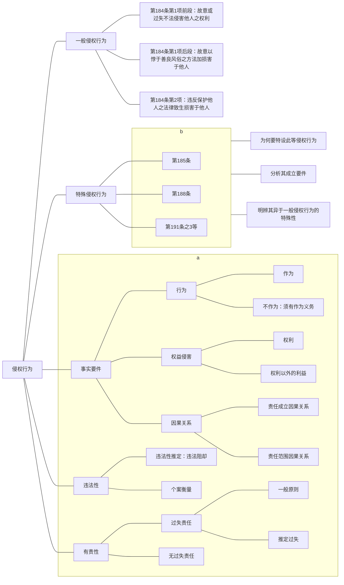

```mermaid
flowchart LR
1[侵权行为]
1---2
1---3
1---4
subgraph a
2[事实要件]
3[违法性]
4[有责性]
5[行为]
6[权益侵害]
7[因果关系]
2---5
2---6
2---7
8["违法性推定：违法阻却"]
9[个案衡量]
3---8
3---9
11[过失责任]
12[无过失责任]
4---11
4---12
13[作为]
14["不作为：须有作为义务"]
5---13
5---14
15[权利]
16[权利以外的利益]
6---15
6---16
17[责任成立因果关系]
18[责任范围因果关系]
7---17
7---18
19[一般原则]
21[推定过失]
11---19
11---21
end
22[一般侵权行为]
23[特殊侵权行为]
1---22
1---23
24["第184条第1项前段：故意或过失不法侵害他人之权利"]
25["第184条第1项后段：故意以悖于善良风俗之方法加损害于他人"]
26["第184条第2项：违反保护他人之法律致生损害于他人"]
22---24
22---25
22---26
subgraph b
27[第185条]
28[第188条]
29[第191条之3等]
end
23---27
23---28
23---29
31[为何要特设此等侵权行为]
32[分析其成立要件]
33[明辨其异于一般侵权行为的特殊性]
b---31
b---32
b---33
```
[[../../台湾民法典相关条文/第185条]]、[[../../台湾民法典相关条文/第188条]]、[[../../台湾民法典相关条文/第191条之3]]