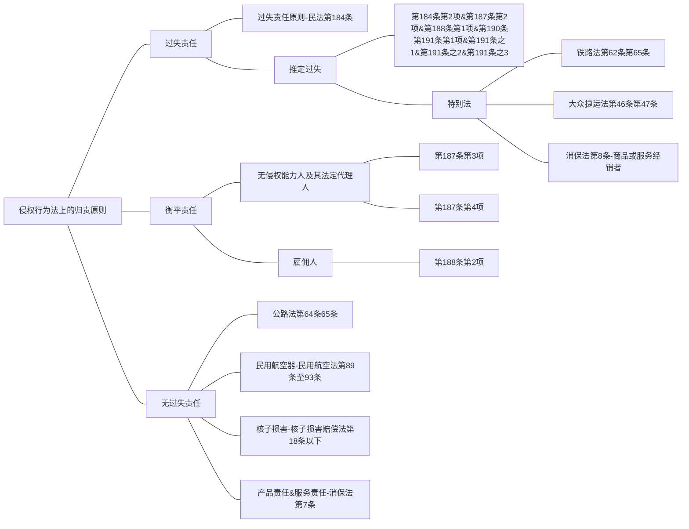

```mermaid
flowchart LR
a[侵权行为法上的归责原则]
b[过失责任]
c[衡平责任]
d[无过失责任]
e[过失责任原则-民法第184条]
a---b & c & d
b---e
f[推定过失]
b---f
f---第184条第2项&第187条第2项&第188条第1项&第190条第191条第1项&第191条之1&第191条之2&第191条之3
c---无侵权能力人及其法定代理人---第187条第3项 & 第187条第4项
c---雇佣人---第188条第2项
f---特别法---铁路法第62条第65条 & 大众捷运法第46条第47条 & 消保法第8条-商品或服务经销者
d---A & B & C & D
A[公路法第64条65条] 
B[民用航空器-民用航空法第89条至93条]
C[核子损害-核子损害赔偿法第18条以下]
D[产品责任&服务责任-消保法第7条]
```