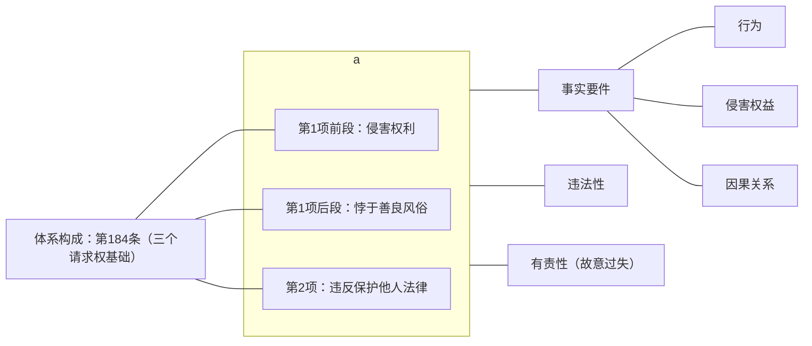
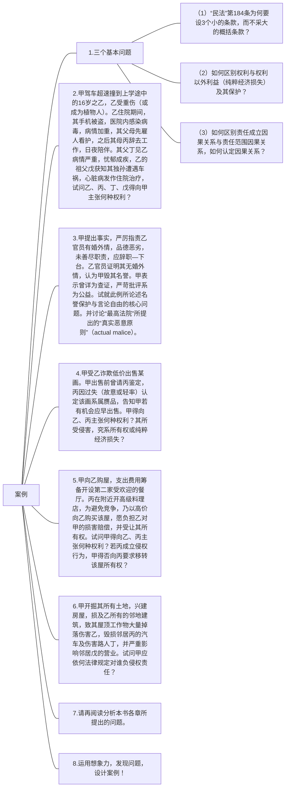

```mermaid
flowchart LR
1["体系构成：第184条（三个请求权基础）"]
subgraph a
2["第1项前段：侵害权利"]
3["第1项后段：悖于善良风俗"]
4["第2项：违反保护他人法律"]
end
1---2 & 3 & 4
5[事实要件]
6[违法性]
7["有责性（故意过失）"]
a---5 & 6 & 7
8[行为]
9[侵害权益]
10[因果关系]
5---8 & 9 & 10
```

```mermaid
flowchart LR
a[案例]
1["1.三个基本问题"]
2["2.甲驾车超速撞到上学途中的16岁之乙，乙受重伤（或成为植物人）。乙住院期间，其手机被盗，医院内感染病毒，病情加重，其父母先雇人看护，之后其母丙辞去工作，日夜陪伴。其父丁见乙病情严重，忧郁成疾，乙的祖父戊获知其独孙遭遇车祸，心脏病发作住院治疗，试问乙、丙、丁、戊得向甲主张何种权利？"]
3["3.甲提出事实，严厉指责乙官员有婚外情，品德恶劣，未善尽职责，应辞职—下台。乙官员证明其无婚外情，认为甲毁其名誉。甲表示曾详为查证，严苛批评系为公益。试就此例所论述名誉保护与言论自由的核心问题。并讨论“最高法院”所提出的“真实恶意原则”（actual malice）。"]
4["4.甲受乙诈欺低价出售某画。甲出售前曾请丙鉴定，丙因过失（故意或轻率）认定该画系属赝品，告知甲若有机会应早出售。甲得向乙、丙主张何种权利？其所受侵害，究系所有权或纯粹经济损失？"]
5["5.甲向乙购屋，支出费用筹备开设第二家受欢迎的餐厅。丙在附近开高级料理店，为避免竞争，乃以高价向乙购买该屋，愿负担乙对甲的损害赔偿，并受让其所有权。试问甲得向乙、丙主张何种权利？若丙成立侵权行为，甲得否向丙要求移转该屋所有权？"]
6["6.甲开掘其所有土地，兴建房屋，损及乙所有的邻地建筑，致其屋顶工作物大量掉落伤害乙，毁损邻居丙的汽车及伤害路人丁，并严重影响邻居戊的营业。试问甲应依何法律规定对谁负侵权责任？"]
7["7.请再阅读分析本书各章所提出的问题。"]
8["8.运用想象力，发现问题，设计案例！"]
a---1 & 2 & 3 & 4 & 5 & 6 & 7 & 8
9["（1）“民法”第184条为何要设3个小的条款，而不采大的概括条款？"]
10["（2）如何区别权利与权利以外利益（纯粹经济损失）及其保护？"]
11["（3）如何区别责任成立因果关系与责任范围因果关系，如何认定因果关系？"]
1---9 & 10 & 11
```