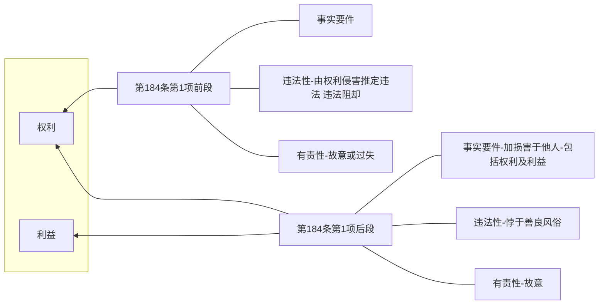

```mermaid
flowchart RL
subgraph  
a[权利]
b[利益]
end
c[第184条第1项前段]
d[第184条第1项后段]
e[事实要件]
f[违法性-由权利侵害推定违法 违法阻却]
g[有责性-故意或过失]
h[事实要件-加损害于他人-包括权利及利益]
i[违法性-悖于善良风俗]
j[有责性-故意]
c-->a
d--->a & b
e & f & g---c
h & i & j---d
```