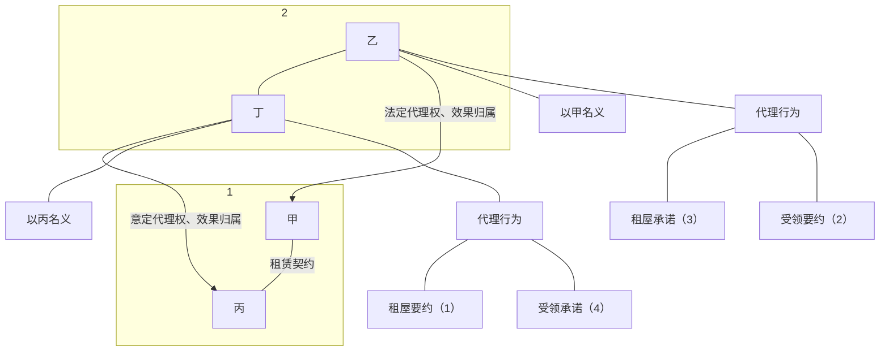

```mermaid
flowchart TB
subgraph 1
甲---|租赁契约|丙
end
subgraph 2
乙---丁
end
乙--->|"法定代理权、效果归属"|甲
丁--->|"意定代理权、效果归属"|丙
a[代理行为]
b[代理行为]
乙---以甲名义
乙---a
丁---以丙名义
丁---b
3["租屋承诺（3）"]
4["受领要约（2）"]
5["租屋要约（1）"]
6["受领承诺（4）"]
a---3
a---4
b---5
b---6
```