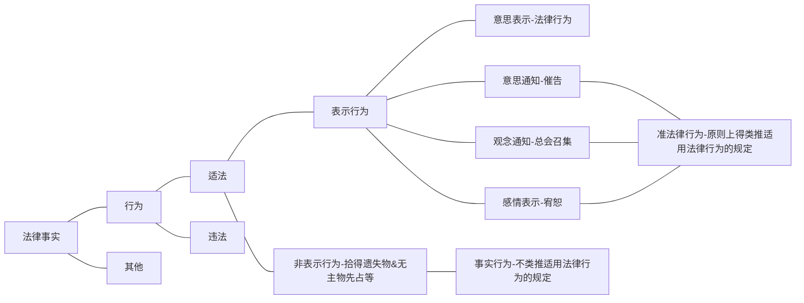

```mermaid
flowchart LR
1[法律事实]
2[行为]
3[其他]
1---2
1---3
4[适法]
5[违法]
2---4
2---5
6[表示行为]
7[非表示行为-拾得遗失物&无主物先占等]
4---6
4---7
8[意思表示-法律行为]
9[意思通知-催告]
11[观念通知-总会召集]
12[感情表示-宥恕]
6---8
6---9
6---11
6---12
13[准法律行为-原则上得类推适用法律行为的规定]
9---13
11---13
12---13
14[事实行为-不类推适用法律行为的规定]
7---14
```
