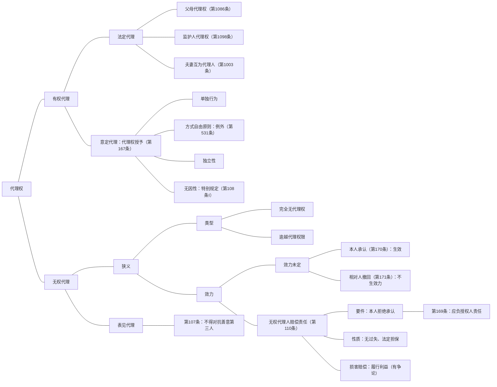
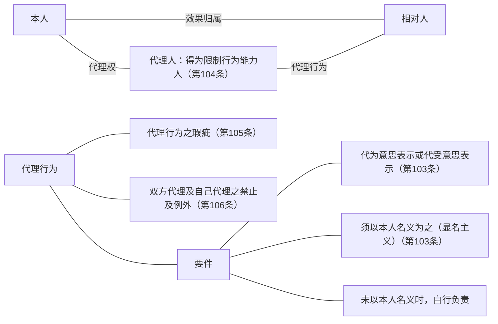

```mermaid
flowchart LR
1[代理权]
2[有权代理]
3[无权代理]
1---2
1---3
4[法定代理]
5["意定代理：代理权授予（第167条）"]
2---4
2---5
6["父母代理权（第1086条）"]
7["监护人代理权（第1098条）"]
8["夫妻互为代理人（第1003条）"]
4---6
4---7
4---8
9[单独行为]
11["方式自由原则：例外（第531条）"]
12[独立性]
13["无因性：特别规定（第108条I）"]
5---9
5---11
5---12
5---13
14[狭义]
15[表见代理]
3---14
3---15
16[类型]
17[效力]
14---16
14---17
18[完全无代理权]
19[逾越代理权限]
16---18
16---19
21[效力未定]
22["无权代理人赔偿责任（第110条）"]
17---21
17---22
23["本人承认（第170条）：生效"]
24["相对人撤回（第171条）：不生效力"]
21---23
21---24
25["要件：本人拒绝承认"]
26["性质：无过失、法定担保"]
27["损害赔偿：履行利益（有争论）"]
22---25
22---26
22---27
28["第107条：不得对抗善意第三人"]
29["第169条：应负授权人责任"]
15---28
25---29
```

```mermaid
flowchart LR
1[本人]
2["代理人：得为限制行为能力人（第104条）"]
3[相对人]
1---|代理权|2
1---|效果归属|3
2---|代理行为|3
4[代理行为]
5[要件]
6["代理行为之瑕疵（第105条）"]
7["双方代理及自己代理之禁止及例外（第106条）"]
4---5
4---6
4---7
8["代为意思表示或代受意思表示（第103条）"]
9["须以本人名义为之（显名主义）（第103条）"]
11["未以本人名义时，自行负责"]
5---8
5---9
5---11
```