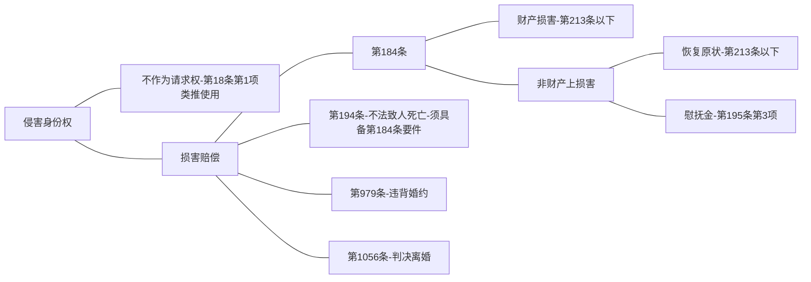

```mermaid
flowchart LR
1[侵害身份权]
2[不作为请求权-第18条第1项类推使用]
3[损害赔偿]
4[第184条]
5[第194条-不法致人死亡-须具备第184条要件]
6[第979条-违背婚约]
7[第1056条-判决离婚]
8[财产损害-第213条以下]
9[非财产上损害]
0[恢复原状-第213条以下]
10[慰抚金-第195条第3项]
1---2
1---3
3---4
3---5
3---6
3---7
4---8
4---9
9---0
9---10
```
[[../../台湾民法典相关条文/第18条]]、[[../../台湾民法典相关条文/第184条]]、[[../../台湾民法典相关条文/第213条]]、[[../../台湾民法典相关条文/第194条]]、[[../../台湾民法典相关条文/第979条]]、[[../../台湾民法典相关条文/第1056条]]、[[../../台湾民法典相关条文/第195条]]