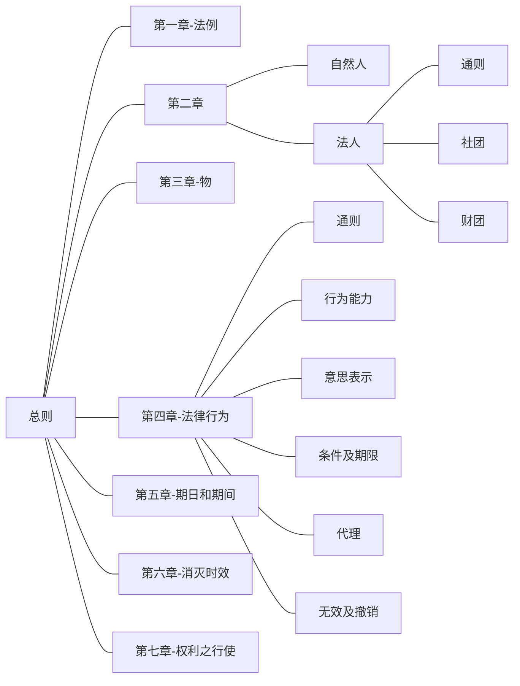

```mermaid
flowchart LR
A[总则]
a[第一章-法例]
b[第二章]
c[第三章-物]
d[第四章-法律行为]
e[第五章-期日和期间]
f[第六章-消灭时效]
g[第七章-权利之行使]
A---a & b & c & d & e & f & g
1[自然人]
2[法人]
3[通则]
4[行为能力]
5[意思表示]
6[条件及期限]
7[代理]
8[无效及撤销]
b---1 & 2
d---3 & 4 & 5 & 6 & 7 & 8
h[通则]
i[社团]
j[财团]
2---h & i & j
```