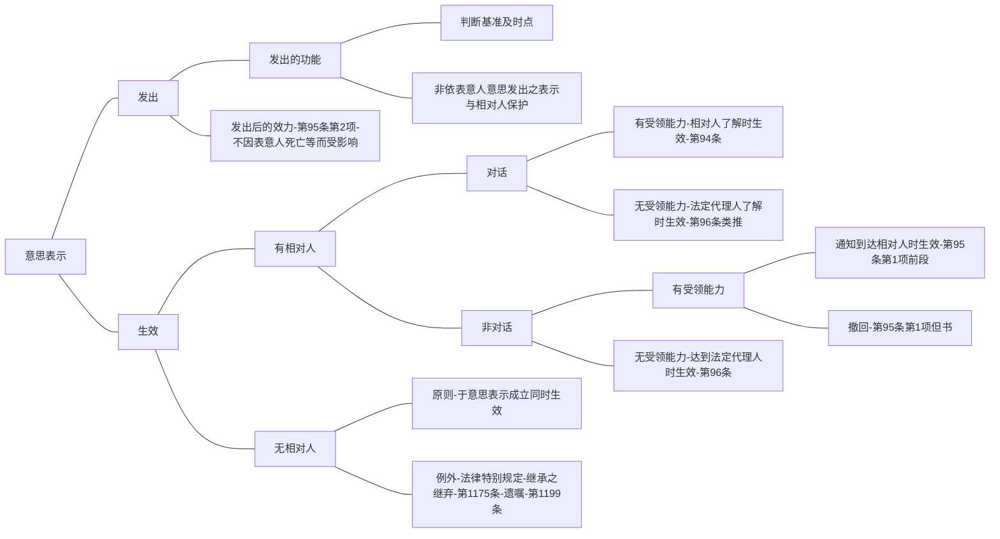

```mermaid
flowchart LR
1[意思表示]
2[发出]
3[生效]
1---2
1---3
4[发出的功能]
5[发出后的效力-第95条第2项-不因表意人死亡等而受影响]
2---4
2---5
6[判断基准及时点]
7[非依表意人意思发出之表示与相对人保护]
4---6
4---7
8[有相对人]
9[无相对人]
3---8
3---9
11[对话]
12[非对话]
8---11
8---12
13[有受领能力-相对人了解时生效-第94条]
14[无受领能力-法定代理人了解时生效-第96条类推]
11---13
11---14
15[有受领能力]
16[无受领能力-达到法定代理人时生效-第96条]
12---15
12---16
17[通知到达相对人时生效-第95条第1项前段]
18[撤回-第95条第1项但书]
15---17
15---18
19[原则-于意思表示成立同时生效]
21[例外-法律特别规定-继承之继弃-第1175条-遗嘱-第1199条]
9---19
9---21
```