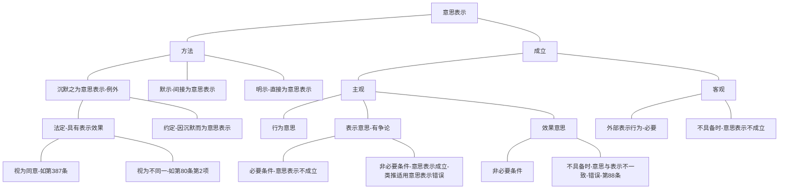

```mermaid
flowchart TB
1[意思表示]
2[方法]
3[成立]
1---2
1---3
4[沉默之为意思表示-例外]
5[默示-间接为意思表示]
6[明示-直接为意思表示]
2---4
2---5
2---6
7[法定-具有表示效果]
8[约定-因沉默而为意思表示]
4---7
4---8
9[视为同意-如第387条]
11[视为不同一-如第80条第2项]
7---9
7---11
12[主观]
13[客观]
3---12
3---13
14[行为意思]
15[表示意思-有争论]
16[效果意思]
12---14
12---15
12---16
17[非必要条件]
18[不具备时-意思与表示不一致-错误-第88条]
16---17
16---18
19[必要条件-意思表示不成立]
21[非必要条件-意思表示成立-类推适用意思表示错误]
15---19
15---21
22[外部表示行为-必要]
23[不具备时-意思表示不成立]
13---22
13---23
```