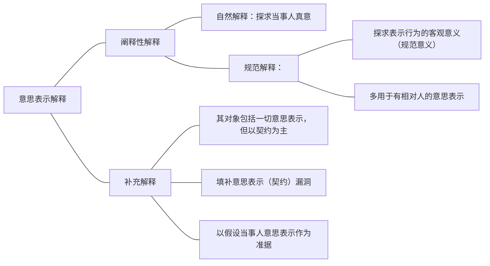

```mermaid
flowchart LR
1[意思表示解释]
2[阐释性解释]
3[补充解释]
1---2
1---3
4["自然解释：探求当事人真意"]
5["规范解释："]
2---4
2---5
6["探求表示行为的客观意义（规范意义）"]
7[多用于有相对人的意思表示]
5---6
5---7
8["其对象包括一切意思表示，但以契约为主"]
9["填补意思表示（契约）漏洞"]
11[以假设当事人意思表示作为准据]
3---8
3---9
3---11
```