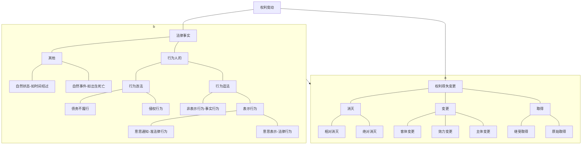

```mermaid
flowchart TB
1[权利变动]
2[权利得失变更]
3[法律事实]
4[消灭]
5[变更]
6[取得]
7[相对消灭]
8[绝对消灭]
9[客体变更]
11[效力变更]
12[主体变更]
13[继受取得]
14[原始取得]
15[其他]
16[行为人的]
17[自然状态-如时间经过]
18[自然事件-如出生死亡]
19[行为违法]
21[行为适法]
22[债务不履行]
23[侵权行为]
24[非表示行为-事实行为]
25[表示行为]
26[意思通知-准法律行为]
27[意思表示-法律行为]
1---2
1---3
subgraph a
2---4
2---5
2---6
4---7
4---8
5---9
5---11
5---12
6---13
6---14
end
subgraph b
3---15
3---16
15---17
15---18
16---19
16---21
19---22
19---23
21---24
21---25
25---26
25---27
end
b--->a
```