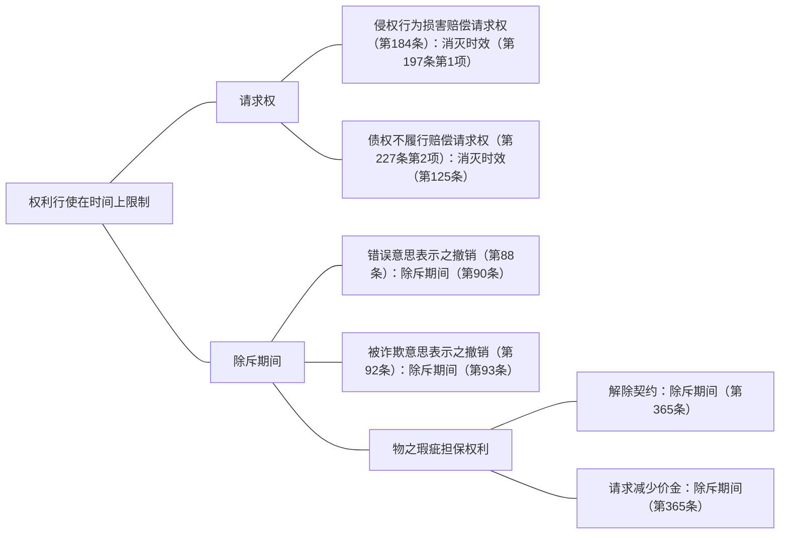

```mermaid
flowchart LR
1[权利行使在时间上限制]
2[请求权]
3[除斥期间]
1---2
1---3
4["侵权行为损害赔偿请求权（第184条）：消灭时效（第197条第1项）"]
5["债权不履行赔偿请求权（第227条第2项）：消灭时效（第125条）"]
2---4
2---5
6["错误意思表示之撤销（第88条）：除斥期间（第90条）"]
7["被诈欺意思表示之撤销（第92条）：除斥期间（第93条）"]
8[物之瑕疵担保权利]
3---6
3---7
3---8
9["解除契约：除斥期间（第365条）"]
11["请求减少价金：除斥期间（第365条）"]
8---9
8---11
```