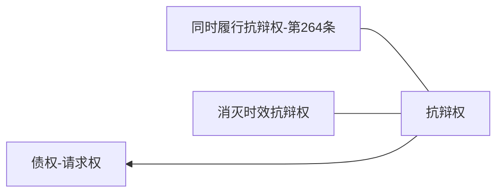
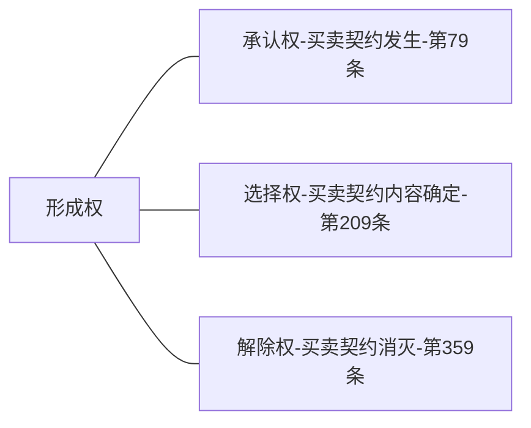

```mermaid
flowchart RL
a[抗辩权]
b[同时履行抗辩权-第264条]
c[消灭时效抗辩权]
d[债权-请求权]
a---b
a---c
a--->d
```
↑

```mermaid
flowchart LR
a[买卖契约即债之关系的得丧变更]
```
↑

```mermaid
flowchart LR
a[形成权]
b[承认权-买卖契约发生-第79条]
c[选择权-买卖契约内容确定-第209条]
d[解除权-买卖契约消灭-第359条]
a---b
a---c
a---d
```
[[../../台湾民法典相关条文/第264条]]、[[../../台湾民法典相关条文/第79条]]、[[../../台湾民法典相关条文/第209条]]、[[../../台湾民法典相关条文/第359条]]

