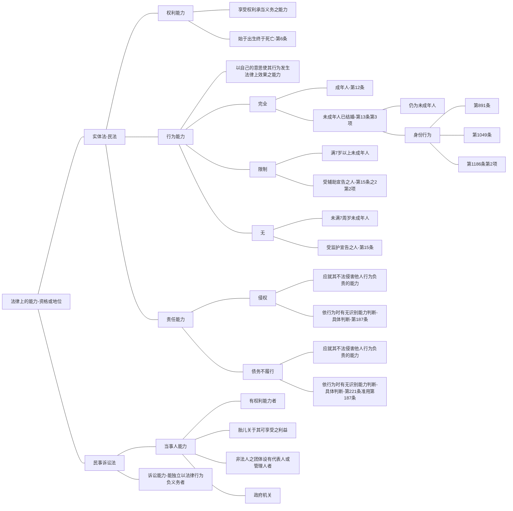

[[../../台湾民法典相关条文/第6条]]、[[../../台湾民法典相关条文/第12条]]、[[../../台湾民法典相关条文/第13条]]、[[../../台湾民法典相关条文/第891条]]、[[../../台湾民法典相关条文/第1049条]]、[[../../台湾民法典相关条文/第1186条]]
[[../../台湾民法典相关条文/第15条]]、[[../../台湾民法典相关条文/第15条之2]]、[[../../台湾民法典相关条文/第187条]]、[[../../台湾民法典相关条文/第221条]]