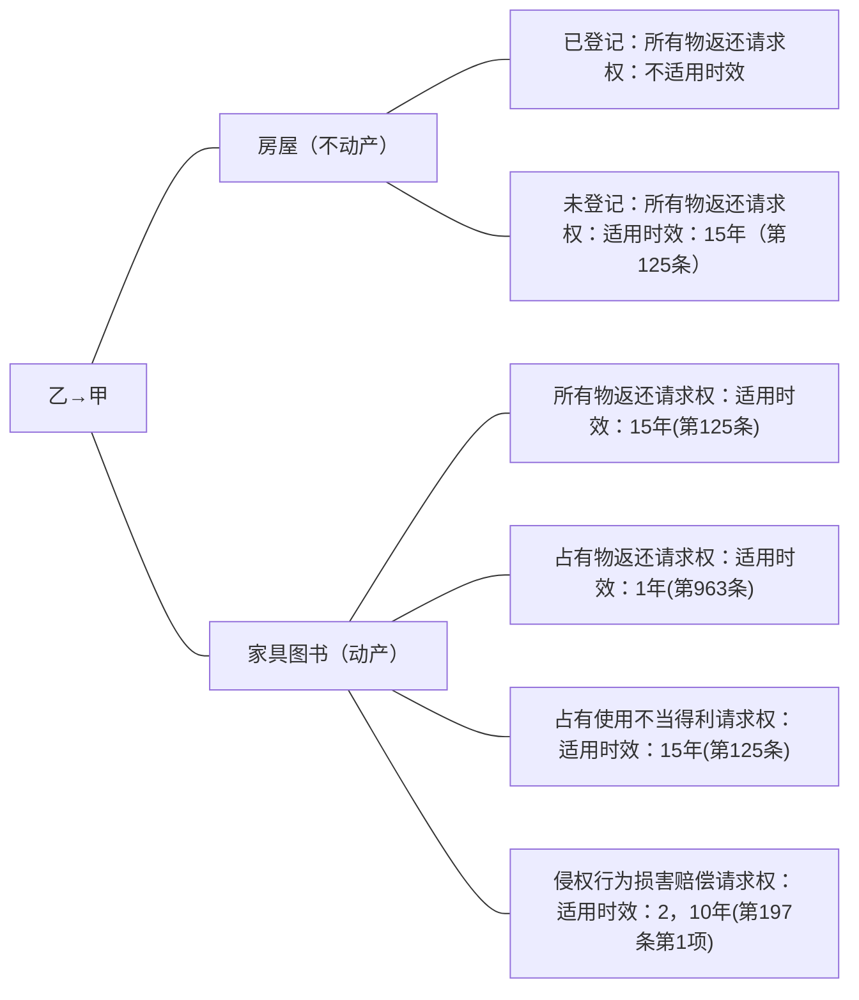

```mermaid
flowchart LR
1["乙→甲"]
2["房屋（不动产）"]
3["家具图书（动产）"]
1---2 & 3
4["已登记：所有物返还请求权：不适用时效"]
5["未登记：所有物返还请求权：适用时效：15年（第125条）"]
2---4 & 5
6["所有物返还请求权：适用时效：15年(第125条)"]
7["占有物返还请求权：适用时效：1年(第963条)"]
8["占有使用不当得利请求权：适用时效：15年(第125条)"]
9["侵权行为损害赔偿请求权：适用时效：2，10年(第197条第1项)"]
3---6 & 7 & 8 & 9
```