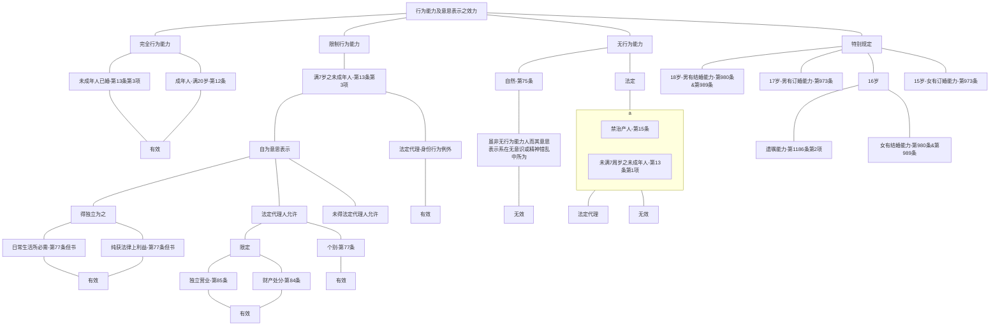

```mermaid
flowchart TB
1[行为能力及意思表示之效力]
2[完全行为能力]
3[限制行为能力]
4[无行为能力]
5[特别规定]
1---2
1---3
1---4
1---5
6[未成年人已婚-第13条第3项]
7[成年人-满20岁-第12条]
8[有效]
2---6
2---7
6---8
7---8
9[满7岁之未成年人-第13条第3项]
11[自为意思表示]
12[法定代理-身份行为例外]
13[有效]
3---9
9---11
9---12---13
14[得独立为之]
15[法定代理人允许]
16[未得法定代理人允许]
11---14
11---15
11---16
17[日常生活所必需-第77条但书]
18[纯获法律上利益-第77条但书]
19[有效]
14---17
14---18
17---19
18---19
21[限定]
22[独立营业-第85条]
23[财产处分-第84条]
24[有效]
15---21
21---22
21---23
22---24
23---24
25[个别-第77条]
26[有效]
15---25
25---26
27[自然-第75条]
28[虽非无行为能力人而其意思表示系在无意识或精神错乱中所为]
29[无效]
4---27---28---29
31[法定]
subgraph a
32[禁治产人-第15条]
33[未满7周岁之未成年人-第13条第1项]
end
34[法定代理]
35[无效]
4---31
31---a
a---34
a---35
36[18岁-男有结婚能力-第980条&第989条]
37[17岁-男有订婚能力-第973条]
38[16岁]
39[遗嘱能力-第1186条第2项]
41[女有结婚能力-第980条&第989条]
42[15岁-女有订婚能力-第973条]
5---36
5---37
5---38
38---39
38---41
5---42
```